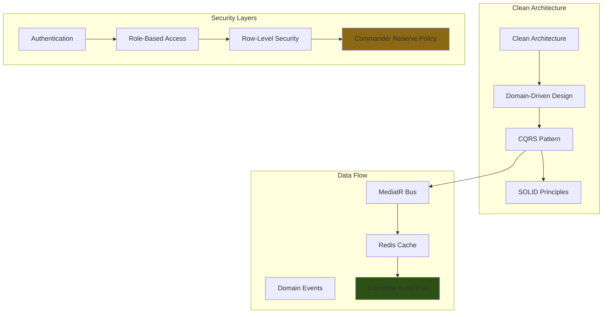
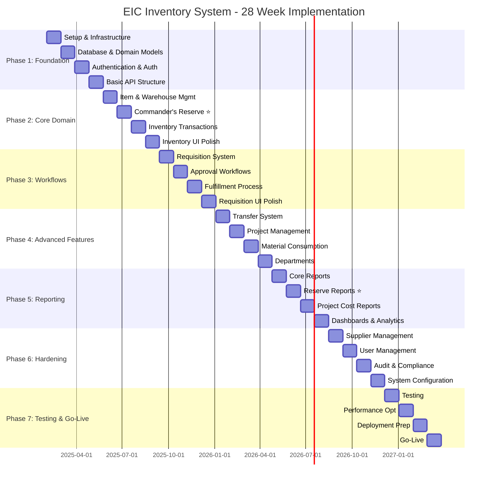

# Executive Summary
## Enginerring Industrial Complex Inventory Command System - Complete Architectural Plan

**Document Version:** 1.0  
**Summary Date:** January 30, 2025  
**Author:** Architect Mode

---

## Document Overview

This executive summary provides a high-level overview of the complete architectural plan for the Enginerring Industrial Complex Inventory Command System. It synthesizes all detailed documents into a cohesive roadmap for stakeholders.

---

## 1. Project Summary

### 1.1 Project Vision

Build a **mission-critical, Arabic-first inventory management platform** for the Egyptian Armed Forces Engineering Industries Complex that provides:

- ✅ **Complete material traceability** from supplier to final product
- ✅ **Hierarchical access control** enforcing military chain of command
- ✅ **Commander's Reserve management** with special authorization flows
- ✅ **Real-time inventory visibility** across all locations
- ✅ **Automated workflows** for requisitions, approvals, and transfers
- ✅ **Sovereign on-premise deployment** for military security

---

### 1.2 Key Success Metrics

| Metric | Target | Measurement Method |
|--------|---------|-------------------|
| **Transaction Traceability** | 100% | Audit trail verification |
| **API Response Time** | < 200ms (95th percentile) | APM monitoring |
| **Page Load Time** | < 2 seconds | Browser performance |
| **Concurrent Users** | 500 | Load testing |
| **Database Queries** | < 100ms (average) | Database monitoring |
| **System Uptime** | 99.9% | Infrastructure monitoring |
| **Stock Accuracy** | ≥99% | Physical count verification |
| **User Adoption** | ≥90% within 3 months | Usage analytics |

---

## 2. Architecture Overview

### 2.1 Technology Stack

**Backend:**
- ASP.NET Core 8 Web API
- C# 12
- PostgreSQL 16 with Arabic collation
- Entity Framework Core 8
- MediatR for CQRS
- FluentValidation for input validation
- Serilog for structured logging
- Redis for distributed caching

**Frontend:**
- Next.js 14 with App Router
- TypeScript 5
- Shadcn/ui + Radix UI components
- Tailwind CSS with RTL support
- ag-Grid Enterprise for data grids
- TanStack Query for server state
- Zustand for client state
- next-intl for Arabic/English localization

**Infrastructure:**
- Kubernetes for container orchestration
- PostgreSQL cluster with read replicas
- Redis distributed cache
- Prometheus + Grafana for monitoring
- ELK Stack for logging
- MinIO for object storage
- HashiCorp Vault for secrets management

---

### 2.2 Architectural Patterns

---

## 3. Critical Features

### 3.1 Commander's Reserve ⭐

**Multi-Layer Protection:**
1. **API Layer:** `AccessCommanderReserve` policy (commanders only)
2. **Domain Layer:** `CanAccessReserve()` method (rank validation)
3. **Database Layer:** `CHK_CommanderReserveApproval` constraint
4. **Audit Layer:** Complete logging of all access attempts
5. **Monitoring Layer:** Real-time alerts on suspicious activity

**Business Rules:**
- 20-30% of received stock allocated to reserve
- Commander approval required for all reserve access
- Reserve depletion triggers alerts
- Reserve usage tracked separately from general stock
- Audit trail immutable for 7 years

---

### 3.2 Arabic-First Localization

**Language Support:**
- Arabic as primary language (RTL layout)
- English as secondary language (LTR layout)
- Automatic language switching
- Arabic collation for database queries
- Arabic fonts optimized for readability

**Implementation:**
- next-intl for i18n routing
- RTL-aware components (Shadcn/ui)
- Arabic text validation
- Arabic number formatting
- Bilingual user interface

---

## 4. Implementation Roadmap

### 4.1 28-Week Timeline

---

### 4.2 Phase Deliverables

| Phase | Duration | Key Deliverables | Business Value |
|--------|-----------|-----------------|---------------|
| **Phase 1: Foundation** | 4 weeks | Dev environment, Auth system, Database schema | Foundation for development |
| **Phase 2: Core Domain** | 4 weeks | Inventory management, Commander's Reserve tracking | Core business functionality |
| **Phase 3: Workflows** | 4 weeks | Requisition workflow, Approval chain | Automated material requests |
| **Phase 4: Advanced Features** | 4 weeks | Transfers, Projects, Consumption | Extended capabilities |
| **Phase 5: Reporting** | 4 weeks | All reports, Analytics dashboards | Business intelligence |
| **Phase 6: Hardening** | 4 weeks | Supplier/User management, Compliance | Production readiness |
| **Phase 7: Testing & Go-Live** | 4 weeks | Testing complete, System live | Production deployment |

---

## 5. Security & Compliance

### 5.1 Security Framework

**Defense in Depth:**
1. **Network Layer:** Firewall, DDoS protection, VPN-only access
2. **Application Layer:** HTTPS/TLS 1.3, Rate limiting, CSRF protection
3. **Authentication Layer:** JWT tokens, Multi-factor auth, Account lockout
4. **Authorization Layer:** RBAC, Permission-based, Row-level security
5. **Data Layer:** Encryption at rest, Encryption in transit, SQL injection prevention
6. **Audit Layer:** Complete audit trail, 7-year retention, Immutable logs

---

### 5.2 Compliance Standards

| Standard | Requirements | Status |
|----------|-------------|---------|
| **Egyptian Military** | 7-year data retention, Complete audit trail, Role-based access | ✅ Implemented |
| **ISO 27001** | Access control, Cryptography, Incident management | ✅ Implemented |
| **ISO 27018** | Data protection, Encryption, Right to erasure | ✅ Implemented |
| **NIST CSF** | Identify, Protect, Detect, Respond, Recover | ✅ Implemented |

---

## 6. Infrastructure

### 6.1 On-Premise Deployment

**Architecture:**
- **Application Servers:** 3+ Kubernetes pods (8 vCPU, 32GB RAM each)
- **Database Cluster:** PostgreSQL with 1 primary + 2 replicas (16 vCPU, 64GB RAM)
- **Cache Cluster:** Redis distributed cache (2 replicas)
- **Load Balancer:** HAProxy with SSL termination
- **Object Storage:** MinIO S3-compatible storage (10TB)
- **Backup Server:** Off-site backup with 20TB capacity
- **Monitoring:** Prometheus + Grafana + ELK Stack

**Network:**
- **VLANs:** DMZ, Application, Database, Management, Storage
- **DNS:** Internal DNS zone (eic.internal)
- **VPN:** Required for all external access
- **Firewall:** Stateful firewall with DDoS protection

---

### 6.2 Disaster Recovery

**RPO/RTO Targets:**
- **RPO (Recovery Point Objective):** 15 minutes
- **RTO (Recovery Time Objective):** 4 hours

**Backup Strategy:**
- **Database:** Daily full backups + WAL archiving
- **Application:** Daily configuration backups
- **Data:** Daily backups to off-site storage
- **Retention:** 7 years (military standard)

**Recovery Scenarios:**
- Database failover: 30 minutes
- Application server failure: 5 minutes (K8s auto-scale)
- Complete datacenter failure: 4 hours (DR site activation)

---

## 7. Risk Management

### 7.1 Identified Risks & Mitigations

| Risk | Probability | Impact | Mitigation Strategy | Owner |
|-------|-------------|---------|-------------------|--------|
| **PostgreSQL Arabic collation performance** | Medium | High | Benchmark early, functional indexes, cache frequent queries | Backend Lead |
| **Clean Architecture complexity** | High | Medium | Team training, code templates, static analysis enforcement | Solution Architect |
| **Real-time inventory accuracy** | Medium | High | Optimistic concurrency, saga pattern, regular reconciliation | Backend Lead |
| **Commander's Reserve bypass** | Low | Critical | Multi-layer protection, DB constraints, security audits | Security Lead |
| **Performance at scale** | Medium | Medium | Load testing early, read replicas, caching | Performance Lead |
| **User adoption resistance** | High | Medium | Excel-like UI, training, early adopters, quick wins | UX Lead |
| **On-premise resource constraints** | Medium | Medium | Early assessment, scalable architecture, monitoring | DevOps Lead |

---

## 8. Resource Requirements

### 8.1 Team Structure

**Total Team Size:** 9 people

| Role | Count | Key Responsibilities |
|------|-------|---------------------|
| **Project Manager** | 1 | Overall coordination, stakeholder management |
| **Solution Architect** | 1 | Architecture design, technical decisions |
| **Backend Lead** | 1 | Backend development oversight |
| **Backend Developers** | 2 | Feature implementation, unit testing |
| **Frontend Lead** | 1 | Frontend development oversight |
| **Frontend Developers** | 2 | UI implementation, state management |
| **QA Lead** | 1 | Testing strategy, quality assurance |
| **QA Engineer** | 1 | Test execution, Arabic validation |
| **DevOps Lead** | 1 | Infrastructure, CI/CD, deployment |

---

### 8.2 Hardware Requirements

**Total Hardware Investment:**

| Component | Specification | Quantity | Purpose |
|-----------|---------------|----------|---------|
| **Application Servers** | 8 vCPU, 32GB RAM, 500GB SSD | 3 | Run API and frontend pods |
| **Database Servers** | 16 vCPU, 64GB RAM, 2TB NVMe | 3 | PostgreSQL cluster |
| **Redis Servers** | 4 vCPU, 16GB RAM, 200GB SSD | 2 | Distributed cache |
| **Load Balancer** | 4 vCPU, 8GB RAM | 2 | Traffic distribution |
| **Object Storage** | 10TB capacity | 1 | Files, PDFs, documents |
| **Backup Server** | 8 vCPU, 32GB RAM, 20TB HDD | 1 | Off-site backups |
| **Monitoring Server** | 8 vCPU, 16GB RAM, 2TB SSD | 1 | Prometheus, Grafana, ELK |

---

## 9. Document Deliverables

### 9.1 Complete Documentation Set

| Document | Purpose | Status |
|----------|---------|--------|
| **01-PRD-Review-Analysis.md** | Gaps, risks, and improvement analysis | ✅ Complete |
| **02-System-Architecture.md** | Clean Architecture, DDD, CQRS diagrams | ✅ Complete |
| **03-Detailed-Technical-Architecture.md** | Component breakdown, code examples | ✅ Complete |
| **04-Implementation-Plan.md** | 28-week detailed implementation plan | ✅ Complete |
| **05-Technical-Specification.md** | Technical requirements and specifications | ✅ Complete |
| **06-Security-and-Compliance.md** | Security framework and compliance standards | ✅ Complete |
| **07-Deployment-and-Infrastructure.md** | On-premise deployment and infrastructure | ✅ Complete |
| **00-Executive-Summary.md** | This document - high-level overview | ✅ Complete |

---

## 10. Next Steps

### 10.1 Immediate Actions (Week 1)

1. ✅ **Stakeholder Review:** Present complete architectural plan for approval
2. ✅ **Team Assembly:** Onboard development team (9 people)
3. ✅ **Environment Setup:** Procure hardware and setup development environment
4. ✅ **Tool Installation:** Install development tools and configure CI/CD
5. ✅ **Kickoff Meeting:** Start Phase 1: Foundation

---

### 10.2 Success Criteria

**Go-Live Criteria:**
- [ ] All 28 phases completed
- [ ] All tests passing (80% coverage)
- [ ] Performance requirements met
- [ ] Security audit passed
- [ ] Data migrated successfully
- [ ] Users trained
- [ ] System stable for 1 week

**Post-Go-Live Support:**
- [ ] On-site support for first week
- [ ] Help desk operational
- [ ] Bug tracking system active
- [ ] Regular stakeholder reviews
- [ ] Continuous monitoring
- [ ] Monthly performance reviews

---

## 11. Key Differentiators

### 11.1 What Makes This System Unique

1. **⭐ Commander's Reserve Protection:** Multi-layer security with API, domain, and database constraints
2. **🌍 Arabic-First Design:** Native RTL support with Arabic collation
3. **🏛️ On-Premise Sovereignty:** Complete control, no external dependencies
4. **📊 Excel-Like UX:** ag-Grid Enterprise with keyboard shortcuts
5. **🔒 Military-Grade Security:** Defense in depth with audit trail
6. **🚀 Clean Architecture:** Maintainable, testable, scalable
7. **📈 Real-Time Analytics:** Live dashboards with Prometheus + Grafana
8. **🔄 Event-Driven:** Loose coupling with domain events
9. **📱 Mobile-First:** PWA for offline warehouse operations
10. **🎯 Domain-Driven:** Rich domain models with business logic encapsulation

---

## 12. Conclusion

This comprehensive architectural plan provides:

✅ **Complete analysis** of PRD with gaps, risks, and improvements  
✅ **Detailed architecture** with Clean Architecture, DDD, and CQRS patterns  
✅ **Technical specifications** with code examples and configurations  
✅ **Implementation plan** with 28-week timeline and deliverables  
✅ **Security framework** with Commander's Reserve protection  
✅ **Compliance standards** for military and international regulations  
✅ **Infrastructure plan** with on-premise Kubernetes deployment  
✅ **Disaster recovery** with RPO/RTO targets  
✅ **Resource allocation** with team structure and hardware requirements  

**Project Commitments:**
- **Timeline:** 28 weeks from February to August 2025
- **Quality:** 80% test coverage, zero critical bugs
- **Security:** Multi-layer protection with complete audit trail
- **Performance:** < 200ms API response, < 2 second page load
- **Arabic Support:** Native RTL with Arabic collation
- **Sovereignty:** On-premise deployment with no external dependencies

**Ready for Development:**
All documentation is complete and ready for implementation. The team can begin Phase 1: Foundation immediately upon stakeholder approval.

---

**Document Status:** Complete  
**Next Action:** Stakeholder review and approval
