# System Architecture Design
## Enginerring Industrial Complex Inventory Command System

**Document Version:** 1.0  
**Architecture Date:** January 30, 2025  
**Architect:** Architect Mode

---

## Table of Contents

1. [Architecture Overview](#1-architecture-overview)
2. [Clean Architecture Layers](#2-clean-architecture-layers)
3. [Domain-Driven Design (DDD)](#3-domain-driven-design-ddd)
4. [CQRS Pattern Implementation](#4-cqrs-pattern-implementation)
5. [Component Architecture](#5-component-architecture)
6. [Data Flow Diagrams](#6-data-flow-diagrams)
7. [Security Architecture](#7-security-architecture)
8. [Deployment Architecture](#8-deployment-architecture)

---

## 1. Architecture Overview

### 1.1 Architectural Principles

The system follows **Clean Architecture** principles combined with **Domain-Driven Design (DDD)** and **CQRS** patterns to ensure:

- **Separation of Concerns:** Each layer has a single responsibility
- **Dependency Inversion:** High-level modules don't depend on low-level modules
- **Testability:** Business logic can be tested without infrastructure
- **Maintainability:** Changes in one layer don't cascade to others
- **Scalability:** Read and write operations can be scaled independently

### 1.2 High-Level Architecture

```mermaid
graph TB
    subgraph "Presentation Layer"
        UI[Next.js Frontend<br/>TypeScript + RTL]
        API[ASP.NET Core Web API<br/>Controllers + Minimal APIs]
    end
    
    subgraph "Application Layer"
        MediatR[MediatR<br/>Command/Query Bus]
        Commands[Commands<br/>Write Operations]
        Queries[Queries<br/>Read Operations]
        Validators[FluentValidation<br/>Input Validation]
        Handlers[Command/Query Handlers<br/>Business Logic Orchestration]
    end
    
    subgraph "Domain Layer"
        Entities[Domain Entities<br/>Aggregate Roots]
        ValueObjects[Value Objects<br/>Quantity, Money, ArabicName]
        Events[Domain Events<br/>ReserveAccessed, StockAdjusted]
        Interfaces[Domain Interfaces<br/>IRepository, IDomainEventDispatcher]
        Exceptions[Domain Exceptions<br/>Business Rule Violations]
    end
    
    subgraph "Infrastructure Layer"
        EFCore[Entity Framework Core<br/>PostgreSQL]
        Repositories[Repository Implementations<br/>Generic + Specific]
        Identity[ASP.NET Identity<br/>JWT Authentication]
        Services[External Services<br/>Email, PDF, Notifications]
        Cache[Redis Cache<br/>Distributed Caching]
    end
    
    UI -->|HTTP/REST| API
    API --> MediatR
    MediatR --> Commands
    MediatR --> Queries
    Commands --> Handlers
    Queries --> Handlers
    Handlers --> Entities
    Handlers --> Interfaces
    Repositories -->|Implements| Interfaces
    EFCore --> Repositories
    Handlers -->|Uses| EFCore
    Handlers -->|Uses| Services
    Handlers -->|Uses| Cache
    API -->|Uses| Identity
    
    style Entities fill:#2d5016
    style ValueObjects fill:#2d5016
    style Events fill:#2d5016
    style UI fill:#1a3d5d
    style API fill:#1a3d5d
```

---

## 2. Clean Architecture Layers

### 2.1 Layer Responsibilities

#### **Layer 1: Domain Layer (Core)**
**Purpose:** Contains enterprise business rules and domain logic

**Components:**
- **Entities:** Core business objects with identity
- **Value Objects:** Immutable objects defined by attributes
- **Domain Events:** Something that happened in the domain
- **Domain Services:** Business logic that doesn't fit in entities
- **Repository Interfaces:** Contracts for data access
- **Domain Exceptions:** Business rule violations

**Dependencies:** None (innermost layer)

**Example:**
```csharp
// Domain/Entities/InventoryItem.cs
public class InventoryItem : AggregateRoot
{
    public Guid Id { get; private set; }
    public Guid WarehouseId { get; private set; }
    public Guid ItemId { get; private set; }
    
    // Value Objects
    public Quantity GeneralStock { get; private set; }
    public Quantity CommanderReserve { get; private set; }
    public Money TotalValue { get; private set; }
    
    // Business Logic (Encapsulated)
    public void ConsumeStock(decimal amount, bool fromReserve, UserRank requestorRank)
    {
        if (fromReserve)
        {
            if (!CanAccessReserve(requestorRank))
                throw new DomainException("Unauthorized access to Commander Reserve");
            
            if (CommanderReserve.Value < amount)
                throw new DomainException("Insufficient Reserve Stock");
            
            CommanderReserve = CommanderReserve.Subtract(amount);
            AddDomainEvent(new CommanderReserveAccessedEvent(this.Id, amount));
        }
        else
        {
            if (GeneralStock.Value < amount)
                throw new DomainException("Insufficient General Stock");
            
            GeneralStock = GeneralStock.Subtract(amount);
        }
        
        UpdateTotalValue();
    }
    
    private bool CanAccessReserve(UserRank rank) =>
        rank == UserRank.FACTORY_COMMANDER || 
        rank == UserRank.COMPLEX_COMMANDER;
}
```

---

#### **Layer 2: Application Layer**
**Purpose:** Orchestrates business logic and use cases

**Components:**
- **Commands:** Write operations (Create, Update, Delete)
- **Queries:** Read operations (Get, List, Search)
- **Command/Query Handlers:** Implement use cases
- **DTOs:** Data Transfer Objects for API
- **Validators:** Input validation rules
- **Mappers:** Entity to DTO mapping

**Dependencies:** Domain Layer only

**Example:**
```csharp
// Application/Features/Inventory/Commands/ConsumeStockCommand.cs
public record ConsumeStockCommand(
    Guid InventoryItemId,
    decimal Quantity,
    bool FromReserve,
    UserRank RequestorRank,
    Guid ProjectId
) : IRequest<Result>;

// Application/Features/Inventory/Commands/ConsumeStockCommandHandler.cs
public class ConsumeStockCommandHandler : IRequestHandler<ConsumeStockCommand, Result>
{
    private readonly IInventoryItemRepository _repository;
    private readonly IUnitOfWork _unitOfWork;
    private readonly ICurrentUserService _currentUser;
    
    public async Task<Result> Handle(ConsumeStockCommand request, CancellationToken ct)
    {
        // 1. Load aggregate
        var inventoryItem = await _repository.GetByIdAsync(request.InventoryItemId, ct);
        if (inventoryItem == null)
            return Result.Failure("Inventory item not found");
        
        // 2. Execute domain logic
        inventoryItem.ConsumeStock(
            request.Quantity,
            request.FromReserve,
            request.RequestorRank
        );
        
        // 3. Persist changes
        await _repository.UpdateAsync(inventoryItem, ct);
        await _unitOfWork.SaveChangesAsync(ct);
        
        // 4. Dispatch domain events
        await _domainEventDispatcher.DispatchAsync(inventoryItem.DomainEvents);
        
        return Result.Success();
    }
}
```

---

#### **Layer 3: Infrastructure Layer**
**Purpose:** Provides technical capabilities for application

**Components:**
- **Data Access:** EF Core DbContext, Migrations
- **Repositories:** Concrete implementations of repository interfaces
- **External Services:** Email, SMS, PDF generation
- **Identity:** Authentication and authorization
- **Caching:** Redis distributed cache
- **Logging:** Serilog configuration

**Dependencies:** Domain and Application Layers

**Example:**
```csharp
// Infrastructure/Persistence/Repositories/InventoryItemRepository.cs
public class InventoryItemRepository : IInventoryItemRepository
{
    private readonly ApplicationDbContext _context;
    
    public async Task<InventoryItem?> GetByIdAsync(Guid id, CancellationToken ct)
    {
        return await _context.InventoryItems
            .Include(i => i.Warehouse)
            .Include(i => i.Item)
            .FirstOrDefaultAsync(i => i.Id == id, ct);
    }
    
    public async Task UpdateAsync(InventoryItem item, CancellationToken ct)
    {
        _context.InventoryItems.Update(item);
        // Save is handled by UnitOfWork
    }
}
```

---

#### **Layer 4: Presentation Layer**
**Purpose:** User interface and API endpoints

**Components:**
- **Web API Controllers:** HTTP endpoints
- **Minimal APIs:** Lightweight endpoints
- **Middleware:** Auth, CORS, Error handling
- **Frontend:** Next.js pages and components

**Dependencies:** Application Layer

**Example:**
```csharp
// WebAPI/Controllers/InventoryController.cs
[ApiController]
[Route("api/[controller]")]
[Authorize]
public class InventoryController : ControllerBase
{
    private readonly IMediator _mediator;
    
    [HttpPost("consume")]
    public async Task<IActionResult> ConsumeStock([FromBody] ConsumeStockCommand command)
    {
        var result = await _mediator.Send(command);
        
        if (result.IsFailure)
            return BadRequest(result.Error);
        
        return Ok();
    }
}
```

---

### 2.2 Dependency Flow

```mermaid
graph LR
    A[Presentation] -->|Depends on| B[Application]
    B -->|Depends on| C[Domain]
    D[Infrastructure] -->|Implements| C
    B -->|Uses| D
    A -->|Uses| D
    
    style C fill:#2d5016
    style B fill:#1a3d5d
    style D fill:#8b6914
    style A fill:#7a1a1a
```

**Key Points:**
- **Domain Layer:** Zero dependencies (innermost)
- **Application Layer:** Depends only on Domain
- **Infrastructure Layer:** Implements Domain interfaces
- **Presentation Layer:** Depends on Application and Infrastructure

---

## 3. Domain-Driven Design (DDD)

### 3.1 Bounded Contexts

The system is organized into bounded contexts based on business capabilities:

```mermaid
graph TB
    subgraph "Inventory Context"
        IC1[Inventory Management]
        IC2[Stock Control]
        IC3[Valuation]
    end
    
    subgraph "Requisition Context"
        RC1[Requisition Workflow]
        RC2[Approval Chain]
        RC3[Fulfillment]
    end
    
    subgraph "Project Context"
        PC1[Project Management]
        PC2[Material Allocation]
        PC3[Cost Tracking]
    end
    
    subgraph "User Context"
        UC1[Authentication]
        UC2[Authorization]
        UC3[Role Management]
    end
    
    subgraph "Reporting Context"
        RptC1[Analytics]
        RptC2[Export]
        RptC3[Scheduling]
    end
    
    IC1 -.->|Domain Events| RC1
    RC1 -.->|Domain Events| PC2
    PC2 -.->|Domain Events| IC2
    
    style IC1 fill:#2d5016
    style RC1 fill:#1a3d5d
    style PC1 fill:#8b6914
    style UC1 fill:#7a1a1a
    style RptC1 fill:#1a4d2e
```

---

### 3.2 Aggregates

#### **Aggregate 1: InventoryItem**
**Root:** `InventoryItem`
**Entities:** None (single entity aggregate)
**Value Objects:** `Quantity`, `Money`, `StorageLocation`
**Invariants:**
- Total = General + Reserve
- Allocated ≤ Available
- Reserve access requires commander authorization

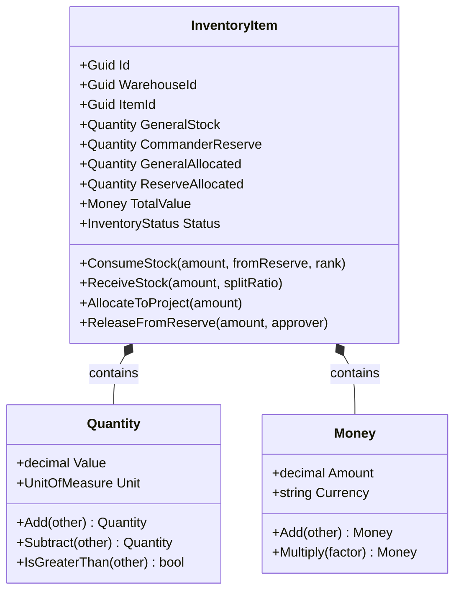

---

#### **Aggregate 2: Requisition**
**Root:** `Requisition`
**Entities:** `RequisitionItem`, `RequisitionApproval`
**Value Objects:** `RequestNumber`, `PriorityLevel`
**Invariants:**
- Approved ≤ Requested
- Issued ≤ Approved
- Reserve items require commander approval

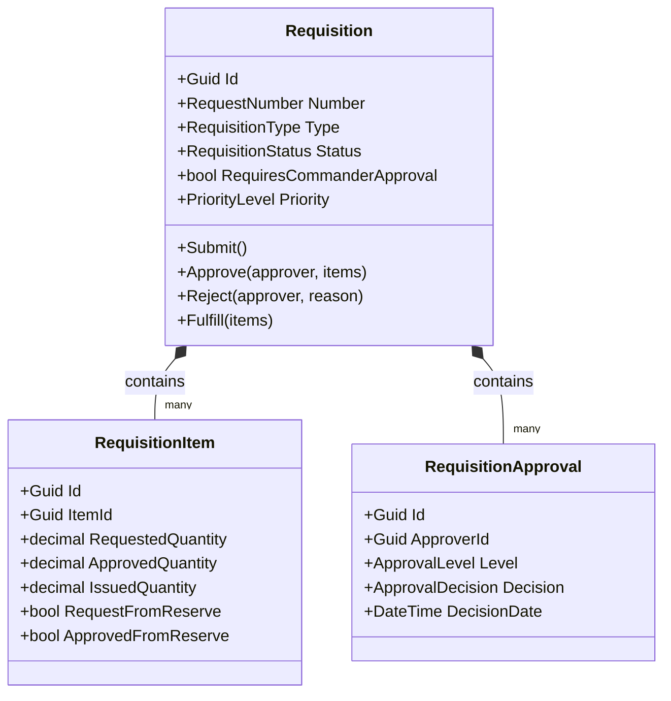

---

#### **Aggregate 3: Project**
**Root:** `Project`
**Entities:** `ProjectItemAllocation`, `ProjectTeamMember`
**Value Objects:** `ProjectNumber`, `Budget`
**Invariants:**
- Consumed ≤ Allocated ≤ Budget
- Produced ≤ Target

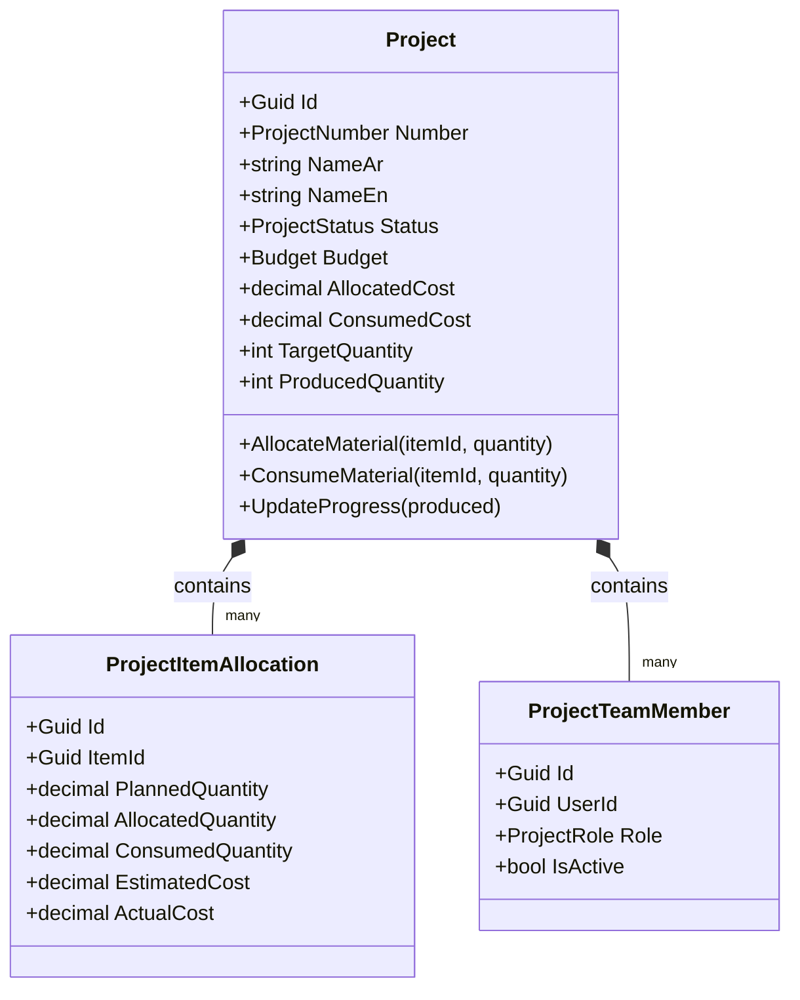

---

### 3.3 Value Objects

Value objects are immutable and defined by their attributes, not identity.

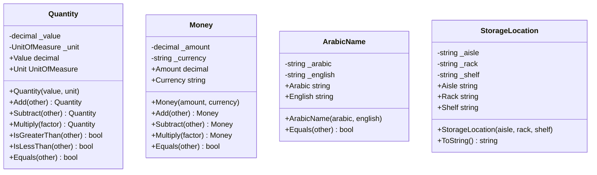

---

### 3.4 Domain Events

Domain events represent something that happened in the domain that other parts of the system may be interested in.

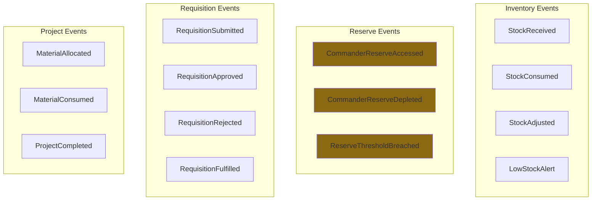

**Event Example:**
```csharp
// Domain/Events/CommanderReserveAccessedEvent.cs
public record CommanderReserveAccessedEvent(
    Guid InventoryItemId,
    decimal Quantity,
    Guid RequestedBy,
    UserRank RequestorRank,
    DateTime AccessedAt
) : IDomainEvent;

// Application/EventHandlers/CommanderReserveAccessedEventHandler.cs
public class CommanderReserveAccessedEventHandler : INotificationHandler<CommanderReserveAccessedEvent>
{
    private readonly IAuditLogRepository _auditLog;
    private readonly INotificationService _notification;
    
    public async Task Handle(CommanderReserveAccessedEvent notification, CancellationToken ct)
    {
        // 1. Log to audit trail
        await _auditLog.LogAsync(new AuditLogEntry
        {
            Action = "COMMANDER_RESERVE_ACCESSED",
            EntityId = notification.InventoryItemId,
            UserId = notification.RequestedBy,
            Details = $"Accessed {notification.Quantity} from Commander's Reserve",
            Timestamp = notification.AccessedAt
        }, ct);
        
        // 2. Notify factory commander
        await _notification.SendAlertAsync(
            recipient: notification.RequestedBy,
            subject: "Commander's Reserve Accessed",
            message: $"Reserve stock accessed: {notification.Quantity}"
        );
    }
}
```

---

## 4. CQRS Pattern Implementation

### 4.1 CQRS Overview

CQRS (Command Query Responsibility Segregation) separates read and write operations for better performance and scalability.

```mermaid
graph TB
    subgraph "Write Side (Commands)"
        C1[Create Requisition]
        C2[Approve Requisition]
        C3[Consume Stock]
        C4[Transfer Materials]
    end
    
    subgraph "Read Side (Queries)"
        Q1[Get Inventory]
        Q2[Search Items]
        Q3[Get Requisitions]
        Q4[Generate Reports]
    end
    
    subgraph "Command Bus"
        CB[MediatR Command Bus]
    end
    
    subgraph "Query Bus"
        QB[MediatR Query Bus]
    end
    
    subgraph "Command Handlers"
        CH1[CreateRequisitionHandler]
        CH2[ApproveRequisitionHandler]
        CH3[ConsumeStockHandler]
        CH4[TransferMaterialsHandler]
    end
    
    subgraph "Query Handlers"
        QH1[GetInventoryHandler]
        QH2[SearchItemsHandler]
        QH3[GetRequisitionsHandler]
        QH4[GenerateReportsHandler]
    end
    
    subgraph "Database"
        DB[(PostgreSQL<br/>Write Model)]
        ReadDB[(PostgreSQL<br/>Read Model<br/>Optional)]
    end
    
    C1 --> CB
    C2 --> CB
    C3 --> CB
    C4 --> CB
    
    CB --> CH1
    CB --> CH2
    CB --> CH3
    CB --> CH4
    
    CH1 --> DB
    CH2 --> DB
    CH3 --> DB
    CH4 --> DB
    
    Q1 --> QB
    Q2 --> QB
    Q3 --> QB
    Q4 --> QB
    
    QB --> QH1
    QB --> QH2
    QB --> QH3
    QB --> QH4
    
    QH1 --> DB
    QH2 --> DB
    QH3 --> DB
    QH4 --> DB
    
    DB -.->|Sync| ReadDB
    
    style CB fill:#7a1a1a
    style QB fill:#1a3d5d
    style DB fill:#2d5016
```

---

### 4.2 Command Examples

#### **Command: CreateRequisition**
```csharp
// Application/Features/Requisitions/Commands/CreateRequisitionCommand.cs
public record CreateRequisitionCommand(
    Guid? ProjectId,
    Guid? DepartmentId,
    Guid SourceWarehouseId,
    PriorityLevel Priority,
    DateTime RequiredDate,
    string Purpose,
    List<RequisitionItemDto> Items
) : IRequest<Result<Guid>>;

public record RequisitionItemDto(
    Guid ItemId,
    decimal RequestedQuantity,
    bool UseCommanderReserve,
    string? ItemPurpose
);

// Handler
public class CreateRequisitionCommandHandler : IRequestHandler<CreateRequisitionCommand, Result<Guid>>
{
    private readonly IRequisitionRepository _repository;
    private readonly IUnitOfWork _unitOfWork;
    private readonly ICurrentUserService _currentUser;
    
    public async Task<Result<Guid>> Handle(CreateRequisitionCommand request, CancellationToken ct)
    {
        // 1. Validate user permissions
        if (!_currentUser.CanCreateRequisition())
            return Result.Failure("Unauthorized");
        
        // 2. Check if any item requests commander's reserve
        var hasReserveRequest = request.Items.Any(i => i.UseCommanderReserve);
        
        // 3. Create requisition aggregate
        var requisition = new Requisition(
            requestedBy: _currentUser.UserId,
            sourceWarehouseId: request.SourceWarehouseId,
            priority: request.Priority,
            requiredDate: request.RequiredDate,
            purpose: request.Purpose,
            requiresCommanderApproval: hasReserveRequest
        );
        
        // 4. Add items
        foreach (var itemDto in request.Items)
        {
            requisition.AddItem(new RequisitionItem(
                itemId: itemDto.ItemId,
                requestedQuantity: itemDto.RequestedQuantity,
                requestFromReserve: itemDto.UseCommanderReserve,
                itemPurpose: itemDto.ItemPurpose
            ));
        }
        
        // 5. Persist
        await _repository.AddAsync(requisition, ct);
        await _unitOfWork.SaveChangesAsync(ct);
        
        // 6. Dispatch domain events
        await _domainEventDispatcher.DispatchAsync(requisition.DomainEvents);
        
        return Result.Success(requisition.Id);
    }
}
```

---

### 4.3 Query Examples

#### **Query: GetInventoryByWarehouse**
```csharp
// Application/Features/Inventory/Queries/GetInventoryByWarehouseQuery.cs
public record GetInventoryByWarehouseQuery(
    Guid WarehouseId,
    string? SearchTerm,
    ItemCategory? Category,
    int PageNumber = 1,
    int PageSize = 20
) : IRequest<PagedResult<InventoryItemDto>>;

// Handler
public class GetInventoryByWarehouseQueryHandler : IRequestHandler<GetInventoryByWarehouseQuery, PagedResult<InventoryItemDto>>
{
    private readonly ApplicationDbContext _context;
    private readonly ICacheService _cache;
    
    public async Task<PagedResult<InventoryItemDto>> Handle(GetInventoryByWarehouseQuery query, CancellationToken ct)
    {
        // 1. Check cache
        var cacheKey = $"inventory_{query.WarehouseId}_{query.PageNumber}";
        var cached = await _cache.GetAsync<PagedResult<InventoryItemDto>>(cacheKey);
        if (cached != null)
            return cached;
        
        // 2. Build query
        var dbQuery = _context.InventoryRecords
            .Include(ir => ir.Item)
            .Include(ir => ir.Warehouse)
            .Where(ir => ir.WarehouseId == query.WarehouseId);
        
        // 3. Apply filters
        if (!string.IsNullOrWhiteSpace(query.SearchTerm))
        {
            dbQuery = dbQuery.Where(ir => 
                ir.Item.NameAr.Contains(query.SearchTerm) ||
                ir.Item.NameEn.Contains(query.SearchTerm) ||
                ir.Item.Code.Contains(query.SearchTerm)
            );
        }
        
        if (query.Category.HasValue)
        {
            dbQuery = dbQuery.Where(ir => ir.Item.Category == query.Category.Value);
        }
        
        // 4. Get total count
        var totalCount = await dbQuery.CountAsync(ct);
        
        // 5. Get paged results
        var items = await dbQuery
            .OrderBy(ir => ir.Item.Code)
            .Skip((query.PageNumber - 1) * query.PageSize)
            .Take(query.PageSize)
            .Select(ir => new InventoryItemDto
            {
                Id = ir.Id,
                ItemCode = ir.Item.Code,
                ItemNameAr = ir.Item.NameAr,
                ItemNameEn = ir.Item.NameEn,
                TotalQuantity = ir.TotalQuantity,
                GeneralQuantity = ir.GeneralQuantity,
                CommanderReserveQuantity = ir.CommanderReserveQuantity,
                GeneralAvailable = ir.GeneralAvailable,
                ReserveAvailable = ir.ReserveAvailable,
                Status = ir.Status,
                AverageCost = ir.AverageCost,
                TotalValue = ir.TotalValue
            })
            .ToListAsync(ct);
        
        // 6. Build result
        var result = new PagedResult<InventoryItemDto>
        {
            Items = items,
            TotalCount = totalCount,
            PageNumber = query.PageNumber,
            PageSize = query.PageSize,
            TotalPages = (int)Math.Ceiling(totalCount / (double)query.PageSize)
        };
        
        // 7. Cache result
        await _cache.SetAsync(cacheKey, result, TimeSpan.FromMinutes(5));
        
        return result;
    }
}
```

---

### 4.4 Event Sourcing (Optional Enhancement)

For complete audit trail and time-travel queries:

```mermaid
graph TB
    subgraph "Command Side"
        C[Command]
        CH[Command Handler]
    end
    
    subgraph "Event Store"
        ES[(Event Store<br/>Immutable Events)]
    end
    
    subgraph "Read Side"
        P[Projector]
        RM[(Read Model<br/>Optimized for Queries)]
    end
    
    C --> CH
    CH -->|Append Event| ES
    ES -->|Subscribe| P
    P -->|Update| RM
    
    style ES fill:#2d5016
    style RM fill:#1a3d5d
```

**Event Store Schema:**
```sql
CREATE TABLE EventStore (
    Id UUID PRIMARY KEY,
    AggregateId UUID NOT NULL,
    AggregateType VARCHAR(100) NOT NULL,
    EventType VARCHAR(200) NOT NULL,
    EventData JSONB NOT NULL,
    Version INT NOT NULL,
    OccurredAt TIMESTAMP NOT NULL,
    CreatedBy UUID NOT NULL,
    
    CONSTRAINT UQ_Aggregate_Version UNIQUE (AggregateId, Version)
);

CREATE INDEX IX_EventStore_AggregateId ON EventStore(AggregateId);
CREATE INDEX IX_EventStore_OccurredAt ON EventStore(OccurredAt DESC);
```

---

## 5. Component Architecture

### 5.1 Backend Components

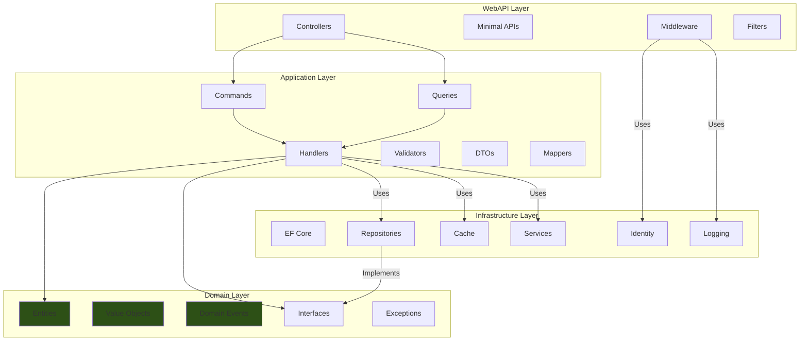

---

### 5.2 Frontend Components

```mermaid
graph TB
    subgraph "Next.js App Router"
        P1[Pages]
        P2[Layouts]
        P3[API Routes]
    end
    
    subgraph "Components"
        C1[UI Components<br/>Shadcn/ui]
        C2[Form Components]
        C3[Table Components<br/>ag-Grid]
        C4[Layout Components]
        C5[Shared Components]
    end
    
    subgraph "State Management"
        S1[TanStack Query<br/>Server State]
        S2[Zustand<br/>Client State]
    end
    
    subgraph "Services"
        SV1[API Client<br/>Axios]
        SV2[Auth Service]
        SV3[Notification Service]
        SV4[i18n Service<br/>next-intl]
    end
    
    subgraph "Utilities"
        U1[Validators<br/>Zod]
        U2[Formatters]
        U3[Helpers]
    end
    
    P1 --> C1
    P1 --> C2
    P1 --> C3
    C1 --> S1
    C1 --> S2
    C1 --> SV1
    C1 --> SV4
    C2 --> U1
    C3 --> U2
    
    style S1 fill:#1a3d5d
    style S2 fill:#8b6914
    style SV4 fill:#2d5016
```

---

## 6. Data Flow Diagrams

### 6.1 Requisition Workflow Data Flow

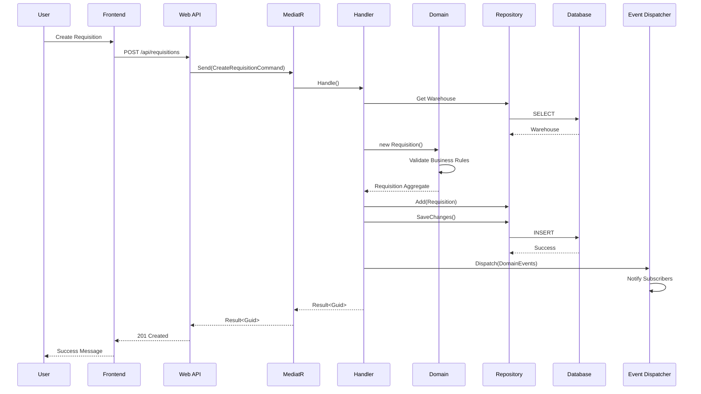

---

### 6.2 Commander's Reserve Approval Flow

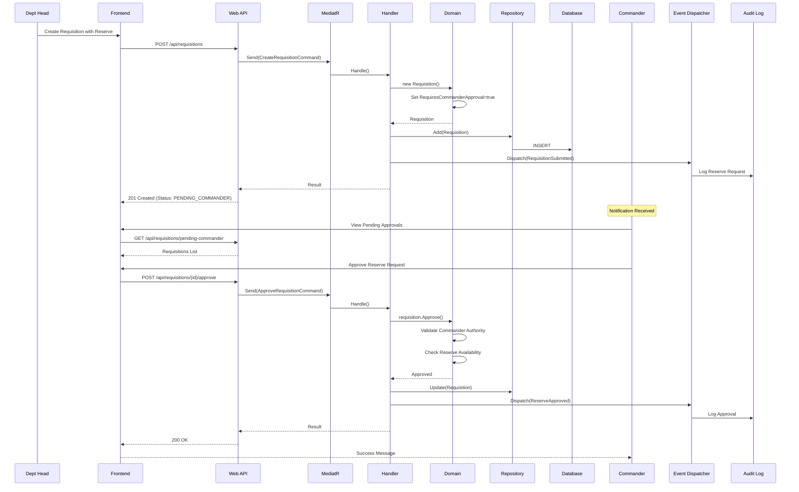

---

### 6.3 Inventory Transaction Flow

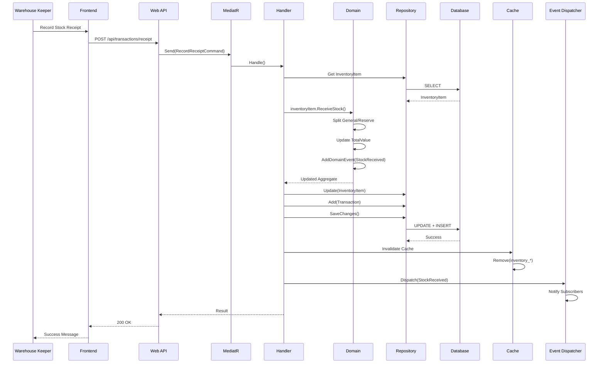

---

## 7. Security Architecture

### 7.1 Security Layers

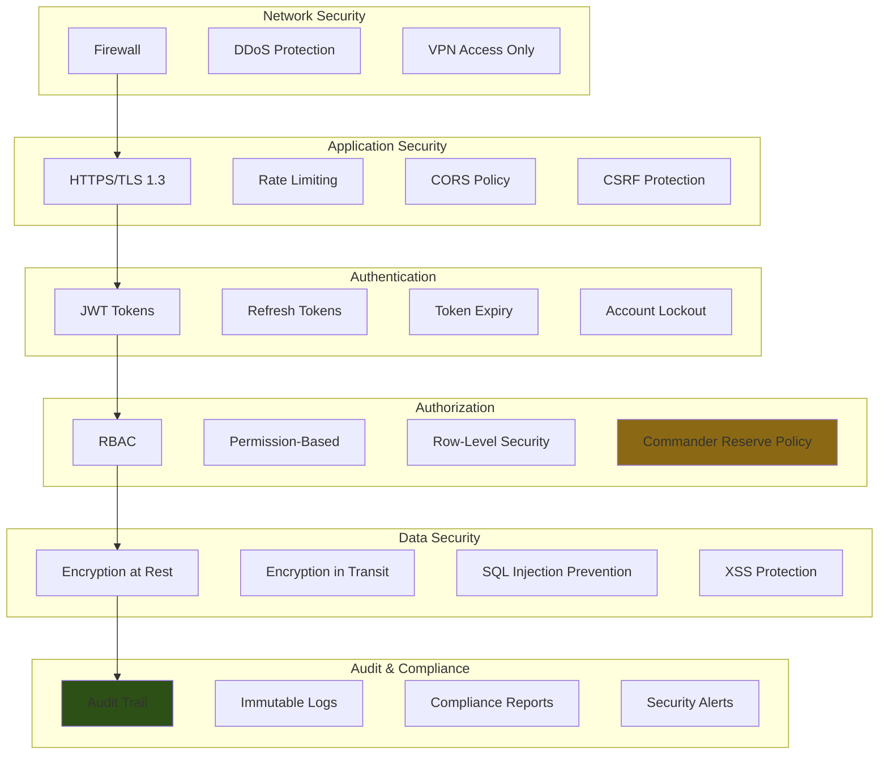

---

### 7.2 Commander's Reserve Security

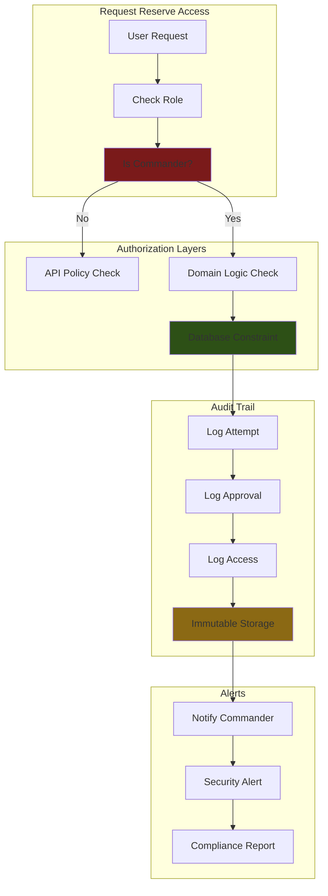

---

## 8. Deployment Architecture

### 8.1 On-Premise Deployment

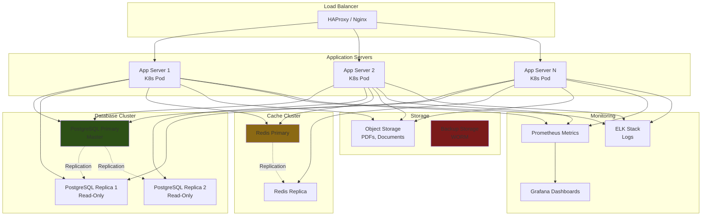

---

### 8.2 Kubernetes Deployment

```yaml
# Deployment: Backend API
apiVersion: apps/v1
kind: Deployment
metadata:
  name: inventory-api
  namespace: eic-inventory
spec:
  replicas: 3
  selector:
    matchLabels:
      app: inventory-api
  template:
    metadata:
      labels:
        app: inventory-api
    spec:
      containers:
      - name: inventory-api
        image: registry.internal/eic-inventory/api:latest
        ports:
        - containerPort: 8080
        env:
        - name: ConnectionStrings__DefaultConnection
          valueFrom:
            secretKeyRef:
              name: db-secrets
              key: connection-string
        - name: Redis__ConnectionString
          valueFrom:
            secretKeyRef:
              name: redis-secrets
              key: connection-string
        resources:
          requests:
            memory: "512Mi"
            cpu: "500m"
          limits:
            memory: "2Gi"
            cpu: "2000m"
        livenessProbe:
          httpGet:
            path: /health
            port: 8080
          initialDelaySeconds: 30
          periodSeconds: 10
        readinessProbe:
          httpGet:
            path: /health/ready
            port: 8080
          initialDelaySeconds: 5
          periodSeconds: 5

---
# Service: Backend API
apiVersion: v1
kind: Service
metadata:
  name: inventory-api
  namespace: eic-inventory
spec:
  selector:
    app: inventory-api
  ports:
  - protocol: TCP
    port: 80
    targetPort: 8080
  type: ClusterIP

---
# Ingress: Backend API
apiVersion: networking.k8s.io/v1
kind: Ingress
metadata:
  name: inventory-api-ingress
  namespace: eic-inventory
  annotations:
    cert-manager.io/cluster-issuer: internal-ca
spec:
  tls:
  - hosts:
    - inventory.eic.internal
    secretName: inventory-api-tls
  rules:
  - host: inventory.eic.internal
    http:
      paths:
      - path: /
        pathType: Prefix
        backend:
          service:
            name: inventory-api
            port:
              number: 80
```

---

## 9. Conclusion

This architecture design provides:

✅ **Clean Architecture** with clear separation of concerns  
✅ **Domain-Driven Design** with rich domain models  
✅ **CQRS** for optimized read/write operations  
✅ **Event-Driven** architecture for loose coupling  
✅ **Security-First** design with Commander's Reserve protection  
✅ **Scalable** deployment with Kubernetes  
✅ **Arabic-First** localization support  

**Next Steps:**
1. Review and approve architecture
2. Create detailed technical specifications
3. Develop implementation plan
4. Set up development environment
5. Begin Phase 1: Foundation

---

**Document Status:** Ready for Review  
**Next Review:** After Technical Specification Completion
