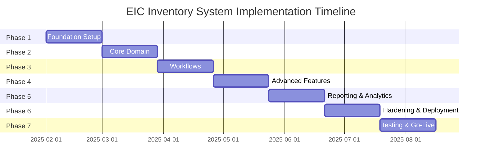

# Implementation Plan
## Enginerring Industrial Complex Inventory Command System

**Document Version:** 1.0  
**Plan Date:** January 30, 2025  
**Planner:** Architect Mode

---

## Table of Contents

1. [Implementation Overview](#1-implementation-overview)
2. [Phase 1: Foundation (Weeks 1-4)](#2-phase-1-foundation-weeks-1-4)
3. [Phase 2: Core Domain (Weeks 5-8)](#3-phase-2-core-domain-weeks-5-8)
4. [Phase 3: Workflows (Weeks 9-12)](#4-phase-3-workflows-weeks-9-12)
5. [Phase 4: Advanced Features (Weeks 13-16)](#5-phase-4-advanced-features-weeks-13-16)
6. [Phase 5: Reporting & Analytics (Weeks 17-20)](#6-phase-5-reporting--analytics-weeks-17-20)
7. [Phase 6: Hardening & Deployment (Weeks 21-24)](#7-phase-6-hardening--deployment-weeks-21-24)
8. [Phase 7: Testing & Go-Live (Weeks 25-28)](#8-phase-7-testing--go-live-weeks-25-28)
9. [Risk Mitigation Strategy](#9-risk-mitigation-strategy)
10. [Resource Allocation](#10-resource-allocation)

---

## 1. Implementation Overview

### 1.1 Project Timeline

---

### 1.2 Success Criteria

| Phase | Success Criteria | Acceptance Criteria |
|--------|----------------|-------------------|
| **Phase 1** | Development environment operational | Team can build and run solution locally |
| **Phase 2** | Core inventory management functional | Can create items, warehouses, and track stock |
| **Phase 3** | Requisition workflow complete | Can create, approve, and fulfill requisitions |
| **Phase 4** | Projects and transfers working | Can manage projects and transfer materials |
| **Phase 5** | Reports generating correctly | All standard reports produce accurate data |
| **Phase 6** | System hardened and deployed | System deployed to staging with security audit passed |
| **Phase 7** | Production ready | System deployed to production with user training complete |

---

### 1.3 Dependencies

```mermaid
graph TB
    P1[Phase 1: Foundation]
    P2[Phase 2: Core Domain]
    P3[Phase 3: Workflows]
    P4[Phase 4: Advanced Features]
    P5[Phase 5: Reporting]
    P6[Phase 6: Hardening]
    P7[Phase 7: Testing]
    
    P1 --> P2
    P2 --> P3
    P3 --> P4
    P4 --> P5
    P5 --> P6
    P6 --> P7
    
    style P1 fill:#2d5016
    style P2 fill:#1a3d5d
    style P3 fill:#8b6914
    style P4 fill:#7a1a1a
    style P5 fill:#1a4d2e
    style P6 fill:#8b6914
    style P7 fill:#2d5016
```

---

## 2. Phase 1: Foundation (Weeks 1-4)

### 2.1 Phase Objectives

**Primary Goals:**
- ✅ Establish development environment and tooling
- ✅ Setup Clean Architecture solution structure
- ✅ Configure Arabic localization infrastructure
- ✅ Implement authentication and authorization
- ✅ Setup database with initial schema

**Success Metrics:**
- All team members can build and run solution
- Authentication system functional with JWT tokens
- Database schema created and migrations working
- Arabic RTL layout rendering correctly

---

### 2.2 Week 1: Project Setup

#### **Tasks:**

**Backend Setup:**
- [ ] Initialize Git repository with proper .gitignore
- [ ] Create solution structure following Clean Architecture
- [ ] Setup ASP.NET Core 8 Web API project
- [ ] Configure Entity Framework Core 8
- [ ] Setup PostgreSQL 16 connection
- [ ] Configure Serilog for structured logging
- [ ] Setup Docker Compose for local development
- [ ] Create database migration scripts

**Frontend Setup:**
- [ ] Initialize Next.js 14 project with TypeScript
- [ ] Configure Tailwind CSS with RTL support
- [ ] Setup Shadcn/ui component library
- [ ] Configure next-intl for Arabic/English
- [ ] Setup ag-Grid Enterprise license
- [ ] Configure TanStack Query for data fetching
- [ ] Setup Zustand for state management
- [ ] Create base layout with RTL support

**DevOps Setup:**
- [ ] Setup GitLab CI/CD pipeline
- [ ] Configure Docker registry
- [ ] Setup Kubernetes development cluster
- [ ] Configure code quality tools (SonarQube)
- [ ] Setup automated testing pipeline

**Deliverables:**
- Working development environment
- Solution builds without errors
- Docker Compose starts all services
- CI/CD pipeline runs successfully

---

### 2.3 Week 2: Database & Domain Models

#### **Tasks:**

**Database Schema:**
- [ ] Create all entity models in Domain layer
- [ ] Define value objects (Quantity, Money, ArabicName)
- [ ] Create EF Core configurations for all entities
- [ ] Setup Arabic collation (ar_EG.utf8) for text fields
- [ ] Create database indexes for performance
- [ ] Define database constraints (check constraints, foreign keys)
- [ ] Create initial migration
- [ ] Seed initial data (complex, factories, warehouses)

**Domain Layer:**
- [ ] Implement aggregate roots (InventoryItem, Requisition, Project)
- [ ] Create domain events (StockReceived, ReserveAccessed, etc.)
- [ ] Implement domain exceptions
- [ ] Create repository interfaces
- [ ] Implement specification pattern for complex queries
- [ ] Create unit tests for domain logic

**Deliverables:**
- Complete database schema
- All domain entities implemented
- Domain logic unit tests passing
- Database migrations working

---

### 2.4 Week 3: Authentication & Authorization

#### **Tasks:**

**Identity System:**
- [ ] Setup ASP.NET Identity with custom User entity
- [ ] Implement JWT token generation and validation
- [ ] Create refresh token mechanism
- [ ] Implement password hashing with military-grade security
- [ ] Setup account lockout after 5 failed attempts
- [ ] Create user roles and permissions
- [ ] Implement role-based authorization policies
- [ ] Create Commander's Reserve authorization policy

**Authorization:**
- [ ] Implement permission-based access control
- [ ] Create row-level security for factories
- [ ] Implement factory access handler
- [ ] Create commander reserve access handler
- [ ] Setup authorization middleware
- [ ] Create permission checker service

**Frontend Auth:**
- [ ] Implement login page with Arabic/English
- [ ] Create auth store with Zustand
- [ ] Implement token storage and refresh
- [ ] Create protected route wrapper
- [ ] Implement logout functionality
- [ ] Create user profile component

**Deliverables:**
- Working authentication system
- JWT tokens generating and validating
- Authorization policies enforced
- Login/logout flow working

---

### 2.5 Week 4: Basic API Structure

#### **Tasks:**

**API Layer:**
- [ ] Setup MediatR for CQRS pattern
- [ ] Create base controller with error handling
- [ ] Implement exception handling middleware
- [ ] Create request logging middleware
- [ ] Setup CORS policy for internal network
- [ ] Configure Swagger/OpenAPI documentation
- [ ] Create API versioning strategy
- [ ] Implement rate limiting middleware

**Application Layer:**
- [ ] Create base command and query handlers
- [ ] Implement validation behavior with FluentValidation
- [ ] Create logging behavior
- [ ] Implement transaction behavior
- [ ] Setup AutoMapper/Mapster profiles
- [ ] Create result pattern for responses

**Frontend API Client:**
- [ ] Create Axios client with interceptors
- [ ] Implement token refresh logic
- [ ] Create error handling for API calls
- [ ] Setup request/response logging
- [ ] Create API service modules

**Deliverables:**
- API endpoints responding
- Swagger documentation accessible
- Frontend can call backend APIs
- Error handling working

---

### 2.6 Phase 1 Deliverables

**Completed Artifacts:**
- ✅ Development environment fully operational
- ✅ Clean Architecture solution structure
- ✅ Database schema with migrations
- ✅ Authentication and authorization system
- ✅ Basic API infrastructure
- ✅ Arabic localization foundation
- ✅ CI/CD pipeline operational

**Acceptance Criteria:**
- All team members can run solution locally
- User can login and receive JWT token
- Database migrations apply successfully
- API documentation accessible via Swagger
- Arabic text renders correctly with RTL

---

## 3. Phase 2: Core Domain (Weeks 5-8)

### 3.1 Phase Objectives

**Primary Goals:**
- ✅ Implement inventory management core features
- ✅ Build Commander's Reserve tracking
- ✅ Create inventory transaction system
- ✅ Develop inventory UI with ag-Grid
- ✅ Implement caching strategy

**Success Metrics:**
- Can create, update, and delete inventory items
- Commander's Reserve properly tracked and protected
- Inventory transactions recorded correctly
- UI displays inventory with Arabic support
- Cache reduces database load

---

### 3.2 Week 5: Item & Warehouse Management

#### **Tasks:**

**Backend:**
- [ ] Create CRUD commands for Items
- [ ] Create CRUD commands for Warehouses
- [ ] Implement item validation (unique codes, required fields)
- [ ] Create warehouse validation (capacity limits)
- [ ] Implement item search with Arabic text
- [ ] Create warehouse hierarchy queries
- [ ] Implement item category filtering
- [ ] Create unit of measure conversions

**Frontend:**
- [ ] Create items list page with ag-Grid
- [ ] Implement item create/edit form
- [ ] Create warehouses list page
- [ ] Implement warehouse create/edit form
- [ ] Add Arabic/English language toggle
- [ ] Implement search and filter functionality
- [ ] Create export to Excel feature

**Deliverables:**
- Items CRUD fully functional
- Warehouses CRUD fully functional
- UI with Arabic support
- Search and filtering working

---

### 3.3 Week 6: Commander's Reserve Implementation ⭐

#### **Tasks:**

**Backend:**
- [ ] Implement reserve allocation logic (20-30% split)
- [ ] Create reserve tracking in inventory records
- [ ] Implement reserve threshold alerts
- [ ] Create reserve access validation
- [ ] Implement commander approval requirement
- [ ] Create reserve usage audit logging
- [ ] Implement reserve depletion warnings
- [ ] Create reserve status queries

**Frontend:**
- [ ] Add reserve column to inventory grid (gold background)
- [ ] Create reserve status dashboard
- [ ] Implement reserve low stock alerts
- [ ] Add reserve usage charts
- [ ] Create reserve audit trail view
- [ ] Implement reserve indicators (⭐ icon)

**Deliverables:**
- Commander's Reserve fully tracked
- Reserve access properly protected
- Reserve status visible in UI
- Reserve alerts working

---

### 3.4 Week 7: Inventory Transactions

#### **Tasks:**

**Backend:**
- [ ] Implement receipt transaction (from suppliers)
- [ ] Implement issue transaction (to projects/departments)
- [ ] Implement adjustment transaction
- [ ] Create transfer transaction (warehouse to warehouse)
- [ ] Implement transaction validation
- [ ] Create transaction audit logging
- [ ] Implement inventory update triggers
- [ ] Create transaction history queries

**Frontend:**
- [ ] Create receipt transaction form
- [ ] Create issue transaction form
- [ ] Create adjustment transaction form
- [ ] Create transfer request form
- [ ] Implement transaction history view
- [ ] Add transaction filtering and search
- [ ] Create transaction export feature

**Deliverables:**
- All transaction types working
- Inventory updates correctly
- Transaction history accessible
- Audit trail complete

---

### 3.5 Week 8: Inventory UI Polish

#### **Tasks:**

**UI Enhancements:**
- [ ] Optimize ag-Grid performance for large datasets
- [ ] Implement virtual scrolling
- [ ] Add column customization (show/hide/reorder)
- [ ] Create saved filter presets
- [ ] Implement bulk actions (approve, reject, export)
- [ ] Add keyboard shortcuts
- [ ] Create mobile-responsive views
- [ ] Implement offline-first design for warehouse

**User Experience:**
- [ ] Add loading states and skeletons
- [ ] Implement error boundaries
- [ ] Create success/error toasts
- [ ] Add confirmation dialogs
- [ ] Implement undo/redo for grid edits
- [ ] Create help tooltips
- [ ] Add context menus

**Deliverables:**
- Polished inventory UI
- Excellent performance
- Mobile-responsive
- User-friendly

---

### 3.6 Phase 2 Deliverables

**Completed Artifacts:**
- ✅ Complete inventory management system
- ✅ Commander's Reserve tracking
- ✅ Transaction system
- ✅ Excel-like UI with ag-Grid
- ✅ Arabic localization
- ✅ Caching strategy implemented

**Acceptance Criteria:**
- Can manage items and warehouses
- Commander's Reserve properly tracked
- All transaction types working
- UI performs well with 1000+ rows
- Arabic text displays correctly

---

## 4. Phase 3: Workflows (Weeks 9-12)

### 4.1 Phase Objectives

**Primary Goals:**
- ✅ Implement requisition workflow
- ✅ Build approval chain (warehouse → officer → commander)
- ✅ Create Commander's Reserve approval flow
- ✅ Implement requisition fulfillment
- ✅ Develop notification system

**Success Metrics:**
- Can create and submit requisitions
- Approval workflow routes correctly
- Commander's Reserve requires commander approval
- Materials can be issued to requisitions
- Notifications sent for approvals

---

### 4.2 Week 9: Requisition System

#### **Tasks:**

**Backend:**
- [ ] Create requisition aggregate and entities
- [ ] Implement requisition CRUD commands
- [ ] Create requisition item management
- [ ] Implement auto-routing logic
- [ ] Create requisition status queries
- [ ] Implement requisition validation
- [ ] Create requisition search and filtering
- [ ] Implement requisition history

**Frontend:**
- [ ] Create requisition list page
- [ ] Implement requisition create form
- [ ] Add item selector with search
- [ ] Create requisition detail view
- [ ] Implement requisition status tracking
- [ ] Add requisition filtering
- [ ] Create requisition export feature

**Deliverables:**
- Requisition CRUD working
- Requisition create form functional
- Requisition list with filtering
- Status tracking working

---

### 4.3 Week 10: Approval Workflows

#### **Tasks:**

**Backend:**
- [ ] Implement warehouse keeper approval
- [ ] Create officer approval workflow
- [ ] Implement commander approval (for reserve) ⭐
- [ ] Create multi-level approval chain
- [ ] Implement approval notifications
- [ ] Create approval history tracking
- [ ] Implement approval rejection with reasons
- [ ] Create approval escalation rules

**Frontend:**
- [ ] Create warehouse keeper approval screen
- [ ] Implement officer approval screen
- [ ] Create commander reserve approval screen ⭐
- [ ] Add approval queue views
- [ ] Implement approval actions (approve/reject)
- [ ] Create approval comments dialog
- [ ] Add approval history view

**Deliverables:**
- All approval levels working
- Commander's Reserve approval enforced
- Approval notifications sent
- Approval history tracked

---

### 4.4 Week 11: Fulfillment Process

#### **Tasks:**

**Backend:**
- [ ] Implement requisition fulfillment
- [ ] Create partial fulfillment support
- [ ] Implement inventory deduction
- [ ] Create issue transaction generation
- [ ] Implement fulfillment validation
- [ ] Create fulfillment status updates
- [ ] Implement fulfillment notifications
- [ ] Create fulfillment history

**Frontend:**
- [ ] Create fulfillment interface
- [ ] Implement item picking workflow
- [ ] Add fulfillment confirmation dialog
- [ ] Create partial fulfillment UI
- [ ] Implement fulfillment status tracking
- [ ] Add fulfillment history view
- [ ] Create delivery note generation

**Deliverables:**
- Requisition fulfillment working
- Partial fulfillment supported
- Inventory updated correctly
- Delivery notes generated

---

### 4.5 Week 12: Requisition UI Polish

#### **Tasks:**

**UI Enhancements:**
- [ ] Optimize requisition forms
- [ ] Implement form validation with real-time feedback
- [ ] Add draft save functionality
- [ ] Create requisition templates
- [ ] Implement bulk requisition creation
- [ ] Add requisition cloning
- [ ] Create requisition analytics dashboard
- [ ] Implement requisition performance metrics

**User Experience:**
- [ ] Add step-by-step requisition wizard
- [ ] Implement auto-save for drafts
- [ ] Create requisition progress indicators
- [ ] Add contextual help
- [ ] Implement keyboard shortcuts
- [ ] Create mobile requisition app
- [ ] Add offline requisition support

**Deliverables:**
- Polished requisition UI
- Draft save working
- Templates available
- Mobile app functional

---

### 4.6 Phase 3 Deliverables

**Completed Artifacts:**
- ✅ Complete requisition workflow
- ✅ Multi-level approval system
- ✅ Commander's Reserve approval
- ✅ Fulfillment process
- ✅ Notification system
- ✅ Mobile requisition app

**Acceptance Criteria:**
- Can create and submit requisitions
- Approval workflow routes correctly
- Commander's Reserve requires commander approval
- Materials can be issued
- Notifications sent for all actions

---

## 5. Phase 4: Advanced Features (Weeks 13-16)

### 5.1 Phase Objectives

**Primary Goals:**
- ✅ Implement transfer system
- ✅ Build project management
- ✅ Create material allocation
- ✅ Implement consumption tracking
- ✅ Develop department management

**Success Metrics:**
- Can transfer materials between warehouses
- Can create and manage projects
- Materials can be allocated to projects
- Consumption tracked accurately
- Departments managed correctly

---

### 5.2 Week 13: Transfer System

#### **Tasks:**

**Backend:**
- [ ] Create transfer request aggregate
- [ ] Implement transfer validation
- [ ] Create transfer approval workflow
- [ ] Implement dual inventory updates
- [ ] Create transfer transaction generation
- [ ] Implement transfer history
- [ ] Add transfer notifications
- [ ] Create transfer status tracking

**Frontend:**
- [ ] Create transfer request form
- [ ] Implement transfer approval screen
- [ ] Add transfer history view
- [ ] Create transfer status dashboard
- [ ] Implement transfer filtering
- [ ] Add transfer export feature
- [ ] Create transfer analytics

**Deliverables:**
- Transfer system working
- Dual inventory updates correct
- Transfer approval workflow
- Transfer history tracked

---

### 5.3 Week 14: Project Management

#### **Tasks:**

**Backend:**
- [ ] Create project aggregate and entities
- [ ] Implement project CRUD commands
- [ ] Create project team management
- [ ] Implement project budget tracking
- [ ] Create project status management
- [ ] Implement project timeline tracking
- [ ] Add project validation
- [ ] Create project search and filtering

**Frontend:**
- [ ] Create project list page
- [ ] Implement project create/edit form
- [ ] Add project detail view
- [ ] Create project team management UI
- [ ] Implement project dashboard
- [ ] Add project timeline view
- [ ] Create project export feature

**Deliverables:**
- Project CRUD working
- Project team management
- Budget tracking functional
- Project dashboard working

---

### 5.4 Week 15: Material Consumption

#### **Tasks:**

**Backend:**
- [ ] Create project item allocation
- [ ] Implement material allocation logic
- [ ] Create consumption transaction
- [ ] Implement cost tracking
- [ ] Create remaining materials handling
- [ ] Add consumption validation
- [ ] Implement consumption notifications
- [ ] Create consumption history

**Frontend:**
- [ ] Create material allocation form
- [ ] Implement consumption recording UI
- [ ] Add consumption history view
- [ ] Create cost tracking dashboard
- [ ] Implement remaining materials view
- [ ] Add consumption analytics
- [ ] Create consumption export feature

**Deliverables:**
- Material allocation working
- Consumption tracking functional
- Cost tracking accurate
- Remaining materials managed

---

### 5.5 Week 16: Departments

#### **Tasks:**

**Backend:**
- [ ] Create department aggregate
- [ ] Implement department CRUD commands
- [ ] Create department head management
- [ ] Implement department requisitions
- [ ] Add department validation
- [ ] Create department search
- [ ] Implement department hierarchy
- [ ] Add department reporting

**Frontend:**
- [ ] Create department list page
- [ ] Implement department create/edit form
- [ ] Add department detail view
- [ ] Create department requisitions view
- [ ] Implement department dashboard
- [ ] Add department analytics
- [ ] Create department export feature

**Deliverables:**
- Department CRUD working
- Department head management
- Department requisitions tracked
- Department reporting functional

---

### 5.6 Phase 4 Deliverables

**Completed Artifacts:**
- ✅ Transfer system
- ✅ Project management
- ✅ Material allocation
- ✅ Consumption tracking
- ✅ Department management

**Acceptance Criteria:**
- Can transfer materials between warehouses
- Can create and manage projects
- Materials allocated to projects
- Consumption tracked accurately
- Departments managed correctly

---

## 6. Phase 5: Reporting & Analytics (Weeks 17-20)

### 6.1 Phase Objectives

**Primary Goals:**
- ✅ Implement core reports
- ✅ Create Commander's Reserve reports
- ✅ Build project cost reports
- ✅ Develop analytics dashboards
- ✅ Implement report scheduling

**Success Metrics:**
- All standard reports generate correctly
- Commander's Reserve reports accurate
- Project cost reports functional
- Analytics dashboards display data
- Reports can be scheduled and emailed

---

### 6.2 Week 17: Core Reports

#### **Tasks:**

**Backend:**
- [ ] Implement inventory valuation report
- [ ] Create movement summary report
- [ ] Implement stock status report
- [ ] Create low stock alert report
- [ ] Implement report generation service
- [ ] Add report caching
- [ ] Create report export (PDF, Excel)
- [ ] Implement report permissions

**Frontend:**
- [ ] Create report list page
- [ ] Implement report generation UI
- [ ] Add report parameter forms
- [ ] Create report preview
- [ ] Implement report download
- [ ] Add report scheduling UI
- [ ] Create report history view

**Deliverables:**
- Core reports working
- Report generation functional
- Export to PDF/Excel working
- Report scheduling implemented

---

### 6.3 Week 18: Commander's Reserve Reports ⭐

#### **Tasks:**

**Backend:**
- [ ] Implement reserve usage report
- [ ] Create reserve trend analysis
- [ ] Implement commander approval history
- [ ] Create reserve depletion forecasts
- [ ] Add reserve compliance reports
- [ ] Implement reserve audit reports
- [ ] Create reserve alerts report
- [ ] Add reserve analytics

**Frontend:**
- [ ] Create reserve usage report UI
- [ ] Implement reserve trend charts
- [ ] Add approval history view
- [ ] Create depletion forecast dashboard
- [ ] Implement compliance report view
- [ ] Add reserve analytics dashboard
- [ ] Create reserve export feature

**Deliverables:**
- Reserve reports working
- Reserve trends analyzed
- Approval history tracked
- Depletion forecasts generated

---

### 6.4 Week 19: Project & Cost Reports

#### **Tasks:**

**Backend:**
- [ ] Implement project cost report
- [ ] Create budget vs actual report
- [ ] Implement project profitability report
- [ ] Create material waste analysis
- [ ] Add project performance metrics
- [ ] Implement project timeline reports
- [ ] Create project resource reports
- [ ] Add project analytics

**Frontend:**
- [ ] Create project cost report UI
- [ ] Implement budget vs actual charts
- [ ] Add profitability dashboard
- [ ] Create waste analysis view
- [ ] Implement performance metrics UI
- [ ] Add timeline reports view
- [ ] Create project export feature

**Deliverables:**
- Project cost reports working
- Budget tracking functional
- Profitability analysis complete
- Waste analysis implemented

---

### 6.5 Week 20: Dashboards & Analytics

#### **Tasks:**

**Backend:**
- [ ] Implement executive dashboard
- [ ] Create factory commander dashboard
- [ ] Implement warehouse keeper dashboard
- [ ] Create real-time KPIs
- [ ] Add dashboard caching
- [ ] Implement dashboard widgets
- [ ] Create dashboard customization
- [ ] Add dashboard sharing

**Frontend:**
- [ ] Create executive dashboard UI
- [ ] Implement factory commander dashboard
- [ ] Add warehouse keeper dashboard
- [ ] Create real-time charts
- [ ] Implement dashboard widgets
- [ ] Add dashboard customization UI
- [ ] Create dashboard export feature

**Deliverables:**
- Executive dashboard working
- Role-specific dashboards
- Real-time KPIs displayed
- Dashboard customization available

---

### 6.6 Phase 5 Deliverables

**Completed Artifacts:**
- ✅ Comprehensive reporting system
- ✅ Commander's Reserve reports
- ✅ Project cost reports
- ✅ Analytics dashboards
- ✅ Report scheduling

**Acceptance Criteria:**
- All standard reports generate correctly
- Reserve reports accurate
- Project cost reports functional
- Dashboards display real-time data
- Reports can be scheduled

---

## 7. Phase 6: Hardening & Deployment (Weeks 21-24)

### 7.1 Phase Objectives

**Primary Goals:**
- ✅ Implement supplier management
- ✅ Build user management system
- ✅ Create audit and compliance features
- ✅ Implement system configuration
- ✅ Deploy to staging environment

**Success Metrics:**
- Supplier management working
- User management functional
- Audit trail complete
- System configurable
- Staging environment operational

---

### 7.2 Week 21: Supplier Management

#### **Tasks:**

**Backend:**
- [ ] Create supplier aggregate
- [ ] Implement supplier CRUD commands
- [ ] Create supplier performance tracking
- [ ] Implement supplier contracts
- [ ] Add supplier validation
- [ ] Create supplier search
- [ ] Implement supplier ratings
- [ ] Add supplier reporting

**Frontend:**
- [ ] Create supplier list page
- [ ] Implement supplier create/edit form
- [ ] Add supplier detail view
- [ ] Create supplier performance dashboard
- [ ] Implement contract management UI
- [ ] Add supplier analytics
- [ ] Create supplier export feature

**Deliverables:**
- Supplier CRUD working
- Performance tracking functional
- Contract management implemented
- Supplier analytics available

---

### 7.3 Week 22: User Management

#### **Tasks:**

**Backend:**
- [ ] Implement user CRUD commands
- [ ] Create user role management
- [ ] Implement permission customization
- [ ] Create user activity logging
- [ ] Implement password management
- [ ] Add user validation
- [ ] Create user search and filtering
- [ ] Implement user bulk operations

**Frontend:**
- [ ] Create user list page
- [ ] Implement user create/edit form
- [ ] Add role management UI
- [ ] Create permission management UI
- [ ] Implement user activity view
- [ ] Add password reset UI
- [ ] Create user export feature

**Deliverables:**
- User CRUD working
- Role management functional
- Permission customization available
- User activity tracked

---

### 7.4 Week 23: Audit & Compliance

#### **Tasks:**

**Backend:**
- [ ] Implement complete audit trail
- [ ] Create compliance reports
- [ ] Implement data export for auditors
- [ ] Create change history tracking
- [ ] Add audit log search
- [ ] Implement audit log retention
- [ ] Create compliance alerts
- [ ] Add audit analytics

**Frontend:**
- [ ] Create audit trail view
- [ ] Implement compliance report UI
- [ ] Add audit log search
- [ ] Create change history view
- [ ] Implement compliance dashboard
- [ ] Add audit export feature
- [ ] Create audit analytics

**Deliverables:**
- Audit trail complete
- Compliance reports working
- Change history tracked
- Audit search functional

---

### 7.5 Week 24: System Configuration

#### **Tasks:**

**Backend:**
- [ ] Implement system settings
- [ ] Create email notification service
- [ ] Implement backup/restore
- [ ] Create data archiving
- [ ] Add system health checks
- [ ] Implement configuration validation
- [ ] Create system diagnostics
- [ ] Add system monitoring

**Frontend:**
- [ ] Create settings page
- [ ] Implement notification preferences UI
- [ ] Add backup/restore UI
- [ ] Create system health dashboard
- [ ] Implement diagnostics view
- [ ] Add configuration export
- [ ] Create system documentation

**Deliverables:**
- System settings working
- Notifications configurable
- Backup/restore functional
- System health monitored

---

### 7.6 Phase 6 Deliverables

**Completed Artifacts:**
- ✅ Supplier management
- ✅ User management
- ✅ Audit and compliance
- ✅ System configuration
- ✅ Staging deployment

**Acceptance Criteria:**
- Supplier management working
- User management functional
- Audit trail complete
- System configurable
- Staging environment operational

---

## 8. Phase 7: Testing & Go-Live (Weeks 25-28)

### 8.1 Phase Objectives

**Primary Goals:**
- ✅ Complete comprehensive testing
- ✅ Optimize performance
- ✅ Deploy to production
- ✅ Migrate data from legacy system
- ✅ Train users
- ✅ Go live with support

**Success Metrics:**
- All tests passing (80% coverage)
- Performance requirements met
- Production deployed successfully
- Data migrated without errors
- Users trained
- System stable in production

---

### 8.2 Week 25: Testing

#### **Tasks:**

**Unit Tests:**
- [ ] Achieve 80% code coverage
- [ ] Test all domain logic
- [ ] Test all command handlers
- [ ] Test all query handlers
- [ ] Test all validators
- [ ] Test all services
- [ ] Test all repositories
- [ ] Create test data factories

**Integration Tests:**
- [ ] Test API endpoints
- [ ] Test database operations
- [ ] Test authentication flow
- [ ] Test authorization policies
- [ ] Test caching behavior
- [ ] Test event handlers
- [ ] Test external integrations

**E2E Tests:**
- [ ] Test critical user journeys
- [ ] Test requisition workflow
- [ ] Test approval workflow
- [ ] Test inventory operations
- [ ] Test Commander's Reserve access
- [ ] Test reporting
- [ ] Test mobile responsiveness

**Deliverables:**
- 80% test coverage achieved
- All tests passing
- E2E tests for critical paths
- Test reports generated

---

### 8.3 Week 26: Performance Optimization

#### **Tasks:**

**Database Optimization:**
- [ ] Analyze slow queries
- [ ] Add missing indexes
- [ ] Optimize complex queries
- [ ] Implement query caching
- [ ] Optimize database connections
- [ ] Implement connection pooling
- [ ] Add database monitoring
- [ ] Create query performance reports

**API Optimization:**
- [ ] Optimize response times
- [ ] Implement response compression
- [ ] Add API caching
- [ ] Optimize serialization
- [ ] Implement pagination
- [ ] Add rate limiting
- [ ] Create API performance reports

**Frontend Optimization:**
- [ ] Optimize bundle size
- [ ] Implement code splitting
- [ ] Add lazy loading
- [ ] Optimize images
- [ ] Implement virtual scrolling
- [ ] Add client-side caching
- [ ] Create frontend performance reports

**Deliverables:**
- API response time < 200ms
- Page load time < 2 seconds
- Database queries optimized
- Frontend bundle optimized

---

### 8.4 Week 27: Deployment Preparation

#### **Tasks:**

**Production Setup:**
- [ ] Setup production Kubernetes cluster
- [ ] Configure production PostgreSQL
- [ ] Setup production Redis
- [ ] Configure production monitoring
- [ ] Setup production logging
- [ ] Configure production backups
- [ ] Setup production SSL certificates
- [ ] Configure production firewall

**CI/CD:**
- [ ] Create production deployment pipeline
- [ ] Configure automated backups
- [ ] Setup database migration scripts
- [ ] Configure rollback procedures
- [ ] Setup monitoring alerts
- [ ] Create deployment documentation
- [ ] Configure disaster recovery
- [ ] Setup incident response

**Deliverables:**
- Production environment ready
- Deployment pipeline configured
- Backup strategy implemented
- Monitoring operational

---

### 8.5 Week 28: Go-Live

#### **Tasks:**

**Data Migration:**
- [ ] Analyze legacy system data
- [ ] Create data mapping
- [ ] Develop migration scripts
- [ ] Test migration on copy
- [ ] Execute production migration
- [ ] Validate migrated data
- [ ] Reconcile data differences
- [ ] Archive legacy system

**User Training:**
- [ ] Create training materials (Arabic)
- [ ] Record video tutorials
- [ ] Conduct training sessions
- [ ] Create user manuals
- [ ] Setup help desk
- [ ] Create FAQ documentation
- [ ] Train power users
- [ ] Conduct user acceptance testing

**Go-Live:**
- [ ] Deploy to production
- [ ] Verify all systems operational
- [ ] Monitor for issues
- [ ] Provide on-site support
- [ ] Address immediate issues
- [ ] Collect user feedback
- [ ] Document lessons learned

**Deliverables:**
- Data migrated successfully
- Users trained
- System live in production
- Support operational

---

### 8.6 Phase 7 Deliverables

**Completed Artifacts:**
- ✅ Comprehensive testing complete
- ✅ Performance optimized
- ✅ Production deployed
- ✅ Data migrated
- ✅ Users trained
- ✅ System live and stable

**Acceptance Criteria:**
- All tests passing with 80% coverage
- Performance requirements met
- Production operational
- Data migrated without errors
- Users trained and confident
- System stable for 1 week

---

## 9. Risk Mitigation Strategy

### 9.1 Technical Risks

| Risk | Probability | Impact | Mitigation Strategy | Owner |
|-------|-------------|---------|-------------------|--------|
| **PostgreSQL Arabic collation performance** | Medium | High | Benchmark early, use functional indexes, cache frequent queries | Backend Lead |
| **Clean Architecture complexity** | High | Medium | Provide training, create templates, enforce with static analysis | Solution Architect |
| **Real-time inventory accuracy** | Medium | High | Optimistic concurrency, saga pattern, regular reconciliation | Backend Lead |
| **Commander's Reserve bypass** | Low | Critical | Defense in depth, DB constraints, security audits | Security Lead |
| **Performance at scale** | Medium | Medium | Load testing early, read replicas, caching strategy | Performance Lead |

---

### 9.2 Business Risks

| Risk | Probability | Impact | Mitigation Strategy | Owner |
|-------|-------------|---------|-------------------|--------|
| **User adoption resistance** | High | Medium | Excel-like UI, training, early adopters, quick wins | UX Lead |
| **Scope creep** | High | Medium | Strict change control, MVP approach, regular reviews | Project Manager |
| **Arabic localization quality** | Medium | Medium | Native speakers on QA, professional translation, user testing | Localization Lead |

---

### 9.3 Operational Risks

| Risk | Probability | Impact | Mitigation Strategy | Owner |
|-------|-------------|---------|-------------------|--------|
| **On-premise resource constraints** | Medium | Medium | Early assessment, scalable architecture, resource monitoring | DevOps Lead |
| **Data loss during migration** | Low | Critical | Comprehensive backup, test migrations, validation scripts, rollback procedures | Database Lead |

---

## 10. Resource Allocation

### 10.1 Team Structure

```mermaid
graph TB
    PM[Project Manager]
    SA[Solution Architect]
    
    subgraph "Backend Team"
        BL[Backend Lead]
        BD1[Backend Developer 1]
        BD2[Backend Developer 2]
    end
    
    subgraph "Frontend Team"
        FL[Frontend Lead]
        FD1[Frontend Developer 1]
        FD2[Frontend Developer 2]
    end
    
    subgraph "QA Team"
        QL[QA Lead]
        QA1[QA Engineer]
    end
    
    subgraph "DevOps Team"
        DL[DevOps Lead]
        DO1[DevOps Engineer]
    end
    
    PM --> SA
    PM --> BL
    PM --> FL
    PM --> QL
    PM --> DL
    
    SA --> BL
    SA --> FL
    
    BL --> BD1
    BL --> BD2
    
    FL --> FD1
    FL --> FD2
    
    QL --> QA1
    
    DL --> DO1
    
    style SA fill:#8b6914
    style BL fill:#2d5016
    style FL fill:#1a3d5d
    style QL fill:#1a4d2e
    style DL fill:#7a1a1a
```

---

### 10.2 Roles & Responsibilities

| Role | Responsibilities | Key Skills |
|------|----------------|-------------|
| **Project Manager** | Overall project coordination, stakeholder management, risk management, timeline tracking | PMP, communication, military domain knowledge |
| **Solution Architect** | Architecture design, technical decisions, code quality, best practices | Clean Architecture, DDD, CQRS, .NET, React |
| **Backend Lead** | Backend development oversight, code reviews, technical guidance | ASP.NET Core, EF Core, PostgreSQL, MediatR |
| **Backend Developers (2)** | Feature implementation, unit testing, bug fixes | C#, .NET 8, PostgreSQL, Domain modeling |
| **Frontend Lead** | Frontend development oversight, UX guidance, code reviews | Next.js, TypeScript, React, Tailwind CSS |
| **Frontend Developers (2)** | UI implementation, state management, testing | React, TypeScript, Next.js, ag-Grid |
| **QA Lead** | Testing strategy, test automation, quality assurance | Testing frameworks, Arabic language, military domain |
| **QA Engineer** | Test execution, bug reporting, user acceptance testing | Manual testing, automated testing, Arabic validation |
| **DevOps Lead** | Infrastructure, CI/CD, deployment, monitoring | Kubernetes, Docker, PostgreSQL, Redis |
| **DevOps Engineer** | Pipeline automation, environment setup, monitoring | GitLab CI, Kubernetes, monitoring tools |

---

### 10.3 Timeline & Milestones

| Phase | Duration | Start Date | End Date | Key Milestones |
|--------|-----------|-------------|------------|----------------|
| **Phase 1: Foundation** | 4 weeks | Feb 1, 2025 | Feb 28, 2025 | Dev environment ready, Auth working |
| **Phase 2: Core Domain** | 4 weeks | Mar 1, 2025 | Mar 28, 2025 | Inventory system complete |
| **Phase 3: Workflows** | 4 weeks | Apr 1, 2025 | Apr 28, 2025 | Requisition workflow complete |
| **Phase 4: Advanced Features** | 4 weeks | May 1, 2025 | May 28, 2025 | Projects and transfers working |
| **Phase 5: Reporting** | 4 weeks | Jun 1, 2025 | Jun 28, 2025 | All reports functional |
| **Phase 6: Hardening** | 4 weeks | Jul 1, 2025 | Jul 28, 2025 | Staging deployed |
| **Phase 7: Testing & Go-Live** | 4 weeks | Aug 1, 2025 | Aug 28, 2025 | Production live |

---

### 10.4 Budget Allocation

| Category | Allocation | Notes |
|----------|------------|--------|
| **Personnel** | 70% | Development team salaries |
| **Infrastructure** | 15% | Servers, storage, networking |
| **Software Licenses** | 5% | ag-Grid Enterprise, development tools |
| **Training** | 5% | User training, documentation |
| **Contingency** | 5% | Risk buffer |

---

## 11. Conclusion

This implementation plan provides:

✅ **Detailed 28-week timeline** with clear phases  
✅ **Specific tasks** for each week  
✅ **Deliverables** and acceptance criteria  
✅ **Risk mitigation** strategies  
✅ **Resource allocation** with team structure  
✅ **Budget planning** with contingency  

**Key Success Factors:**
- Strict adherence to Clean Architecture
- Early and continuous testing
- Regular stakeholder reviews
- Proactive risk management
- Focus on Arabic localization
- Commander's Reserve security priority

**Next Steps:**
1. Review and approve implementation plan
2. Assemble development team
3. Kick off Phase 1: Foundation
4. Begin weekly progress tracking
5. Execute risk mitigation strategies

---

**Document Status:** Ready for Execution  
**Next Review:** Weekly during implementation
