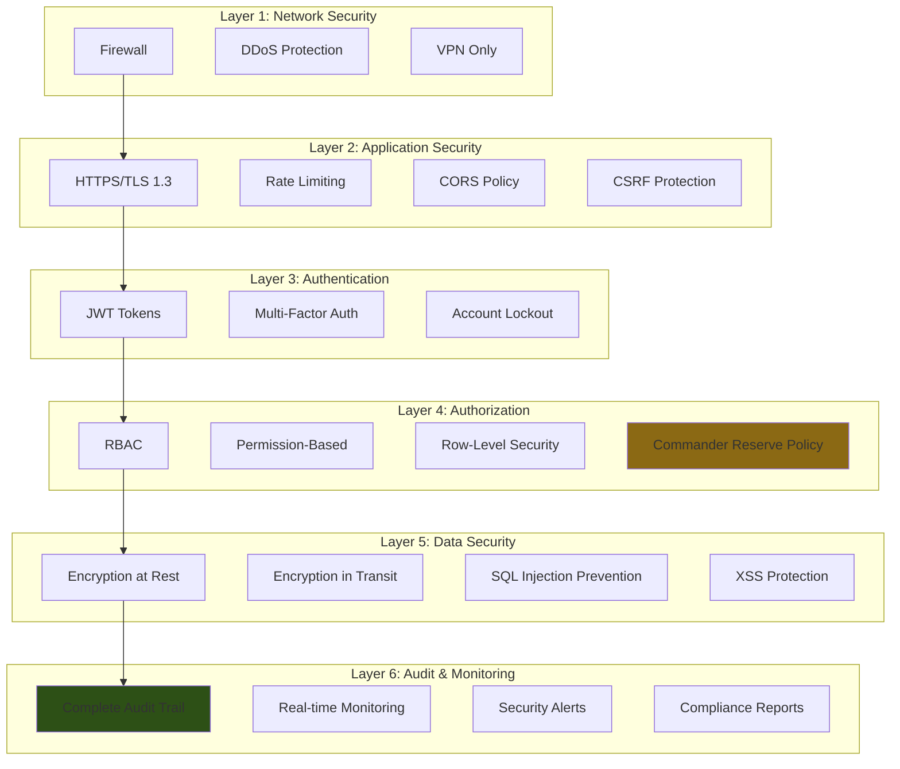

# Security and Compliance Requirements
## Enginerring Industrial Complex Inventory Command System

**Document Version:** 1.0  
**Security Date:** January 30, 2025  
**Author:** Architect Mode

---

## Table of Contents

1. [Security Overview](#1-security-overview)
2. [Authentication & Authorization](#2-authentication--authorization)
3. [Commander's Reserve Security](#3-commanders-reserve-security)
4. [Data Protection](#4-data-protection)
5. [Audit & Compliance](#5-audit--compliance)
6. [Network Security](#6-network-security)
7. [Incident Response](#7-incident-response)
8. [Compliance Standards](#8-compliance-standards)

---

## 1. Security Overview

### 1.1 Security Principles

The system follows **Defense in Depth** principle with multiple security layers:



---

### 1.2 Security Threat Model

| Threat | Description | Likelihood | Impact | Mitigation |
|--------|-------------|------------|---------|------------|
| **Unauthorized Access** | Non-authorized users accessing system | Medium | High | Strong authentication, RBAC |
| **Commander's Reserve Bypass** | Accessing reserve without commander approval | Low | Critical | Multi-layer authorization, DB constraints |
| **SQL Injection** | Injecting malicious SQL | Low | Critical | Parameterized queries, ORM |
| **XSS Attacks** | Injecting malicious scripts | Medium | Medium | Input sanitization, CSP |
| **CSRF Attacks** | Cross-site request forgery | Low | Medium | Anti-CSRF tokens |
| **Data Breach** | Unauthorized data access | Low | Critical | Encryption, audit trail |
| **Denial of Service** | Overwhelming system | Medium | High | Rate limiting, DDoS protection |
| **Insider Threat** | Authorized user abusing access | Medium | High | Audit trail, least privilege |
| **Man-in-the-Middle** | Intercepting communications | Low | High | TLS 1.3, certificate pinning |

---

## 2. Authentication & Authorization

### 2.1 Authentication Requirements

#### **2.1.1 Password Policy**

```csharp
public class PasswordPolicy
{
    public const int MinimumLength = 12;
    public const int MaximumLength = 128;
    public const int RequiredUniqueChars = 3;
    public const int PasswordHistoryCount = 5;
    public const int PasswordExpiryDays = 90;
    public const int FailedAttemptLockout = 5;
    public const int LockoutDurationMinutes = 30;
    
    public static ValidationResult ValidatePassword(string password)
    {
        var errors = new List<string>();
        
        // Length
        if (password.Length < MinimumLength)
            errors.Add($"Password must be at least {MinimumLength} characters");
        
        if (password.Length > MaximumLength)
            errors.Add($"Password must not exceed {MaximumLength} characters");
        
        // Complexity
        if (!password.Any(char.IsUpper))
            errors.Add("Password must contain at least one uppercase letter");
        
        if (!password.Any(char.IsLower))
            errors.Add("Password must contain at least one lowercase letter");
        
        if (!password.Any(char.IsDigit))
            errors.Add("Password must contain at least one digit");
        
        if (!password.Any(c => !char.IsLetterOrDigit(c)))
            errors.Add("Password must contain at least one special character");
        
        // Common passwords
        if (IsCommonPassword(password))
            errors.Add("Password is too common. Choose a stronger password.");
        
        // Personal information
        if (ContainsPersonalInfo(password))
            errors.Add("Password must not contain personal information");
        
        return new ValidationResult
        {
            IsValid = errors.Count == 0,
            Errors = errors
        };
    }
}
```

---

#### **2.1.2 JWT Token Configuration**

```csharp
public class JwtTokenConfiguration
{
    public const string SecretKey = "<256-bit-secret-key>";
    public const string Issuer = "https://inventory.eic.internal";
    public const string Audience = "https://inventory.eic.internal";
    public const int AccessTokenExpiryMinutes = 15;
    public const int RefreshTokenExpiryDays = 7;
    public const int ClockSkewMinutes = 5;
    
    public static string GenerateAccessToken(ApplicationUser user)
    {
        var claims = new List<Claim>
        {
            new Claim(JwtRegisteredClaimNames.Sub, user.Id.ToString()),
            new Claim(JwtRegisteredClaimNames.UniqueName, user.UserName),
            new Claim(JwtRegisteredClaimNames.Email, user.Email),
            new Claim(JwtRegisteredClaimNames.Jti, Guid.NewGuid().ToString()),
            new Claim(ClaimTypes.Role, user.Role.ToString()),
            new Claim("Rank", user.Rank.ToString()),
            new Claim("FactoryId", user.FactoryId?.ToString() ?? string.Empty),
            new Claim("DepartmentId", user.DepartmentId?.ToString() ?? string.Empty)
        };
        
        var key = new SymmetricSecurityKey(Encoding.UTF8.GetBytes(SecretKey));
        var credentials = new SigningCredentials(key, SecurityAlgorithms.HmacSha256);
        
        var token = new JwtSecurityToken(
            issuer: Issuer,
            audience: Audience,
            claims: claims,
            expires: DateTime.UtcNow.AddMinutes(AccessTokenExpiryMinutes),
            signingCredentials: credentials
        );
        
        return new JwtSecurityTokenHandler().WriteToken(token);
    }
}
```

---

#### **2.1.3 Account Lockout Policy

```csharp
public class AccountLockoutService
{
    private const int MaxFailedAttempts = 5;
    private const int LockoutDurationMinutes = 30;
    
    public async Task<bool> IsLockedOutAsync(string userId)
    {
        // Check Redis for lockout
        var lockoutKey = $"lockout:{userId}";
        var lockoutEnd = await _cache.GetAsync<DateTime>(lockoutKey);
        
        return lockoutEnd.HasValue && lockoutEnd.Value > DateTime.UtcNow;
    }
    
    public async Task RecordFailedAttemptAsync(string userId)
    {
        var attemptsKey = $"attempts:{userId}";
        var attempts = await _cache.GetAsync<int>(attemptsKey) ?? 0;
        attempts++;
        
        if (attempts >= MaxFailedAttempts)
        {
            // Lock account
            var lockoutKey = $"lockout:{userId}";
            var lockoutEnd = DateTime.UtcNow.AddMinutes(LockoutDurationMinutes);
            await _cache.SetAsync(lockoutKey, lockoutEnd, TimeSpan.FromMinutes(LockoutDurationMinutes));
            
            // Log security event
            _logger.LogWarning("Account locked for user {UserId} after {Attempts} failed attempts", userId, attempts);
        }
        else
        {
            await _cache.SetAsync(attemptsKey, attempts, TimeSpan.FromMinutes(15));
        }
    }
    
    public async Task ResetFailedAttemptsAsync(string userId)
    {
        var attemptsKey = $"attempts:{userId}";
        var lockoutKey = $"lockout:{userId}";
        
        await _cache.RemoveAsync(attemptsKey);
        await _cache.RemoveAsync(lockoutKey);
    }
}
```

---

### 2.2 Authorization Requirements

#### **2.2.1 Role-Based Access Control (RBAC)**

```csharp
public enum UserRole
{
    COMPLEX_COMMANDER,      // Full access to all data
    FACTORY_COMMANDER,      // Full access to factory data
    CENTRAL_WAREHOUSE_KEEPER,  // Manage central warehouse
    FACTORY_WAREHOUSE_KEEPER,  // Manage factory warehouse
    DEPARTMENT_HEAD,         // Manage department
    PROJECT_MANAGER,          // Manage projects
    OFFICER,                 // Supervise operations
    CIVIL_ENGINEER,          // Technical work
    WORKER,                  // Read-only access
    AUDITOR                   // Read-only access to all data
}

public static class RolePermissions
{
    private static readonly Dictionary<UserRole, List<string>> _permissions = new()
    {
        [UserRole.COMPLEX_COMMANDER] = new()
        {
            "view_all_factories",
            "view_all_inventory",
            "create_requisition",
            "approve_requisition_general",
            "approve_requisition_reserve",
            "access_commander_reserve",
            "issue_materials",
            "create_transfer",
            "approve_transfer",
            "create_project",
            "manage_project",
            "view_all_projects",
            "manage_users",
            "view_audit_trail",
            "export_reports"
        },
        
        [UserRole.FACTORY_COMMANDER] = new()
        {
            "view_factory_inventory",
            "view_factory_projects",
            "create_requisition",
            "approve_requisition_general",
            "approve_requisition_reserve",
            "access_commander_reserve",
            "issue_materials",
            "create_transfer",
            "approve_transfer",
            "create_project",
            "manage_project",
            "manage_factory_users",
            "view_factory_audit_trail",
            "export_reports"
        },
        
        [UserRole.FACTORY_WAREHOUSE_KEEPER] = new()
        {
            "view_warehouse_inventory",
            "create_requisition",
            "approve_requisition_general",
            "issue_materials",
            "view_commander_reserve",
            "adjust_inventory",
            "view_warehouse_audit_trail"
        },
        
        [UserRole.DEPARTMENT_HEAD] = new()
        {
            "view_department_data",
            "view_factory_inventory",
            "create_requisition",
            "view_department_audit_trail"
        },
        
        [UserRole.PROJECT_MANAGER] = new()
        {
            "view_own_projects",
            "view_factory_inventory",
            "create_requisition",
            "update_project",
            "view_project_allocations",
            "record_consumption"
        },
        
        [UserRole.WORKER] = new()
        {
            "view_assigned_tasks",
            "record_consumption"
        },
        
        [UserRole.AUDITOR] = new()
        {
            "view_all_data",
            "view_audit_trail",
            "export_reports"
        }
    };
    
    public static bool HasPermission(this UserRole role, string permission)
    {
        return _permissions.TryGetValue(role, out var permissions) && 
               permissions.Contains(permission);
    }
}
```

---

#### **2.2.2 Row-Level Security**

```csharp
public class FactoryAccessRequirement : IAuthorizationRequirement
{
    public string FactoryId { get; }
    
    public FactoryAccessRequirement(string factoryId)
    {
        FactoryId = factoryId;
    }
}

public class FactoryAccessHandler : AuthorizationHandler<FactoryAccessRequirement>
{
    private readonly ICurrentUserService _currentUser;
    
    protected override Task HandleRequirementAsync(
        AuthorizationHandlerContext context,
        FactoryAccessRequirement requirement,
        CancellationToken cancellationToken)
    {
        var userFactoryId = _currentUser.FactoryId;
        var userRole = _currentUser.Role;
        
        // Complex commanders can access all factories
        if (userRole == UserRole.COMPLEX_COMMANDER)
        {
            context.Succeed(requirement);
            return Task.CompletedTask;
        }
        
        // Users can only access their own factory
        if (userFactoryId?.ToString() == requirement.FactoryId)
        {
            context.Succeed(requirement);
            return Task.CompletedTask;
        }
        
        // Auditors can access all factories
        if (userRole == UserRole.AUDITOR)
        {
            context.Succeed(requirement);
            return Task.CompletedTask;
        }
        
        // Access denied
        context.Fail(new AuthorizationFailureReason(this)
        {
            ErrorMessage = "You do not have permission to access this factory",
            Data = new { RequiredFactoryId = requirement.FactoryId, UserFactoryId = userFactoryId }
        });
        
        return Task.CompletedTask;
    }
}
```

---

## 3. Commander's Reserve Security ⭐

### 3.1 Multi-Layer Protection

Commander's Reserve requires **defense in depth** with multiple authorization layers:

```mermaid
graph TB
    subgraph "Layer 1: API Authorization"
        A1[AccessCommanderReserve Policy]
        A2[Role Check: Commander Only]
    end
    
    subgraph "Layer 2: Domain Validation"
        D1[CanAccessReserve Method]
        D2[Domain Exception on Unauthorized]
    end
    
    subgraph "Layer 3: Database Constraints"
        DB1[CHK_ReserveApproval Constraint]
        DB2[CommanderApprovalId NOT NULL]
    end
    
    subgraph "Layer 4: Audit Trail"
        AD1[Log All Reserve Access Attempts]
        AD2[Log Successful Access]
        AD3[Log Failed Access]
        AD4[Alert on Suspicious Activity]
    end
    
    subgraph "Layer 5: Monitoring"
        M1[Real-time Alerts]
        M2[Compliance Reports]
        M3[Usage Analytics]
    end
    
    A1 --> A2
    A2 --> D1
    D1 --> D2
    D2 --> DB1
    DB1 --> DB2
    DB2 --> AD1
    AD1 --> M1
    AD1 --> M2
    AD1 --> M3
    
    style A2 fill:#8b6914
    style D2 fill:#7a1a1a
    style DB1 fill:#2d5016
    style AD1 fill:#1a4d2e
```



---

### 3.2 Domain Layer Protection

```csharp
public class InventoryItem : AggregateRoot
{
    public void ConsumeStock(decimal amount, bool fromReserve, UserRank requestorRank)
    {
        if (fromReserve)
        {
            // Layer 1: Domain validation
            if (!CanAccessReserve(requestorRank))
                throw new DomainException("Unauthorized access to Commander Reserve");
            
            // Layer 2: Check availability
            if (CommanderReserve.Value < amount)
                throw new DomainException("Insufficient Reserve Stock");
            
            // Layer 3: Execute consumption
            CommanderReserve = CommanderReserve.Subtract(amount);
            
            // Layer 4: Log domain event
            AddDomainEvent(new CommanderReserveAccessedEvent(
                this.Id,
                amount,
                requestorRank,
                DateTime.UtcNow
            ));
        }
        else
        {
            // General stock consumption
            if (GeneralStock.Value < amount)
                throw new DomainException("Insufficient General Stock");
            
            GeneralStock = GeneralStock.Subtract(amount);
        }
        
        UpdateTotalValue();
    }
    
    private bool CanAccessReserve(UserRank rank)
    {
        // Only commanders can access reserve
        return rank == UserRank.FACTORY_COMMANDER || 
               rank == UserRank.COMPLEX_COMMANDER ||
               rank == UserRank.LIEUTENANT_GENERAL ||
               rank == UserRank.MAJOR_GENERAL ||
               rank == UserRank.BRIGADIER ||
               rank == UserRank.GENERAL;
    }
}
```

---

### 3.3 Database Constraint Protection

```sql
-- Commander's Reserve approval constraint
ALTER TABLE InventoryTransactions
ADD CONSTRAINT CHK_CommanderReserveApproval
CHECK (
    IsFromCommanderReserve = FALSE OR
    (IsFromCommanderReserve = TRUE AND CommanderApprovalId IS NOT NULL)
);

-- Ensure commander approval is from authorized role
ALTER TABLE InventoryTransactions
ADD CONSTRAINT CHK_CommanderApprovalRole
CHECK (
    IsFromCommanderReserve = FALSE OR
    EXISTS (
        SELECT 1 FROM Users 
        WHERE Id = CommanderApprovalId 
        AND Role IN ('FACTORY_COMMANDER', 'COMPLEX_COMMANDER')
    )
);

-- Prevent negative reserve
ALTER TABLE InventoryRecords
ADD CONSTRAINT CHK_NonNegativeReserve
CHECK (CommanderReserveQuantity >= 0);
```

---

### 3.4 API Policy Protection

```csharp
// Commander's Reserve authorization policy
services.AddAuthorization(options =>
{
    options.AddPolicy("AccessCommanderReserve", policy =>
        policy.RequireAssertion(context =>
        {
            var role = context.User.FindFirst(ClaimTypes.Role)?.Value;
            var rank = context.User.FindFirst("Rank")?.Value;
            
            // Only commanders can access
            var isCommander = role == UserRole.FACTORY_COMMANDER.ToString() ||
                              role == UserRole.COMPLEX_COMMANDER.ToString();
            
            if (!isCommander)
            {
                // Log unauthorized access attempt
                _logger.LogWarning(
                    "Unauthorized attempt to access Commander's Reserve by user {UserId} with role {Role}",
                    context.User.FindFirst(ClaimTypes.NameIdentifier)?.Value,
                    role
                );
                
                return false;
            }
            
            return true;
        }));
});

// Controller usage
[HttpPost("reserve/release")]
[Authorize(Policy = "AccessCommanderReserve")]
public async Task<IActionResult> ReleaseCommanderReserve(
    [FromBody] ReserveReleaseRequest request)
{
    // Only commanders reach this endpoint
    // Additional validation in handler
    var result = await _mediator.Send(request);
    
    if (result.IsFailure)
        return BadRequest(result.Error);
    
    return Ok(result);
}
```

---

### 3.5 Audit Trail for Reserve Access

```csharp
public class ReserveAccessAuditService
{
    private readonly IAuditLogRepository _auditLog;
    private readonly IAlertService _alertService;
    
    public async Task LogReserveAccessAsync(
        Guid inventoryItemId,
        decimal quantity,
        Guid accessedBy,
        UserRank accessRank,
        DateTime accessedAt,
        bool wasSuccessful,
        string? failureReason = null)
    {
        // Create audit log entry
        var auditLog = new AuditLogEntry
        {
            Action = wasSuccessful ? "COMMANDER_RESERVE_ACCESSED" : "COMMANDER_RESERVE_ACCESS_DENIED",
            EntityId = inventoryItemId,
            EntityType = "InventoryItem",
            UserId = accessedBy,
            UserRole = accessRank.ToString(),
            ActionData = JsonSerializer.Serialize(new
            {
                Quantity = quantity,
                AccessRank = accessRank,
                AccessedAt = accessedAt,
                WasSuccessful = wasSuccessful,
                FailureReason = failureReason
            }),
            Timestamp = accessedAt,
            IpAddress = _currentUser.IpAddress,
            UserAgent = _currentUser.UserAgent
        };
        
        await _auditLog.AddAsync(auditLog);
        
        // Alert on suspicious activity
        if (!wasSuccessful || accessRank < UserRank.FACTORY_COMMANDER)
        {
            await _alertService.SendSecurityAlertAsync(new SecurityAlert
            {
                AlertType = "COMMANDER_RESERVE_ACCESS_ATTEMPT",
                Severity = wasSuccessful ? "HIGH" : "CRITICAL",
                Description = $"Reserve access attempt by {accessRank}",
                UserId = accessedBy,
                Timestamp = accessedAt
            });
        }
        
        // Notify commander
        if (wasSuccessful)
        {
            await _notificationService.NotifyCommanderAsync(new CommanderNotification
            {
                Type = "RESERVE_ACCESSED",
                Message = $"Reserve stock accessed: {quantity}",
                AccessedBy = accessedBy,
                Timestamp = accessedAt
            });
        }
    }
}
```

---

## 4. Data Protection

### 4.1 Encryption

#### **4.1.1 Encryption at Rest**

```csharp
public class EncryptionService
{
    private readonly byte[] _encryptionKey;
    private readonly byte[] _iv;
    
    public EncryptionService(IConfiguration configuration)
    {
        // Load encryption key from secure vault
        _encryptionKey = Convert.FromBase64String(configuration["Encryption:Key"]);
        _iv = Convert.FromBase64String(configuration["Encryption:IV"]);
    }
    
    public string Encrypt(string plainText)
    {
        using var aes = Aes.Create();
        aes.Key = _encryptionKey;
        aes.IV = _iv;
        aes.Mode = CipherMode.CBC;
        aes.Padding = PaddingMode.PKCS7;
        
        using var encryptor = aes.CreateEncryptor();
        using var msEncrypt = new MemoryStream();
        using (var csEncrypt = new CryptoStream(msEncrypt, encryptor, CryptoStreamMode.Write))
        using (var swEncrypt = new StreamWriter(csEncrypt))
        {
            swEncrypt.Write(plainText);
        }
        
        return Convert.ToBase64String(msEncrypt.ToArray());
    }
    
    public string Decrypt(string cipherText)
    {
        using var aes = Aes.Create();
        aes.Key = _encryptionKey;
        aes.IV = _iv;
        aes.Mode = CipherMode.CBC;
        aes.Padding = PaddingMode.PKCS7;
        
        using var decryptor = aes.CreateDecryptor();
        using var msDecrypt = new MemoryStream(Convert.FromBase64String(cipherText));
        using (var csDecrypt = new CryptoStream(msDecrypt, decryptor, CryptoStreamMode.Read))
        using (var srDecrypt = new StreamReader(csDecrypt))
        {
            return srDecrypt.ReadToEnd();
        }
    }
}
```

---

#### **4.1.2 Encryption in Transit**

**TLS Configuration:**
```csharp
public class TlsConfiguration
{
    public const int TlsVersion = 3; // TLS 1.3
    public const string[] AllowedCipherSuites = new[]
    {
        "TLS_AES_256_GCM_SHA384",
        "TLS_CHACHA20_POLY1305_SHA256",
        "TLS_AES_128_GCM_SHA256"
    };
    
    public static void ConfigureTls(KestrelConfigurationOptions options)
    {
        options.ConfigureHttpsDefaults(httpsOptions =>
        {
            httpsOptions.SslProtocols = SslProtocols.Tls13;
            httpsOptions.ClientCertificateMode = ClientCertificateMode.RequireCertificate;
            httpsOptions.CheckCertificateRevocation = true;
        });
    }
}
```

---

### 4.2 Input Validation

```csharp
public class InputSanitizationService
{
    // SQL Injection prevention
    public static string SanitizeForSql(string input)
    {
        // Remove potential SQL injection patterns
        var sanitized = Regex.Replace(input, @"[';""--]|/\*|\*/", string.Empty, RegexOptions.IgnoreCase);
        return sanitized;
    }
    
    // XSS prevention
    public static string SanitizeForXss(string input)
    {
        // Encode HTML entities
        var sanitized = System.Web.HttpUtility.HtmlEncode(input);
        return sanitized;
    }
    
    // Path traversal prevention
    public static string SanitizeFilePath(string path)
    {
        // Remove directory traversal patterns
        var sanitized = Regex.Replace(path, @"\.\.\/", string.Empty);
        return sanitized;
    }
    
    // File upload validation
    public static bool IsValidFileUpload(IFormFile file)
    {
        // Check file extension
        var allowedExtensions = new[] { ".pdf", ".xlsx", ".csv", ".jpg", ".png" };
        var fileExtension = Path.GetExtension(file.FileName).ToLowerInvariant();
        
        if (!allowedExtensions.Contains(fileExtension))
            return false;
        
        // Check file size (max 10MB)
        if (file.Length > 10 * 1024 * 1024)
            return false;
        
        // Check file signature
        var fileSignature = GetFileSignature(file);
        var allowedSignatures = new[] { "PDF", "XLSX", "CSV", "JPEG", "PNG" };
        
        return allowedSignatures.Contains(fileSignature);
    }
}
```

---

### 4.3 Content Security Policy (CSP)

```csharp
public class SecurityHeadersMiddleware
{
    public async Task InvokeAsync(HttpContext context, RequestDelegate next)
    {
        // Content Security Policy
        context.Response.Headers.Append("Content-Security-Policy",
            "default-src 'self'; " +
            "script-src 'self' 'unsafe-inline' 'unsafe-eval'; " +
            "style-src 'self' 'unsafe-inline'; " +
            "img-src 'self' data:; " +
            "font-src 'self'; " +
            "connect-src 'self'; " +
            "frame-ancestors 'none'; " +
            "base-uri 'self'; " +
            "form-action 'self';"
        );
        
        // X-Frame-Options
        context.Response.Headers.Append("X-Frame-Options", "DENY");
        
        // X-Content-Type-Options
        context.Response.Headers.Append("X-Content-Type-Options", "nosniff");
        
        // X-XSS-Protection
        context.Response.Headers.Append("X-XSS-Protection", "1; mode=block");
        
        // Strict-Transport-Security
        context.Response.Headers.Append("Strict-Transport-Security", "max-age=31536000; includeSubDomains");
        
        // Referrer-Policy
        context.Response.Headers.Append("Referrer-Policy", "strict-origin-when-cross-origin");
        
        // Permissions-Policy
        context.Response.Headers.Append("Permissions-Policy", "geolocation=(), microphone=(), camera=()");
        
        await next();
    }
}
```

---

## 5. Audit & Compliance

### 5.1 Audit Trail Requirements

**Audit Log Schema:**
```sql
CREATE TABLE AuditLogs (
    Id UUID PRIMARY KEY DEFAULT gen_random_uuid(),
    Action VARCHAR(100) NOT NULL,
    EntityId UUID,
    EntityType VARCHAR(100),
    UserId UUID NOT NULL REFERENCES Users(Id),
    UserRole VARCHAR(50) NOT NULL,
    ActionData JSONB,
    Timestamp TIMESTAMP NOT NULL DEFAULT CURRENT_TIMESTAMP,
    IpAddress INET,
    UserAgent TEXT,
    Success BOOLEAN NOT NULL,
    FailureReason TEXT,
    Severity VARCHAR(20)
);

CREATE INDEX IX_AuditLogs_Timestamp ON AuditLogs(Timestamp DESC);
CREATE INDEX IX_AuditLogs_UserId ON AuditLogs(UserId);
CREATE INDEX IX_AuditLogs_Action ON AuditLogs(Action);
```

---

### 5.2 Audit Log Events

**Critical Events to Audit:**
```csharp
public enum AuditAction
{
    // Authentication
    USER_LOGIN,
    USER_LOGOUT,
    USER_LOGIN_FAILED,
    PASSWORD_CHANGED,
    PASSWORD_RESET,
    ACCOUNT_LOCKED,
    
    // Authorization
    UNAUTHORIZED_ACCESS_ATTEMPT,
    PERMISSION_DENIED,
    ROLE_CHANGED,
    
    // Commander's Reserve ⭐
    COMMANDER_RESERVE_ACCESSED,
    COMMANDER_RESERVE_ACCESS_DENIED,
    COMMANDER_RESERVE_RELEASED,
    COMMANDER_RESERVE_DEPLETED,
    
    // Inventory
    INVENTORY_CREATED,
    INVENTORY_UPDATED,
    INVENTORY_DELETED,
    STOCK_ADJUSTED,
    STOCK_RECEIVED,
    STOCK_ISSUED,
    STOCK_TRANSFERRED,
    
    // Requisitions
    REQUISITION_CREATED,
    REQUISITION_SUBMITTED,
    REQUISITION_APPROVED,
    REQUISITION_REJECTED,
    REQUISITION_FULFILLED,
    
    // Projects
    PROJECT_CREATED,
    PROJECT_UPDATED,
    MATERIAL_ALLOCATED,
    MATERIAL_CONSUMED,
    
    // Data
    DATA_EXPORTED,
    DATA_IMPORTED,
    DATA_MIGRATED,
    
    // System
    SYSTEM_CONFIG_CHANGED,
    SECURITY_ALERT,
    COMPLIANCE_VIOLATION
}
```

---

### 5.3 Audit Log Retention

**Retention Policy:**
```csharp
public class AuditLogRetentionPolicy
{
    public const int ActiveRetentionDays = 365;      // 1 year in active DB
    public const int ArchiveRetentionYears = 7;      // 7 years in archive
    public const int TotalRetentionYears = 7;         // Military standard
    
    public static async Task ApplyRetentionPolicyAsync(IAuditLogRepository repository)
    {
        // Archive logs older than 1 year
        var cutoffDate = DateTime.UtcNow.AddDays(-ActiveRetentionDays);
        var logsToArchive = await repository.GetLogsBeforeAsync(cutoffDate);
        
        foreach (var log in logsToArchive)
        {
            await ArchiveToColdStorageAsync(log);
            await repository.MarkAsArchivedAsync(log.Id);
        }
        
        // Delete logs older than 7 years
        var deleteCutoffDate = DateTime.UtcNow.AddYears(-TotalRetentionYears);
        var logsToDelete = await repository.GetArchivedLogsBeforeAsync(deleteCutoffDate);
        
        foreach (var log in logsToDelete)
        {
            await repository.DeleteAsync(log.Id);
        }
    }
    
    private static async Task ArchiveToColdStorageAsync(AuditLogEntry log)
    {
        // Write to WORM (Write-Once-Read-Many) storage
        await _wormStorage.WriteAsync($"audit/{log.Timestamp:yyyy-MM-dd}/{log.Id}.json", log);
    }
}
```

---

### 5.4 Compliance Reporting

**Compliance Reports:**
```csharp
public class ComplianceReportService
{
    public async Task<ComplianceReport> GenerateQuarterlyReportAsync(DateTime quarterStart, DateTime quarterEnd)
    {
        var report = new ComplianceReport
        {
            PeriodStart = quarterStart,
            PeriodEnd = quarterEnd,
            GeneratedAt = DateTime.UtcNow,
            GeneratedBy = _currentUser.UserId
        };
        
        // 1. Commander's Reserve Access Report
        report.ReserveAccesses = await GetReserveAccessReportAsync(quarterStart, quarterEnd);
        
        // 2. Unauthorized Access Attempts
        report.UnauthorizedAttempts = await GetUnauthorizedAccessAttemptsAsync(quarterStart, quarterEnd);
        
        // 3. Data Export Report
        report.DataExports = await GetDataExportsAsync(quarterStart, quarterEnd);
        
        // 4. User Activity Report
        report.UserActivities = await GetUserActivityReportAsync(quarterStart, quarterEnd);
        
        // 5. System Changes Report
        report.SystemChanges = await GetSystemChangesAsync(quarterStart, quarterEnd);
        
        // 6. Security Incidents Report
        report.SecurityIncidents = await GetSecurityIncidentsAsync(quarterStart, quarterEnd);
        
        return report;
    }
}
```

---

## 6. Network Security

### 6.1 Firewall Rules

**Allowed Traffic:**
```yaml
# Firewall Rules
inbound:
  - source: 10.0.0.0/8  # Military network
    destination: 10.0.1.0/24  # Application servers
    ports:
      - 443/tcp  # HTTPS
      - 22/tcp  # SSH (admin only)
    action: allow
    
  - source: 0.0.0.0/0
    destination: 10.0.1.0/24
    ports:
      - 443/tcp
    action: deny  # Block external access
    
outbound:
  - source: 10.0.1.0/24
    destination: any
    ports:
      - 443/tcp  # HTTPS
      - 5432/tcp  # PostgreSQL
      - 6379/tcp  # Redis
    action: allow
```

---

### 6.2 DDoS Protection

```csharp
public class DdosProtectionMiddleware
{
    private const int MaxRequestsPerMinute = 1000;
    private const int MaxRequestsPerSecond = 20;
    private const int BlockDurationMinutes = 30;
    
    private readonly IRateLimitStore _rateLimitStore;
    
    public async Task InvokeAsync(HttpContext context, RequestDelegate next)
    {
        var clientIp = context.Connection.RemoteIpAddress?.ToString();
        
        // Check rate limit
        var requestCount = await _rateLimitStore.GetRequestCountAsync(clientIp);
        
        if (requestCount >= MaxRequestsPerMinute)
        {
            // Block IP
            await _rateLimitStore.BlockIpAsync(clientIp, TimeSpan.FromMinutes(BlockDurationMinutes));
            
            _logger.LogWarning("IP {IpAddress} blocked due to rate limiting", clientIp);
            
            context.Response.StatusCode = 429; // Too Many Requests
            await context.Response.WriteAsync("Rate limit exceeded");
            return;
        }
        
        await next();
    }
}
```

---

### 6.3 VPN Access Only

**VPN Configuration:**
```yaml
# VPN Requirements
vpn:
  required: true
  allowed_protocols:
    - OpenVPN
    - IPsec
  authentication:
    - Multi-factor authentication
    - Military ID verification
  session_timeout: 8 hours
  logging:
    - Connection attempts
    - User activities
    - Data transferred
```

---

## 7. Incident Response

### 7.1 Incident Classification

| Severity | Description | Response Time | Escalation |
|----------|-------------|---------------|------------|
| **Critical** | System breach, data loss, reserve bypass | < 15 minutes | CIO, Security Team |
| **High** | Unauthorized access, system outage | < 1 hour | IT Director, Security Team |
| **Medium** | Security violation, performance issue | < 4 hours | IT Manager |
| **Low** | Minor security issue, policy violation | < 24 hours | Team Lead |

---

### 7.2 Incident Response Process

```mermaid
graph TB
    I1[Incident Detected]
    I2[Classify Severity]
    I3[Notify Stakeholders]
    I4[Contain Incident]
    I5[Eradicate Threat]
    I6[Recover Systems]
    I7[Post-Incident Review]
    I8[Lessons Learned]
    
    I1 --> I2
    I2 --> I3
    I3 --> I4
    I4 --> I5
    I5 --> I6
    I6 --> I7
    I7 --> I8
    
    style I1 fill:#7a1a1a
    style I2 fill:#8b6914
    style I4 fill:#2d5016
    style I5 fill:#1a3d5d
    style I8 fill:#1a4d2e
```



---

### 7.3 Incident Response Plan

```csharp
public class IncidentResponsePlan
{
    public async Task HandleIncidentAsync(SecurityIncident incident)
    {
        // 1. Classification
        var severity = ClassifyIncident(incident);
        incident.Severity = severity;
        
        // 2. Notification
        await NotifyStakeholdersAsync(incident, severity);
        
        // 3. Containment
        await ContainIncidentAsync(incident);
        
        // 4. Eradication
        await EradicateThreatAsync(incident);
        
        // 5. Recovery
        await RecoverSystemsAsync(incident);
        
        // 6. Post-Incident Review
        await ConductPostIncidentReviewAsync(incident);
        
        // 7. Documentation
        await DocumentIncidentAsync(incident);
    }
    
    private IncidentSeverity ClassifyIncident(SecurityIncident incident)
    {
        return incident.Type switch
        {
            IncidentType.COMMANDER_RESERVE_BYPASS => IncidentSeverity.CRITICAL,
            IncidentType.DATA_BREACH => IncidentSeverity.CRITICAL,
            IncidentType.UNAUTHORIZED_ACCESS => IncidentSeverity.HIGH,
            IncidentType.DOS_ATTACK => IncidentSeverity.HIGH,
            IncidentType.SECURITY_VIOLATION => IncidentSeverity.MEDIUM,
            _ => IncidentSeverity.LOW
        };
    }
    
    private async Task NotifyStakeholdersAsync(SecurityIncident incident, IncidentSeverity severity)
    {
        var recipients = GetStakeholders(severity);
        
        foreach (var recipient in recipients)
        {
            await _notificationService.SendAlertAsync(new SecurityAlert
            {
                AlertType = "SECURITY_INCIDENT",
                Severity = severity.ToString(),
                Description = incident.Description,
                IncidentId = incident.Id,
                Timestamp = DateTime.UtcNow
            });
        }
    }
    
    private async Task ContainIncidentAsync(SecurityIncident incident)
    {
        switch (incident.Type)
        {
            case IncidentType.UNAUTHORIZED_ACCESS:
                // Revoke compromised tokens
                await RevokeUserTokensAsync(incident.UserId);
                // Lock affected accounts
                await LockUserAccountAsync(incident.UserId);
                break;
                
            case IncidentType.DOS_ATTACK:
                // Block malicious IP
                await _firewall.BlockIpAsync(incident.IpAddress);
                // Enable rate limiting
                await _rateLimiter.EnableStrictModeAsync();
                break;
        }
    }
}
```

---

## 8. Compliance Standards

### 8.1 Military Standards

**Egyptian Military Standards:**
- Data retention: 7 years
- Audit trail: Complete and immutable
- Access control: Role-based with least privilege
- Encryption: AES-256 for sensitive data
- Authentication: Multi-factor for privileged access
- Backup: Daily with off-site storage
- Classification: Internal use only

---

### 8.2 International Standards

**ISO 27001:2013 (Information Security):**
- A.9 Access Control
- A.10 Cryptography
- A.12 Operations Security
- A.16 Information Security Incident Management

**ISO 27018:2014 (Data Protection):**
- PII protection
- Data retention
- Right to erasure
- Data portability

**NIST Cybersecurity Framework:**
- Identify
- Protect
- Detect
- Respond
- Recover

---

### 8.3 Compliance Checklist

| Standard | Requirement | Status | Evidence |
|----------|-------------|---------|----------|
| **Egyptian Military** | 7-year data retention | ✅ | Audit log retention policy |
| **Egyptian Military** | Complete audit trail | ✅ | All actions logged |
| **Egyptian Military** | Role-based access | ✅ | RBAC implemented |
| **ISO 27001** | Access control | ✅ | Multi-layer authorization |
| **ISO 27001** | Cryptography | ✅ | AES-256 encryption |
| **ISO 27001** | Incident management | ✅ | Incident response plan |
| **ISO 27018** | Data protection | ✅ | Encryption at rest/transit |
| **NIST CSF** | Detect | ✅ | Real-time monitoring |
| **NIST CSF** | Respond | ✅ | Automated alerts |

---

## 9. Conclusion

This security and compliance document provides:

✅ **Multi-layer security architecture** with defense in depth  
✅ **Strong authentication** with password policies and JWT tokens  
✅ **Comprehensive authorization** with RBAC and row-level security  
✅ **Commander's Reserve protection** with multiple layers  
✅ **Data protection** with encryption and input validation  
✅ **Complete audit trail** with retention policy  
✅ **Network security** with firewall and DDoS protection  
✅ **Incident response** plan with classification  
✅ **Compliance** with military and international standards  

**Key Security Features:**
- Defense in depth with 6 security layers
- Commander's Reserve protected at API, domain, and database levels
- Complete audit trail with 7-year retention
- Real-time monitoring and alerting
- Incident response plan with 15-minute critical response
- Compliance with Egyptian Military and ISO standards

**Next Steps:**
1. Review and approve security requirements
2. Implement security controls during development
3. Conduct security testing before deployment
4. Perform regular security audits
5. Update security policies as needed

---

**Document Status:** Ready for Implementation  
**Next Review:** Quarterly security audit
