# Deployment and Infrastructure Plan
## Enginerring Industrial Complex Inventory Command System

**Document Version:** 1.0  
**Deployment Date:** January 30, 2025  
**Author:** Architect Mode

---

## Table of Contents

1. [Infrastructure Overview](#1-infrastructure-overview)
2. [On-Premise Architecture](#2-on-premise-architecture)
3. [Kubernetes Deployment](#3-kubernetes-deployment)
4. [Database Infrastructure](#4-database-infrastructure)
5. [Monitoring & Logging](#5-monitoring--logging)
6. [Backup & Disaster Recovery](#6-backup--disaster-recovery)
7. [Security Infrastructure](#7-security-infrastructure)
8. [Deployment Process](#8-deployment-process)

---

## 1. Infrastructure Overview

### 1.1 High-Level Architecture

```mermaid
graph TB
    subgraph "External"
        Users[Users]
        Suppliers[Suppliers]
    end
    
    subgraph "Network Layer"
        FW[Firewall]
        LB[Load Balancer]
        DDoS[DDoS Protection]
    end
    
    subgraph "Application Layer"
        K8s[Kubernetes Cluster]
        API[API Pods]
        FE[Frontend Pods]
        Workers[Worker Pods]
    end
    
    subgraph "Data Layer"
        PG[PostgreSQL Primary]
        PG_R1[PostgreSQL Replica 1]
        PG_R2[PostgreSQL Replica 2]
        Redis[Redis Cluster]
    end
    
    subgraph "Storage Layer"
        MinIO[Object Storage]
        WORM[WORM Storage]
        Backup[Backup Storage]
    end
    
    subgraph "Monitoring Layer"
        Prometheus[Prometheus]
        Grafana[Grafana Dashboards]
        ELK[ELK Stack]
        Alerts[Alert Manager]
    end
    
    Users --> FW
    Suppliers --> FW
    FW --> LB
    LB --> K8s
    DDoS --> LB
    
    K8s --> API
    K8s --> FE
    K8s --> Workers
    
    API --> PG
    API --> PG_R1
    API --> PG_R2
    API --> Redis
    
    PG -.->|Replication| PG_R1
    PG -.->|Replication| PG_R2
    
    K8s --> MinIO
    K8s --> WORM
    MinIO --> Backup
    
    K8s --> Prometheus
    Prometheus --> Grafana
    K8s --> ELK
    Prometheus --> Alerts
    
    style PG fill:#2d5016
    style Redis fill:#8b6914
    style WORM fill:#7a1a1a
    style Backup fill:#1a4d2e
```



---

### 1.2 Infrastructure Components

| Component | Quantity | Specifications | Purpose |
|-----------|----------|----------------|---------|
| **Application Servers** | 3+ | 8 vCPU, 32GB RAM, 500GB SSD | Run API and frontend |
| **Database Servers** | 3 | 16 vCPU, 64GB RAM, 2TB NVMe | PostgreSQL cluster |
| **Redis Servers** | 2 | 4 vCPU, 16GB RAM, 200GB SSD | Distributed cache |
| **Load Balancer** | 2 | HAProxy, 4 vCPU, 8GB RAM | Traffic distribution |
| **Object Storage** | 1 | MinIO, 10TB capacity | Files, PDFs, documents |
| **Backup Server** | 1 | 8 vCPU, 32GB RAM, 20TB HDD | Off-site backups |
| **Monitoring Server** | 1 | 8 vCPU, 16GB RAM, 2TB SSD | Prometheus, Grafana, ELK |

---

## 2. On-Premise Architecture

### 2.1 Network Topology

```mermaid
graph TB
    subgraph "Military Network"
        Internet[Internet]
        VPN[VPN Gateway]
        Firewall[Firewall]
        DMZ[DMZ]
        Internal[Internal Network]
    end
    
    subgraph "DMZ Services"
        LB[Load Balancer]
        Ingress[Ingress Controller]
    end
    
    subgraph "Internal Services"
        K8s[Kubernetes Cluster]
        DB[Database Cluster]
        Cache[Redis Cluster]
        Storage[Object Storage]
    end
    
    subgraph "Management Network"
        Mgmt[Management Network]
        GitLab[GitLab CI/CD]
        Vault[HashiCorp Vault]
        Monitoring[Monitoring Stack]
    end
    
    Internet --> VPN
    VPN --> Firewall
    Firewall --> DMZ
    Firewall --> Internal
    Firewall --> Mgmt
    
    DMZ --> LB
    LB --> Ingress
    Ingress --> K8s
    
    Internal --> K8s
    Internal --> DB
    Internal --> Cache
    Internal --> Storage
    
    Mgmt --> GitLab
    Mgmt --> Vault
    Mgmt --> Monitoring
    
    Monitoring --> K8s
    Monitoring --> DB
    Monitoring --> Cache
    
    style VPN fill:#8b6914
    style Firewall fill:#7a1a1a
    style Mgmt fill:#1a3d5d
```



---

### 2.2 Network Configuration

**VLAN Configuration:**
```yaml
network:
  vlans:
    - id: 10
      name: "DMZ"
      cidr: "10.0.10.0/24"
      purpose: "Public-facing services"
    
    - id: 20
      name: "Application"
      cidr: "10.0.20.0/24"
      purpose: "Application servers"
    
    - id: 30
      name: "Database"
      cidr: "10.0.30.0/24"
      purpose: "Database cluster"
    
    - id: 40
      name: "Management"
      cidr: "10.0.40.0/24"
      purpose: "Management services"
    
    - id: 50
      name: "Storage"
      cidr: "10.0.50.0/24"
      purpose: "Object storage"
```

**DNS Configuration:**
```yaml
dns:
  zones:
    - name: "eic.internal"
      records:
        - name: "api"
          type: "A"
          value: "10.0.20.10"
        
        - name: "inventory"
          type: "CNAME"
          value: "api.eic.internal"
        
        - name: "db"
          type: "A"
          value: "10.0.30.10"
        
        - name: "cache"
          type: "A"
          value: "10.0.20.20"
        
        - name: "storage"
          type: "A"
          value: "10.0.50.10"
```

---

## 3. Kubernetes Deployment

### 3.1 Cluster Configuration

```yaml
# k8s/cluster-config.yaml
apiVersion: kubeadm.k8s.io/v1beta3
kind: ClusterConfiguration
networking:
  dnsDomain: cluster.local
  serviceSubnet: "10.96.0.0/12"
  podSubnet: "10.244.0.0/16"
  podSubnet: "10.244.0.0/24"

kubernetesVersion: "1.28.0"

controlPlaneEndpoint: "10.0.20.100:6443"

clusterName: "eic-inventory"
```

---

### 3.2 Namespace Configuration

```yaml
# k8s/namespaces.yaml
apiVersion: v1
kind: Namespace
metadata:
  name: eic-inventory
  labels:
    name: eic-inventory
    environment: production
    tier: application
---
apiVersion: v1
kind: Namespace
metadata:
  name: eic-monitoring
  labels:
    name: eic-monitoring
    environment: production
    tier: monitoring
---
apiVersion: v1
kind: Namespace
metadata:
  name: eic-infrastructure
  labels:
    name: eic-infrastructure
    environment: production
    tier: infrastructure
```

---

### 3.3 Backend Deployment

```yaml
# k8s/backend/deployment.yaml
apiVersion: apps/v1
kind: Deployment
metadata:
  name: inventory-api
  namespace: eic-inventory
  labels:
    app: inventory-api
    version: v1
spec:
  replicas: 3
  strategy:
    type: RollingUpdate
    rollingUpdate:
      maxSurge: 1
      maxUnavailable: 1
  selector:
    matchLabels:
      app: inventory-api
  template:
    metadata:
      labels:
        app: inventory-api
        version: v1
    spec:
      containers:
      - name: inventory-api
        image: registry.internal/eic-inventory/api:1.0.0
        imagePullPolicy: Always
        ports:
        - containerPort: 8080
          protocol: TCP
        env:
        - name: ASPNETCORE_ENVIRONMENT
          value: "Production"
        - name: ConnectionStrings__DefaultConnection
          valueFrom:
            secretKeyRef:
              name: db-secrets
              key: connection-string
        - name: Redis__ConnectionString
          valueFrom:
            secretKeyRef:
              name: redis-secrets
              key: connection-string
        - name: Jwt__Key
          valueFrom:
            secretKeyRef:
              name: jwt-secrets
              key: key
        resources:
          requests:
            memory: "512Mi"
            cpu: "500m"
          limits:
            memory: "2Gi"
            cpu: "2000m"
        livenessProbe:
          httpGet:
            path: /health
            port: 8080
          initialDelaySeconds: 30
          periodSeconds: 10
          timeoutSeconds: 5
          failureThreshold: 3
        readinessProbe:
          httpGet:
            path: /health/ready
            port: 8080
          initialDelaySeconds: 5
          periodSeconds: 5
          timeoutSeconds: 3
          failureThreshold: 1
        volumeMounts:
        - name: logs
          mountPath: /app/logs
      volumes:
      - name: logs
        emptyDir: {}
---
apiVersion: v1
kind: Service
metadata:
  name: inventory-api
  namespace: eic-inventory
spec:
  selector:
    app: inventory-api
  ports:
  - protocol: TCP
    port: 80
    targetPort: 8080
  type: ClusterIP
---
apiVersion: autoscaling/v2
kind: HorizontalPodAutoscaler
metadata:
  name: inventory-api-hpa
  namespace: eic-inventory
spec:
  scaleTargetRef:
    apiVersion: apps/v1
    kind: Deployment
    name: inventory-api
  minReplicas: 3
  maxReplicas: 10
  metrics:
  - type: Resource
    resource:
      name: cpu
      target:
        type: Utilization
        averageUtilization: 70
  - type: Resource
    resource:
      name: memory
      target:
        type: Utilization
        averageUtilization: 80
```

---

### 3.4 Frontend Deployment

```yaml
# k8s/frontend/deployment.yaml
apiVersion: apps/v1
kind: Deployment
metadata:
  name: inventory-frontend
  namespace: eic-inventory
  labels:
    app: inventory-frontend
    version: v1
spec:
  replicas: 2
  strategy:
    type: RollingUpdate
  selector:
    matchLabels:
      app: inventory-frontend
  template:
    metadata:
      labels:
        app: inventory-frontend
        version: v1
    spec:
      containers:
      - name: inventory-frontend
        image: registry.internal/eic-inventory/frontend:1.0.0
        imagePullPolicy: Always
        ports:
        - containerPort: 3000
          protocol: TCP
        env:
        - name: NEXT_PUBLIC_API_URL
          value: "https://inventory.eic.internal"
        - name: NEXT_PUBLIC_LOCALE
          value: "ar"
        resources:
          requests:
            memory: "256Mi"
            cpu: "250m"
          limits:
            memory: "1Gi"
            cpu: "1000m"
        livenessProbe:
          httpGet:
            path: /
            port: 3000
          initialDelaySeconds: 30
          periodSeconds: 10
        readinessProbe:
          httpGet:
            path: /
            port: 3000
          initialDelaySeconds: 5
          periodSeconds: 5
---
apiVersion: v1
kind: Service
metadata:
  name: inventory-frontend
  namespace: eic-inventory
spec:
  selector:
    app: inventory-frontend
  ports:
  - protocol: TCP
    port: 80
    targetPort: 3000
  type: ClusterIP
```

---

### 3.5 Ingress Configuration

```yaml
# k8s/ingress.yaml
apiVersion: networking.k8s.io/v1
kind: Ingress
metadata:
  name: inventory-ingress
  namespace: eic-inventory
  annotations:
    cert-manager.io/cluster-issuer: internal-ca
    nginx.ingress.kubernetes.io/ssl-redirect: "false"
    nginx.ingress.kubernetes.io/use-regex: "true"
spec:
  ingressClassName: nginx
  tls:
  - hosts:
    - inventory.eic.internal
    secretName: inventory-tls
  rules:
  - host: inventory.eic.internal
    http:
      paths:
      - path: /api
        pathType: Prefix
        backend:
          service:
            name: inventory-api
            port:
              number: 80
      - path: /
        pathType: Prefix
        backend:
          service:
            name: inventory-frontend
            port:
              number: 80
```

---

## 4. Database Infrastructure

### 4.1 PostgreSQL Cluster

```yaml
# k8s/postgresql/statefulset.yaml
apiVersion: apps/v1
kind: StatefulSet
metadata:
  name: postgresql
  namespace: eic-inventory
spec:
  serviceName: postgresql
  replicas: 3
  selector:
    matchLabels:
      app: postgresql
  template:
    metadata:
      labels:
        app: postgresql
    spec:
      containers:
      - name: postgresql
        image: postgres:16.0-alpine
        ports:
        - containerPort: 5432
        env:
        - name: POSTGRES_DB
          value: "eic_inventory"
        - name: POSTGRES_USER
          valueFrom:
            secretKeyRef:
              name: postgres-secrets
              key: username
        - name: POSTGRES_PASSWORD
          valueFrom:
            secretKeyRef:
              name: postgres-secrets
              key: password
        - name: PGDATA
          value: /var/lib/postgresql/data
        - name: POSTGRES_INITDB_ARGS
          value: "-E lc_collate='ar_EG.utf8' -E lc_ctype='ar_EG.utf8'"
        volumeMounts:
        - name: postgresql-data
          mountPath: /var/lib/postgresql/data
        - name: postgresql-backup
          mountPath: /var/lib/postgresql/backup
        resources:
          requests:
            memory: "8Gi"
            cpu: "4000m"
          limits:
            memory: "16Gi"
            cpu: "8000m"
        livenessProbe:
          exec:
            command:
            - pg_isready
            - -U
            - postgres
          initialDelaySeconds: 30
          periodSeconds: 10
        readinessProbe:
          exec:
            command:
            - pg_isready
            - -U
            - postgres
          initialDelaySeconds: 5
          periodSeconds: 5
      volumes:
      - name: postgresql-data
        persistentVolumeClaim:
          claimName: postgresql-data-pvc
      - name: postgresql-backup
        persistentVolumeClaim:
          claimName: postgresql-backup-pvc
  volumeClaimTemplates:
  - metadata:
      name: postgresql-data-pvc
    spec:
      accessModes: ["ReadWriteOnce"]
      storageClassName: fast-ssd
      resources:
        requests:
          storage: 2Ti
  - metadata:
      name: postgresql-backup-pvc
    spec:
      accessModes: ["ReadWriteOnce"]
      storageClassName: standard-hdd
      resources:
        requests:
          storage: 500Gi
---
apiVersion: v1
kind: Service
metadata:
  name: postgresql
  namespace: eic-inventory
spec:
  selector:
    app: postgresql
  ports:
  - port: 5432
    name: postgresql
  clusterIP: None
  type: ClusterIP
```

---

### 4.2 Redis Cluster

```yaml
# k8s/redis/statefulset.yaml
apiVersion: apps/v1
kind: StatefulSet
metadata:
  name: redis
  namespace: eic-inventory
spec:
  serviceName: redis
  replicas: 2
  selector:
    matchLabels:
      app: redis
  template:
    metadata:
      labels:
        app: redis
    spec:
      containers:
      - name: redis
        image: redis:7-alpine
        ports:
        - containerPort: 6379
        command:
        - redis-server
        - --appendonly
        - --save
        - "900"
        - --replica-announce-ip
        - "10.0.20.30"
        env:
        - name: REDIS_REPLICATION_MODE
          value: master
        volumeMounts:
        - name: redis-data
          mountPath: /data
        resources:
          requests:
            memory: "4Gi"
            cpu: "1000m"
          limits:
            memory: "8Gi"
            cpu: "2000m"
        livenessProbe:
          exec:
            command:
            - redis-cli
            - ping
          initialDelaySeconds: 30
          periodSeconds: 10
        readinessProbe:
          exec:
            command:
            - redis-cli
            - ping
          initialDelaySeconds: 5
          periodSeconds: 5
      volumes:
      - name: redis-data
        persistentVolumeClaim:
          claimName: redis-data-pvc
  volumeClaimTemplates:
  - metadata:
      name: redis-data-pvc
    spec:
      accessModes: ["ReadWriteOnce"]
      storageClassName: fast-ssd
      resources:
        requests:
          storage: 200Gi
---
apiVersion: v1
kind: Service
metadata:
  name: redis
  namespace: eic-inventory
spec:
  selector:
    app: redis
  ports:
  - port: 6379
    name: redis
  clusterIP: None
  type: ClusterIP
```

---

## 5. Monitoring & Logging

### 5.1 Prometheus Configuration

```yaml
# k8s/monitoring/prometheus/config.yaml
apiVersion: v1
kind: ConfigMap
metadata:
  name: prometheus-config
  namespace: eic-monitoring
data:
  prometheus.yml: |
    global:
      scrape_interval: 15s
      evaluation_interval: 15s
    
    scrape_configs:
      - job_name: 'kubernetes-pods'
        kubernetes_sd_configs:
          - role: pod
        relabel_configs:
          - source_labels: [__meta_kubernetes_pod_annotation_prometheus_io_scrape]
            action: keep
            regex: true
          - source_labels: [__meta_kubernetes_pod_annotation_prometheus_io_path]
            action: replace
            target_label: __metrics_path__
            regex: true
          - source_labels: [__address__]
            target_label: __param_target__
            regex: true
          - source_labels: [__param_scrape_interval__]
            target_label: __param_scrape_interval__
            regex: true
          - action: labelmap
            regex: __meta_kubernetes_pod_label_(.+)
            replacement: $1
          - action: labeldrop
            regex: '(pod|container|namespace|pod_ip)'
    
    alerting:
      alertmanagers:
        - static_configs:
            - api_url: http://alertmanager:9093/api/v1/alerts
      
      rules:
        - alert: HighAPIResponseTime
          expr: histogram_quantile(0.95, rate(http_request_duration_seconds_bucket[5m])) > 0.2
          for: 5m
          labels:
            severity: warning
          annotations:
            summary: "API response time above 200ms"
        
        - alert: HighErrorRate
          expr: rate(http_requests_total{status=~"5.."}[5m]) > 0.1
          for: 5m
          labels:
            severity: critical
          annotations:
            summary: "High error rate detected"
        
        - alert: DatabaseConnectionPoolExhausted
          expr: pg_stat_activity_count{datname="eic_inventory"} / pg_settings_max_connections > 0.9
          for: 5m
          labels:
            severity: critical
          annotations:
            summary: "Database connection pool nearly exhausted"
        
        - alert: RedisMemoryHigh
          expr: redis_memory_used_bytes / redis_memory_max_bytes > 0.9
          for: 5m
          labels:
            severity: warning
          annotations:
            summary: "Redis memory usage above 90%"
        
        - alert: PodCrashLooping
          expr: rate(kube_pod_container_status_restarts_total[15m]) > 0
          for: 5m
          labels:
            severity: critical
          annotations:
            summary: "Pod crash looping detected"
```

---

### 5.2 Grafana Dashboards

**Dashboard 1: System Overview**
```json
{
  "dashboard": {
    "title": "EIC Inventory System Overview",
    "panels": [
      {
        "title": "API Response Time",
        "targets": [
          {
            "expr": "histogram_quantile(0.95, rate(http_request_duration_seconds_bucket[5m]))"
          }
        ],
        "type": "graph"
      },
      {
        "title": "Requests per Second",
        "targets": [
          {
            "expr": "rate(http_requests_total[1m])"
          }
        ],
        "type": "graph"
      },
      {
        "title": "Database Connections",
        "targets": [
          {
            "expr": "pg_stat_activity_count{datname=\"eic_inventory\"}"
          }
        ],
        "type": "gauge"
      },
      {
        "title": "Redis Memory Usage",
        "targets": [
          {
            "expr": "redis_memory_used_bytes / redis_memory_max_bytes * 100"
          }
        ],
        "type": "gauge"
      },
      {
        "title": "Pod Status",
        "targets": [
          {
            "expr": "kube_pod_status_phase{namespace=\"eic-inventory\"}"
          }
        ],
        "type": "stat"
      }
    ]
  }
}
```

**Dashboard 2: Commander's Reserve Monitoring** ⭐
```json
{
  "dashboard": {
    "title": "Commander's Reserve Monitoring",
    "panels": [
      {
        "title": "Reserve Access Attempts",
        "targets": [
          {
            "expr": "rate(commander_reserve_access_total[5m])"
          }
        ],
        "type": "graph"
      },
      {
        "title": "Reserve Access Denied",
        "targets": [
          {
            "expr": "rate(commander_reserve_access_denied_total[5m])"
          }
        ],
        "type": "graph"
      },
      {
        "title": "Reserve Depletion Rate",
        "targets": [
          {
            "expr": "rate(commander_reserve_consumed_total[1h])"
          }
        ],
        "type": "graph"
      },
      {
        "title": "Current Reserve Levels",
        "targets": [
          {
            "expr": "sum(inventory_commander_reserve_quantity)"
          }
        ],
        "type": "gauge"
      }
    ]
  }
}
```

---

### 5.3 ELK Stack Configuration

```yaml
# k8s/monitoring/elk/elasticsearch.yaml
apiVersion: apps/v1
kind: Deployment
metadata:
  name: elasticsearch
  namespace: eic-monitoring
spec:
  replicas: 3
  selector:
    matchLabels:
      app: elasticsearch
  template:
    spec:
      containers:
      - name: elasticsearch
        image: docker.elastic.co/elasticsearch:8.11.0
        ports:
        - containerPort: 9200
        env:
        - name: discovery.type
          value: single-node
        - name: ES_JAVA_OPTS
          value: "-Xms2g -Xmx2g"
        resources:
          requests:
            memory: "2Gi"
            cpu: "1000m"
          limits:
            memory: "4Gi"
            cpu: "2000m"
        volumeMounts:
        - name: elasticsearch-data
          mountPath: /usr/share/elasticsearch/data
      volumes:
      - name: elasticsearch-data
        persistentVolumeClaim:
          claimName: elasticsearch-data-pvc
---
apiVersion: v1
kind: Service
metadata:
  name: elasticsearch
  namespace: eic-monitoring
spec:
  selector:
    app: elasticsearch
  ports:
  - port: 9200
    name: http
  clusterIP: None
```

---

## 6. Backup & Disaster Recovery

### 6.1 Backup Strategy

**Backup Schedule:**
```yaml
backup:
  database:
    full:
      schedule: "0 2 * * *"  # Daily at 2 AM
      retention: 7 days
      destination: "backup-server"
    
    incremental:
      schedule: "0 */4 * * *"  # Every 4 hours
      retention: 1 day
      destination: "backup-server"
    
    wal:
      enabled: true
      archive: true
      retention: 1 day
  
  application:
    config:
      schedule: "0 3 * * *"  # Daily at 3 AM
      retention: 30 days
      destination: "object-storage"
    
    data:
      schedule: "0 1 * * *"  # Daily at 1 AM
      retention: 90 days
      destination: "worm-storage"
```

---

### 6.2 Disaster Recovery Plan

**RPO/RTO Targets:**
- **RPO (Recovery Point Objective):** 15 minutes
- **RTO (Recovery Time Objective):** 4 hours

**Recovery Scenarios:**

| Scenario | Recovery Steps | Estimated Time |
|----------|---------------|----------------|
| **Database Failure** | 1. Failover to replica<br>2. Verify data integrity<br>3. Update connection strings | 30 minutes |
| **Application Server Failure** | 1. Kubernetes auto-scales<br>2. New pod starts automatically | 5 minutes |
| **Complete Datacenter Failure** | 1. Activate DR site<br>2. Restore from backups<br>3. Update DNS<br>4. Verify functionality | 4 hours |
| **Corrupted Data** | 1. Identify corruption<br>2. Restore from backup<br>3. Replay WAL logs<br>4. Verify data | 2 hours |

---

### 6.3 Backup Verification

```bash
#!/bin/bash
# scripts/verify-backup.sh

BACKUP_DATE=$1
BACKUP_FILE="/backup/postgresql-${BACKUP_DATE}.dump"

echo "Verifying backup: ${BACKUP_FILE}"

# 1. Check file exists
if [ ! -f "$BACKUP_FILE" ]; then
    echo "ERROR: Backup file not found"
    exit 1
fi

# 2. Check file size
FILE_SIZE=$(stat -f%s "$BACKUP_FILE")
echo "Backup size: ${FILE_SIZE} bytes"

# 3. Verify database can be restored
echo "Testing restore..."
pg_restore -l "$BACKUP_FILE" > /dev/null
if [ $? -eq 0 ]; then
    echo "SUCCESS: Backup is valid"
else
    echo "ERROR: Backup is corrupted"
    exit 1
fi

# 4. Check critical tables
echo "Verifying critical tables..."
pg_restore -l "$BACKUP_FILE" | grep -E "(InventoryRecords|Requisitions|Users|Projects)" > /dev/null
if [ $? -eq 0 ]; then
    echo "SUCCESS: Critical tables present"
else
    echo "ERROR: Critical tables missing"
    exit 1
fi

echo "Backup verification complete"
```

---

## 7. Security Infrastructure

### 7.1 Firewall Configuration

```yaml
# firewall/firewall-rules.yaml
firewall:
  inbound:
    - source: "10.0.0.0/8"  # Military network
      destination: "10.0.20.0/24"  # Application servers
      ports:
        - 443/tcp  # HTTPS
      action: accept
    
    - source: "0.0.0.0/0"
      destination: "10.0.20.0/24"
      ports:
        - 443/tcp
      action: deny  # Block external access
  
  outbound:
    - source: "10.0.20.0/24"
      destination: any
      ports:
        - 443/tcp   # HTTPS
        - 5432/tcp  # PostgreSQL
        - 6379/tcp  # Redis
      action: accept
  
  vpn:
    required: true
    allowed_protocols:
      - OpenVPN
      - IPsec
    authentication:
      - multi-factor
      - military-id-verification
```

---

### 7.2 Secrets Management

**HashiCorp Vault Configuration:**
```yaml
# vault/config.hcl
listener "tcp" {
  address = "0.0.0.0:8200"
  tls_cert_file = "/etc/vault/tls.crt"
  tls_key_file = "/etc/vault/tls.key"
  tls_client_ca_file = "/etc/vault/ca.crt"
}

storage "file" {
  path = "/vault/data"
}

ui = true

seal {
  address = "https://vault.eic.internal:8200"
}

# Enable transit encryption
backend "transit" {
  path = "transit"
}

# Enable audit logging
backend "audit" {
  path = "audit"
  options = {
    "file_path" = "/vault/audit.log"
    "mode" = "0640"
  }
}
```

---

## 8. Deployment Process

### 8.1 CI/CD Pipeline

```yaml
# .gitlab-ci.yml
stages:
  - build
  - test
  - security-scan
  - deploy-staging
  - deploy-production

variables:
  DOCKER_REGISTRY: registry.internal/eic-inventory
  IMAGE_TAG: $CI_COMMIT_SHORT_SHA

build:
  stage: build
  image: docker:24.0
  services:
    - docker:dind
  script:
    - docker login -u $REGISTRY_USER -p $REGISTRY_PASSWORD $DOCKER_REGISTRY
    - docker build -t $DOCKER_REGISTRY/api:$IMAGE_TAG -f docker/Dockerfile.backend .
    - docker build -t $DOCKER_REGISTRY/frontend:$IMAGE_TAG -f docker/Dockerfile.frontend .
    - docker push $DOCKER_REGISTRY/api:$IMAGE_TAG
    - docker push $DOCKER_REGISTRY/frontend:$IMAGE_TAG
  only:
    - main
    - develop

test:
  stage: test
  image: $DOCKER_REGISTRY/api:$IMAGE_TAG
  services:
    - postgres:16.0
    - redis:7-alpine
  script:
    - dotnet test --logger "console;verbosity=detailed"
  coverage: '/Coverage\.xml/'
  artifacts:
    reports:
      coverage_report:
        coverage_format: cobertura
  only:
    - main
    - merge_requests

security-scan:
  stage: security-scan
  image: aquasec/trivy:latest
  script:
    - trivy image --exit-code 1 --severity HIGH,CRITICAL $DOCKER_REGISTRY/api:$IMAGE_TAG
    - trivy image --exit-code 1 --severity HIGH,CRITICAL $DOCKER_REGISTRY/frontend:$IMAGE_TAG
  allow_failure: true
  only:
    - main

deploy-staging:
  stage: deploy-staging
  image: bitnami/kubectl:latest
  script:
    - kubectl config use-context staging-cluster
    - kubectl set image deployment/inventory-api inventory-api=$DOCKER_REGISTRY/api:$IMAGE_TAG
    - kubectl set image deployment/inventory-frontend inventory-frontend=$DOCKER_REGISTRY/frontend:$IMAGE_TAG
    - kubectl rollout status deployment/inventory-api
    - kubectl rollout status deployment/inventory-frontend
  environment:
    name: staging
  only:
    - main

deploy-production:
  stage: deploy-production
  image: bitnami/kubectl:latest
  script:
    - kubectl config use-context production-cluster
    - kubectl apply -f k8s/backend/deployment.yaml
    - kubectl apply -f k8s/frontend/deployment.yaml
    - kubectl rollout status deployment/inventory-api
    - kubectl rollout status deployment/inventory-frontend
  environment:
    name: production
  when: manual
  only:
    - main
```

---

### 8.2 Deployment Checklist

**Pre-Deployment:**
- [ ] All tests passing (80% coverage)
- [ ] Security scan completed (no HIGH/CRITICAL issues)
- [ ] Database migrations tested
- [ ] Backup verified
- [ ] Rollback procedure tested
- [ ] Stakeholders notified
- [ ] Maintenance window scheduled

**Deployment:**
- [ ] Create deployment tag
- [ ] Run database migrations
- [ ] Deploy backend (rolling update)
- [ ] Deploy frontend (rolling update)
- [ ] Verify health endpoints
- [ ] Run smoke tests
- [ ] Monitor error rates
- [ ] Check performance metrics

**Post-Deployment:**
- [ ] Verify all services running
- [ ] Check database connectivity
- [ ] Verify cache connectivity
- [ ] Run integration tests
- [ ] Monitor logs for errors
- [ ] Check alert status
- [ ] Verify user can login
- [ ] Test critical workflows
- [ ] Notify stakeholders of success

---

### 8.3 Rollback Procedure

```bash
#!/bin/bash
# scripts/rollback.sh

DEPLOYMENT_TAG=$1

echo "Initiating rollback to: ${DEPLOYMENT_TAG}"

# 1. Rollback backend
kubectl set image deployment/inventory-api inventory-api=registry.internal/eic-inventory/api:${DEPLOYMENT_TAG}
kubectl rollout undo deployment/inventory-api

# 2. Rollback frontend
kubectl set image deployment/inventory-frontend inventory-frontend=registry.internal/eic-inventory/frontend:${DEPLOYMENT_TAG}
kubectl rollout undo deployment/inventory-frontend

# 3. Wait for rollout
kubectl rollout status deployment/inventory-api
kubectl rollout status deployment/inventory-frontend

# 4. Verify rollback
echo "Verifying rollback..."
sleep 30

# 5. Run health checks
curl -f https://inventory.eic.internal/health
curl -f https://inventory.eic.internal/health/ready

echo "Rollback complete"
```

---

## 9. Conclusion

This deployment and infrastructure plan provides:

✅ **Complete on-premise architecture** with network topology  
✅ **Kubernetes deployment** for scalability and high availability  
✅ **Database infrastructure** with PostgreSQL cluster  
✅ **Monitoring and logging** with Prometheus, Grafana, ELK  
✅ **Backup and disaster recovery** with RPO/RTO targets  
✅ **Security infrastructure** with firewall and secrets management  
✅ **CI/CD pipeline** for automated deployments  
✅ **Rollback procedures** for quick recovery  

**Key Infrastructure Features:**
- On-premise deployment for sovereignty
- Kubernetes for scalability (3+ replicas)
- PostgreSQL cluster with read replicas
- Redis distributed cache
- Comprehensive monitoring (Prometheus + Grafana + ELK)
- Automated backups with verification
- Disaster recovery with 4-hour RTO
- Multi-layer security (firewall + VPN + secrets)
- CI/CD pipeline with security scanning

**Next Steps:**
1. Review and approve infrastructure plan
2. Procure hardware resources
3. Setup network infrastructure
4. Deploy Kubernetes cluster
5. Configure monitoring and logging
6. Test backup and recovery procedures
7. Execute deployment during maintenance window

---

**Document Status:** Ready for Implementation  
**Next Review:** Pre-deployment readiness check
