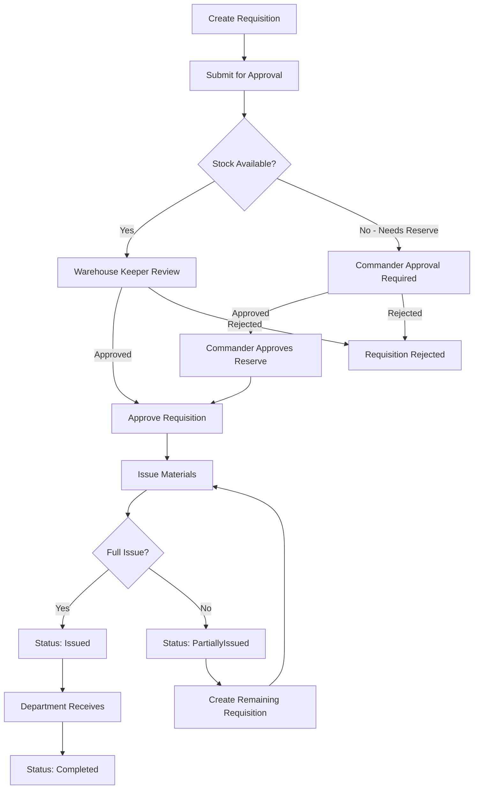
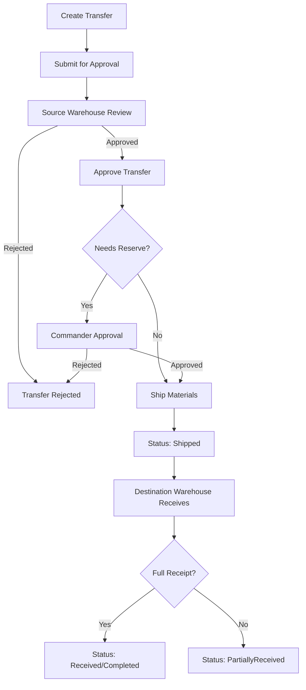
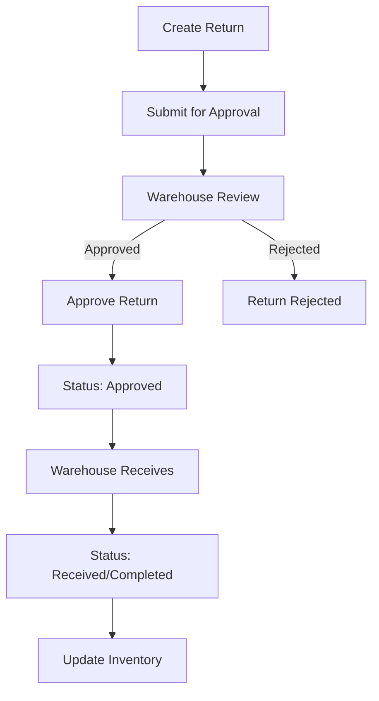
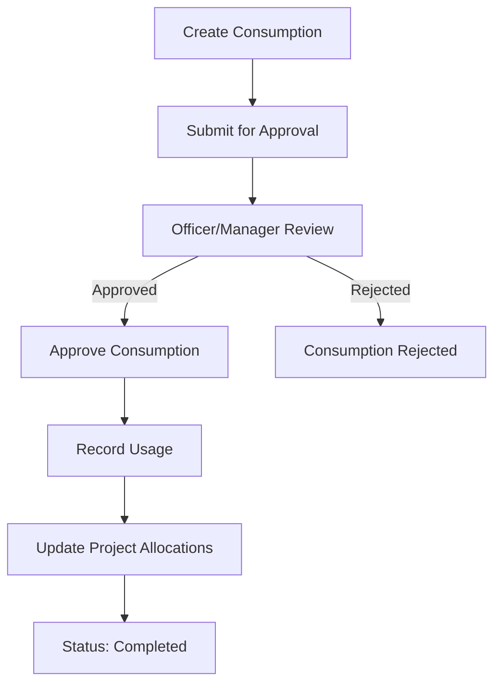

# System Understanding Analysis
## مجمع الصناعات الهندسية - نظام إدارة المخازن

**Date:** February 1, 2026  
**Status:** Complete System Understanding  
**Version:** 1.0

---

## Table of Contents

1. [Executive Summary](#executive-summary)
2. [Technology Stack](#technology-stack)
3. [System Architecture](#system-architecture)
4. [Domain Entities & Data Model](#domain-entities--data-model)
5. [Database Schema](#database-schema)
6. [API Endpoints](#api-endpoints)
7. [Frontend Architecture](#frontend-architecture)
8. [Current Workflows](#current-workflows)
9. [Key Features](#key-features)
10. [Commander's Reserve System](#commanders-reserve-system)
11. [Weaknesses & Risks Identified](#weaknesses--risks-identified)

---

## Executive Summary

The EIC (Engineering Industries Complex) Inventory Management System is a **mission-critical offline warehouse/inventory management platform** for the Egyptian Armed Forces. The system provides complete material traceability from supplier to final product, hierarchical access control based on military chain of command, and specialized Commander's Reserve management for emergency stock.

### System Overview

- **Purpose:** Manage inventory across central warehouses, factory warehouses, and projects
- **Scale:** Military-grade, supporting multiple factories, warehouses, departments, and projects
- **Language:** Bilingual (Arabic & English)
- **Deployment:** Offline-capable with local database
- **Access Control:** Role-based with military hierarchy enforcement

### Current State

The system is **well-architected** with:
- ✅ Clean Architecture with DDD principles
- ✅ CQRS pattern for separation of concerns
- ✅ Comprehensive domain entities with business logic
- ✅ Bilingual support throughout
- ✅ Commander's Reserve tracking
- ✅ Audit trail capabilities
- ⚠️ **Missing:** Project BOQ (Bill of Quantities) system
- ⚠️ **Missing:** Advanced item details page
- ⚠️ **Missing:** Search-based item selection (currently uses dropdowns with potential for free text)
- ⚠️ **Missing:** Partial/full issuing workflow for BOQ

---

## Technology Stack

### Backend

| Component | Technology | Version |
|-----------|-------------|----------|
| **Framework** | .NET | 8.0 |
| **API** | ASP.NET Core Web API | 8.0 |
| **ORM** | Entity Framework Core | 8.0 |
| **Database** | SQL Server | 2022+ |
| **Authentication** | JWT | - |
| **CQRS** | MediatR | - |
| **Validation** | FluentValidation | - |
| **Logging** | Serilog | - |

### Frontend

| Component | Technology | Version |
|-----------|-------------|----------|
| **Framework** | React | 18 |
| **Language** | TypeScript | - |
| **UI Library** | Material-UI (MUI) | - |
| **Routing** | React Router | - |
| **HTTP Client** | Axios | - |
| **Build Tool** | Vite | - |
| **Icons** | Lucide React | - |

---

## System Architecture

### Architecture Pattern

The system follows **Clean Architecture** with **Domain-Driven Design (DDD)** and **CQRS** patterns:

```
┌─────────────────────────────────────────────────────────────┐
│                     Presentation Layer                      │
│  ┌──────────────┐         ┌──────────────┐              │
│  │   React SPA   │         │  ASP.NET API │              │
│  │  (Frontend)  │◄────────┤  (Backend)   │              │
│  └──────────────┘         └──────────────┘              │
└─────────────────────────────────────────────────────────────┘
                              │
                              ▼
┌─────────────────────────────────────────────────────────────┐
│                    Application Layer                        │
│  ┌──────────────┐  ┌──────────────┐  ┌──────────┐ │
│  │   Commands    │  │    Queries   │  │ Handlers  │ │
│  └──────────────┘  └──────────────┘  └──────────┘ │
└─────────────────────────────────────────────────────────────┘
                              │
                              ▼
┌─────────────────────────────────────────────────────────────┐
│                      Domain Layer                          │
│  ┌──────────────┐  ┌──────────────┐  ┌──────────┐ │
│  │   Entities    │  │Value Objects │  │  Events  │ │
│  └──────────────┘  └──────────────┘  └──────────┘ │
└─────────────────────────────────────────────────────────────┘
                              │
                              ▼
┌─────────────────────────────────────────────────────────────┐
│                  Infrastructure Layer                       │
│  ┌──────────────┐  ┌──────────────┐  ┌──────────┐ │
│  │EF Core + SQL  │  │  Repositories │  │ Services │ │
│  │    Server     │  │              │  │          │ │
│  └──────────────┘  └──────────────┘  └──────────┘ │
└─────────────────────────────────────────────────────────────┘
```

### Project Structure

```
EIC Inventory System/
├── src/
│   ├── EICInventorySystem.Domain/          # Domain Layer
│   │   ├── Entities/                     # 30+ domain entities
│   │   ├── Enums/                        # Status types
│   │   ├── DomainEvents/                 # Event definitions
│   │   ├── Exceptions/                   # Domain exceptions
│   │   └── Common/                      # Base classes
│   │
│   ├── EICInventorySystem.Application/     # Application Layer
│   │   ├── Commands/                     # Command handlers
│   │   ├── Queries/                      # Query handlers
│   │   ├── DTOs/                        # Data transfer objects
│   │   ├── Interfaces/                   # Service interfaces
│   │   └── Common/                      # Shared utilities
│   │
│   ├── EICInventorySystem.Infrastructure/  # Infrastructure Layer
│   │   ├── Data/                        # DbContext
│   │   ├── Repositories/                 # Repository implementations
│   │   ├── Services/                     # External services
│   │   └── BackgroundServices/           # Background tasks
│   │
│   ├── EICInventorySystem.WebAPI/        # API Layer
│   │   ├── Controllers/                  # 5 main controllers
│   │   ├── Middleware/                   # Custom middleware
│   │   └── Configuration/               # App configuration
│   │
│   └── EICInventorySystem.Frontend/      # Frontend Layer
│       ├── src/
│       │   ├── pages/                     # 12 main pages
│       │   ├── components/                # Reusable components
│       │   ├── services/                 # API clients
│       │   ├── stores/                   # State management
│       │   ├── types/                    # TypeScript types
│       │   └── theme/                    # UI theming
│       └── public/
│
└── Docs/                                 # Documentation
```

---

## Domain Entities & Data Model

### Core Entities

#### 1. **Item** (صنف)
The master item catalog with comprehensive tracking:

```csharp
public class Item : BaseEntity
{
    // Identification
    public string ItemCode { get; }           // Unique identifier
    public string Name { get; }               // English name
    public string NameArabic { get; }         // Arabic name
    public string Description { get; }
    public string DescriptionArabic { get; }
    
    // Classification
    public string Category { get; }
    public string CategoryArabic { get; }
    public string Unit { get; }               // Unit of measure
    public string UnitOfMeasureArabic { get; }
    
    // Financial & Physical
    public decimal StandardCost { get; }
    public decimal Weight { get; }
    public string WeightUnit { get; }
    public string? Specifications { get; }
    public string? SpecificationsArabic { get; }
    public string? Barcode { get; }
    
    // Stock Control
    public int ReorderPoint { get; }
    public int MinimumStock { get; }
    public int MaximumStock { get; }
    
    // Commander's Reserve
    public decimal ReservePercentage { get; }   // 20-30%
    public decimal ReservedQuantity { get; }
    
    // Flags
    public bool IsActive { get; }
    public bool IsCritical { get; }
    public bool IsVehicleRelated { get; }
    
    // Navigation
    public ICollection<InventoryRecord> InventoryRecords { get; }
    public ICollection<RequisitionItem> RequisitionItems { get; }
    public ICollection<TransferItem> TransferItems { get; }
    public ICollection<ReceiptItem> ReceiptItems { get; }
    public ICollection<ConsumptionItem> ConsumptionItems { get; }
    public ICollection<ReturnItem> ReturnItems { get; }
    public ICollection<AdjustmentItem> AdjustmentItems { get; }
    public ICollection<PurchaseOrderItem> PurchaseOrderItems { get; }
    public ICollection<ItemTransactionHistory> TransactionHistory { get; }
    public ICollection<Project> AssignedProjects { get; }
    public ICollection<Department> AssignedDepartments { get; }
}
```

**Key Observations:**
- ✅ Bilingual support (English & Arabic)
- ✅ Unique ItemCode for identification
- ✅ Commander's Reserve percentage tracking
- ✅ Critical item flagging
- ✅ Vehicle-related item tracking
- ⚠️ **No BOQ relationship** (missing feature)
- ⚠️ **No reserved stock tracking per warehouse** (only global ReservedQuantity)

#### 2. **InventoryRecord** (سجل المخزون)
Tracks item quantities in each warehouse with Commander's Reserve separation:

```csharp
public class InventoryRecord : BaseEntity
{
    public int WarehouseId { get; }
    public int ItemId { get; }
    
    // Quantities
    public decimal TotalQuantity { get; }
    public decimal GeneralQuantity { get; }           // Available for normal use
    public decimal CommanderReserveQuantity { get; }  // Emergency stock
    
    // Allocations
    public decimal GeneralAllocated { get; }
    public decimal ReserveAllocated { get; }
    
    // Thresholds
    public decimal MinimumReserveRequired { get; }
    public decimal ReorderPoint { get; }
    
    // Computed (not stored)
    public decimal AvailableQuantity => GeneralQuantity - GeneralAllocated;
    public decimal AvailableReserve => CommanderReserveQuantity - ReserveAllocated;
    public decimal TotalAvailable => AvailableQuantity + AvailableReserve;
    
    // Navigation
    public Warehouse Warehouse { get; }
    public Item Item { get; }
    public ICollection<InventoryTransaction> Transactions { get; }
}
```

**Key Observations:**
- ✅ Separation of General and Commander's Reserve quantities
- ✅ Allocation tracking (allocated but not yet issued)
- ✅ Computed available quantities
- ✅ Unique constraint on (WarehouseId, ItemId)
- ⚠️ **No BOQ allocation tracking** (missing feature)

#### 3. **InventoryTransaction** (حركة المخزون)
Tracks all inventory movements:

```csharp
public class InventoryTransaction : BaseEntity
{
    public int InventoryRecordId { get; }
    public string TransactionType { get; }  // "Receipt", "Issue", "TransferOut", "TransferIn", "Adjustment", "Return"
    public decimal Quantity { get; }
    public decimal GeneralQuantity { get; }
    public decimal CommanderReserveQuantity { get; }
    public decimal UnitPrice { get; }
    public decimal TotalValue { get; }
    
    // State tracking
    public decimal PreviousGeneralQuantity { get; }
    public decimal PreviousReserveQuantity { get; }
    public decimal NewGeneralQuantity { get; }
    public decimal NewReserveQuantity { get; }
    
    public DateTime TransactionDate { get; }
    public int? ReferenceId { get; }
    public string ReferenceType { get; }  // "Requisition", "Transfer", "Receipt", "Adjustment", "Return", "Consumption"
    public string? ReferenceNumber { get; }
    public string? Notes { get; }
    
    // Commander's Reserve flag
    public bool IsFromCommanderReserve { get; }
    public int? UserId { get; }
    
    // Navigation
    public InventoryRecord InventoryRecord { get; }
    public User? User { get; }
}
```

**Key Observations:**
- ✅ Complete transaction history with before/after states
- ✅ Reference tracking to source documents
- ✅ Commander's Reserve usage flagging
- ✅ User attribution
- ⚠️ **No BOQ reference type** (missing feature)

#### 4. **Requisition** (طلب صرف)
Material request from departments/projects to warehouses:

```csharp
public class Requisition : BaseEntity
{
    public string Number { get; }
    public int RequesterId { get; }
    public int? DepartmentId { get; }
    public int? ProjectId { get; }
    public int WarehouseId { get; }
    public DateTime RequestDate { get; }
    public DateTime? RequiredDate { get; }
    
    public RequisitionStatus Status { get; }  // Draft, Pending, Approved, Rejected, PartiallyIssued, Issued, PartiallyReceived, Completed, Cancelled
    public RequisitionPriority Priority { get; }  // Low, Medium, High, Critical
    
    public string? Reason { get; }
    public string? ReasonArabic { get; }
    
    // Approval
    public int? ApproverId { get; }
    public DateTime? ApprovalDate { get; }
    public string? ApprovalNotes { get; }
    
    // Quantities
    public decimal TotalQuantity { get; }
    public decimal TotalValue { get; }
    public decimal IssuedQuantity { get; }
    
    // Commander's Reserve
    public bool RequiresCommanderReserve { get; }
    public decimal CommanderReserveQuantity { get; }
    public int? CommanderApprovalId { get; }
    public DateTime? CommanderApprovalDate { get; }
    public string? CommanderApprovalNotes { get; }
    
    // Navigation
    public User Requester { get; }
    public Department? Department { get; }
    public Project? Project { get; }
    public Warehouse Warehouse { get; }
    public User? Approver { get; }
    public User? CommanderApprover { get; }
    public ICollection<RequisitionItem> Items { get; }
}
```

**Key Observations:**
- ✅ Comprehensive status workflow
- ✅ Commander's Reserve approval tracking
- ✅ Partial issuance support (PartiallyIssued status)
- ✅ Priority levels
- ⚠️ **Not designed for BOQ workflow** (different use case)
- ⚠️ **No link to BOQ** (missing feature)

#### 5. **RequisitionItem** (صنف في طلب الصرف)
Individual items within a requisition:

```csharp
public class RequisitionItem : BaseEntity
{
    public int RequisitionId { get; }
    public int ItemId { get; }
    public decimal RequestedQuantity { get; }
    public decimal IssuedQuantity { get; }
    public decimal UnitPrice { get; }
    public decimal TotalValue { get; }
    public string? Notes { get; }
    
    // Commander's Reserve
    public bool IsFromCommanderReserve { get; }
    public decimal CommanderReserveQuantity { get; }
    
    // Navigation
    public Requisition Requisition { get; }
    public Item Item { get; }
}
```

**Key Observations:**
- ✅ Tracks requested vs issued quantities
- ✅ Commander's Reserve flag per item
- ⚠️ **No partial issue tracking per item** (only at requisition level)

#### 6. **Project** (مشروع)
Production project management:

```csharp
public class Project : BaseEntity
{
    public string Code { get; }
    public string Name { get; }
    public string NameArabic { get; }
    public string Description { get; }
    public string DescriptionArabic { get; }
    public int FactoryId { get; }
    public int? ManagerId { get; }
    public DateTime StartDate { get; }
    public DateTime? EndDate { get; }
    
    // Budget
    public decimal Budget { get; }
    public decimal SpentAmount { get; }
    
    public ProjectStatus Status { get; }  // Planned, Planning, InProgress, Active, OnHold, Completed, Cancelled
    public int Priority { get; }  // 1=Low, 2=Medium, 3=High, 4=Critical
    public bool IsActive { get; }
    
    // Navigation
    public Factory Factory { get; }
    public User? Manager { get; }
    public ICollection<User> TeamMembers { get; }
    public ICollection<ProjectAllocation> Allocations { get; }
    public ICollection<Consumption> Consumptions { get; }
    public ICollection<Item> Items { get; }
    public ICollection<ItemTransactionHistory> TransactionHistory { get; }
}
```

**Key Observations:**
- ✅ Budget tracking
- ✅ Priority levels
- ✅ Status workflow
- ⚠️ **No BOQ relationship** (missing feature)
- ⚠️ **No BOQ status tracking** (missing feature)

#### 7. **ProjectAllocation** (تخصيص للمشروع)
Items allocated to projects:

```csharp
public class ProjectAllocation : BaseEntity
{
    public int ProjectId { get; }
    public int ItemId { get; }
    public int WarehouseId { get; }
    public decimal AllocatedQuantity { get; }
    public decimal ConsumedQuantity { get; }
    public decimal ReturnedQuantity { get; }
    public decimal UnitPrice { get; }
    public decimal TotalValue { get; }
    public DateTime AllocationDate { get; }
    public string? Notes { get; }
    public string? NotesArabic { get; }
    
    // Commander's Reserve
    public bool IsFromCommanderReserve { get; }
    public decimal CommanderReserveQuantity { get; }
    
    // Navigation
    public Project Project { get; }
    public Item Item { get; }
    public Warehouse Warehouse { get; }
}
```

**Key Observations:**
- ✅ Tracks allocated, consumed, and returned quantities
- ✅ Commander's Reserve flag
- ⚠️ **No BOQ linkage** (missing feature)

#### 8. **Transfer** (نقل)
Material transfer between warehouses:

```csharp
public class Transfer : BaseEntity
{
    public string TransferNumber { get; }
    public int CreatedByUserId { get; }
    public int SourceWarehouseId { get; }
    public int DestinationWarehouseId { get; }
    public DateTime TransferDate { get; }
    public DateTime? RequiredDate { get; }
    public DateTime? ShippedDate { get; }
    public DateTime? ReceivedDate { get; }
    
    public string Status { get; }  // "Draft", "Pending", "Approved", "Rejected", "Shipped", "Received", "Cancelled"
    public string Priority { get; }  // "Low", "Medium", "High", "Critical"
    public string? Notes { get; }
    public string? ReasonArabic { get; }
    
    // Approval
    public int? ApprovedBy { get; }
    public DateTime? ApprovalDate { get; }
    public string? ApprovalNotes { get; }
    public string? RejectionReason { get; }
    
    // Quantities
    public decimal TotalQuantity { get; }
    public decimal TotalValue { get; }
    public decimal ShippedQuantity { get; }
    public decimal ReceivedQuantity { get; }
    
    // Commander's Reserve
    public bool RequiresCommanderReserve { get; }
    public decimal CommanderReserveQuantity { get; }
    public int? CommanderApprovalId { get; }
    public DateTime? CommanderApprovalDate { get; }
    public string? CommanderApprovalNotes { get; }
    
    // Navigation
    public User CreatedByUser { get; }
    public Warehouse SourceWarehouse { get; }
    public Warehouse DestinationWarehouse { get; }
    public User? ApprovedByUser { get; }
    public User? CommanderApprover { get; }
    public ICollection<TransferItem> Items { get; }
}
```

**Key Observations:**
- ✅ Complete transfer workflow
- ✅ Commander's Reserve approval
- ✅ Shipped vs received tracking
- ⚠️ **No BOQ transfer support** (missing feature)

#### 9. **Return** (إرجاع)
Material return from projects/departments to warehouses:

```csharp
public class Return : BaseEntity
{
    public string Number { get; }
    public int ProjectId { get; }
    public int? DepartmentId { get; }
    public int WarehouseId { get; }
    public DateTime ReturnDate { get; }
    
    public string Status { get; }  // "Draft", "Pending", "Approved", "Rejected", "Received", "Cancelled"
    public string? Reason { get; }
    public string? ReasonArabic { get; }
    
    // Approval & Receipt
    public int? ApproverId { get; }
    public DateTime? ApprovalDate { get; }
    public string? ApprovalNotes { get; }
    public decimal TotalQuantity { get; }
    public decimal TotalValue { get; }
    public int? ReceiverId { get; }
    public DateTime? ReceivedDate { get; }
    
    // Navigation
    public Project Project { get; }
    public Department? Department { get; }
    public Warehouse Warehouse { get; }
    public User? Approver { get; }
    public User? Receiver { get; }
    public ICollection<ReturnItem> Items { get; }
}
```

**Key Observations:**
- ✅ Approval workflow
- ✅ Receipt tracking
- ⚠️ **No BOQ return support** (missing feature)

#### 10. **Consumption** (استهلاك)
Material usage tracking in projects:

```csharp
public class Consumption : BaseEntity
{
    public string Number { get; }
    public int ProjectId { get; }
    public int? DepartmentId { get; }
    public int WarehouseId { get; }
    public DateTime ConsumptionDate { get; }
    
    public ConsumptionStatus Status { get; }  // Draft, Pending, Approved, Rejected, Completed, Cancelled
    public string? Notes { get; }
    public string? NotesArabic { get; }
    
    // Approval
    public int? ApprovedBy { get; }
    public DateTime? ApprovalDate { get; }
    public string? ApprovalNotes { get; }
    
    // Quantities
    public decimal TotalQuantity { get; }
    public decimal TotalValue { get; }
    
    // Vehicle tracking
    public string? VehicleNumber { get; }
    public string? WorkOrderNumber { get; }
    
    // Navigation
    public Project Project { get; }
    public Department? Department { get; }
    public Warehouse Warehouse { get; }
    public User? Approver { get; }
    public ICollection<ConsumptionItem> Items { get; }
}
```

**Key Observations:**
- ✅ Vehicle number tracking
- ✅ Work order tracking
- ⚠️ **No BOQ consumption tracking** (missing feature)

### Supporting Entities

#### **ItemTransactionHistory** (تاريخ حركات الصنف)
Complete transaction history per item:

```csharp
public class ItemTransactionHistory : BaseEntity
{
    public int ItemId { get; }
    public string TransactionType { get; }
    public decimal Quantity { get; }
    public decimal UnitPrice { get; }
    public decimal TotalValue { get; }
    public DateTime TransactionDate { get; }
    public string? Notes { get; }
    public string? NotesArabic { get; }
    
    // References
    public int? ProjectId { get; }
    public int? DepartmentId { get; }
    public int? WarehouseId { get; }
    public int? WorkerId { get; }
    public int? ApproverId { get; }
    
    // Navigation
    public Item Item { get; }
    public Project? Project { get; }
    public Department? Department { get; }
    public User? Worker { get; }
    public User? Approver { get; }
}
```

**Key Observations:**
- ✅ Complete audit trail per item
- ✅ Multi-dimensional reference tracking
- ⚠️ **No BOQ reference** (missing feature)

#### **AuditLog** (سجل المراجعة)
System-wide audit logging:

```csharp
public class AuditLog : BaseEntity
{
    public string Action { get; }
    public string EntityType { get; }
    public int? EntityId { get; }
    public string? OldValues { get; }
    public string? NewValues { get; }
    public string? Changes { get; }
    public string? Reason { get; }
    public DateTime Timestamp { get; }
    public int UserId { get; }
    public string? Username { get; }
    public string? IpAddress { get; }
    
    // Navigation
    public User User { get; }
}
```

**Key Observations:**
- ✅ Comprehensive audit logging
- ✅ Change tracking (old/new values)
- ✅ IP address logging

---

## Database Schema

### Database Configuration

```csharp
public class ApplicationDbContext : DbContext
{
    // Core entities
    public DbSet<User> Users => Set<User>();
    public DbSet<Factory> Factories => Set<Factory>();
    public DbSet<Warehouse> Warehouses => Set<Warehouse>();
    public DbSet<Department> Departments => Set<Department>();
    public DbSet<Project> Projects => Set<Project>();
    public DbSet<Supplier> Suppliers => Set<Supplier>();
    public DbSet<Item> Items => Set<Item>();
    
    // Inventory entities
    public DbSet<InventoryRecord> InventoryRecords => Set<InventoryRecord>();
    public DbSet<InventoryTransaction> InventoryTransactions => Set<InventoryTransaction>();
    public DbSet<ItemTransactionHistory> ItemTransactionHistories => Set<ItemTransactionHistory>();
    public DbSet<StockAdjustment> StockAdjustments => Set<StockAdjustment>();
    
    // Transaction entities
    public DbSet<Requisition> Requisitions => Set<Requisition>();
    public DbSet<RequisitionItem> RequisitionItems => Set<RequisitionItem>();
    public DbSet<Transfer> Transfers => Set<Transfer>();
    public DbSet<TransferItem> TransferItems => Set<TransferItem>();
    public DbSet<Receipt> Receipts => Set<Receipt>();
    public DbSet<ReceiptItem> ReceiptItems => Set<ReceiptItem>();
    public DbSet<Consumption> Consumptions => Set<Consumption>();
    public DbSet<ConsumptionItem> ConsumptionItems => Set<ConsumptionItem>();
    public DbSet<Return> Returns => Set<Return>();
    public DbSet<ReturnItem> ReturnItems => Set<ReturnItem>();
    public DbSet<Adjustment> Adjustments => Set<Adjustment>();
    public DbSet<AdjustmentItem> AdjustmentItems => Set<AdjustmentItem>();
    
    // Purchase entities
    public DbSet<PurchaseOrder> PurchaseOrders => Set<PurchaseOrder>();
    public DbSet<PurchaseOrderItem> PurchaseOrderItems => Set<PurchaseOrderItem>();
    
    // System entities
    public DbSet<AuditLog> AuditLogs => Set<AuditLog>();
    public DbSet<Notification> Notifications => Set<Notification>();
    public DbSet<SystemConfiguration> SystemConfigurations => Set<SystemConfiguration>();
    public DbSet<SystemSettings> SystemSettings => Set<SystemSettings>();
}
```

### Key Database Constraints

| Entity | Unique Constraint | Index | Precision |
|--------|------------------|--------|-----------|
| **User** | Username, Email | UserId | - |
| **Item** | ItemCode | ItemCode | Cost: (18,4), Weight: (18,4) |
| **InventoryRecord** | (WarehouseId, ItemId) | - | Quantities: (18,4) |
| **Requisition** | Number | Number | Quantities: (18,4) |
| **Transfer** | TransferNumber | TransferNumber | Quantities: (18,4) |
| **Receipt** | Number | Number | Quantities: (18,4) |
| **Consumption** | Number | Number | Quantities: (18,4) |
| **Return** | Number | Number | Quantities: (18,4) |
| **Adjustment** | Number | Number | Quantities: (18,4) |
| **Project** | Code | Code | Budget: (18,4) |
| **Factory** | Code | Code | - |
| **Warehouse** | Code | Code | - |
| **Department** | Code | Code | - |
| **Supplier** | Code | Code | Credit: (18,4) |

### Entity Relationships

```
User (1) ──(*) Requisitions (as Requester)
User (1) ──(*) Requisitions (as Approver)
User (1) ──(*) Requisitions (as CommanderApprover)
User (1) ──(*) Transfers (as CreatedBy)
User (1) ──(*) Transfers (as ApprovedBy)
User (1) ──(*) Transfers (as CommanderApprover)
User (1) ──(*) Consumptions (as Approver)
User (1) ──(*) Returns (as Approver)
User (1) ──(*) Adjustments (as Approver)
User (1) ──(*) AuditLogs

Factory (1) ──(*) Warehouses
Factory (1) ──(*) Projects
Factory (1) ──(*) Departments
Factory (1) ──(*) Users

Warehouse (1) ──(*) InventoryRecords
Warehouse (1) ──(*) Requisitions
Warehouse (1) ──(*) Transfers (as Source)
Warehouse (1) ──(*) Transfers (as Destination)
Warehouse (1) ──(*) Receipts
Warehouse (1) ──(*) Consumptions
Warehouse (1) ──(*) Returns

Item (1) ──(*) InventoryRecords
Item (1) ──(*) RequisitionItems
Item (1) ──(*) TransferItems
Item (1) ──(*) ReceiptItems
Item (1) ──(*) ConsumptionItems
Item (1) ──(*) ReturnItems
Item (1) ──(*) AdjustmentItems
Item (1) ──(*) PurchaseOrderItems
Item (1) ──(*) ItemTransactionHistory

Project (1) ──(*) Requisitions
Project (1) ──(*) ProjectAllocations
Project (1) ──(*) Consumptions
Project (1) ──(*) Returns
Project (1) ──(*) ItemTransactionHistory

Department (1) ──(*) Requisitions
Department (1) ──(*) Consumptions
Department (1) ──(*) Returns
Department (1) ──(*) ItemTransactionHistory
```

---

## API Endpoints

### Controllers Overview

| Controller | Purpose | Endpoints |
|------------|----------|-----------|
| **AuthController** | Authentication & Authorization | Login, Logout, Refresh Token |
| **RequisitionController** | Requisition Management | CRUD, Approve, Reject, Issue, Receive, Cancel |
| **InventoryController** | Inventory Management | Query, Summary, Transaction History, Alerts, Commander's Reserve |
| **CommanderReserveController** | Commander's Reserve Management | Query, Request, Approve, Release, Allocate, Adjust |
| **ReportsController** | Reporting & Analytics | Various reports |

### RequisitionController Endpoints

```
GET    /api/requisition                              # Get all requisitions (filtered)
GET    /api/requisition/{id}                         # Get by ID
GET    /api/requisition/number/{requisitionNumber}     # Get by number
GET    /api/requisition/pending                       # Get pending requisitions
GET    /api/requisition/for-approval                  # Get for approval
GET    /api/requisition/for-issuance                  # Get for issuance
GET    /api/requisition/for-receiving                 # Get for receiving
GET    /api/requisition/statistics                     # Get statistics
POST   /api/requisition                              # Create requisition
PUT    /api/requisition/{id}                         # Update requisition
POST   /api/requisition/{id}/approve                  # Approve requisition
POST   /api/requisition/{id}/reject                   # Reject requisition
POST   /api/requisition/{id}/issue                    # Issue requisition
POST   /api/requisition/{id}/receive                  # Receive requisition
POST   /api/requisition/{id}/cancel                  # Cancel requisition
```

### InventoryController Endpoints

```
GET    /api/inventory                                # Get inventory records
GET    /api/inventory/{warehouseId}/{itemId}          # Get specific record
GET    /api/inventory/summary                        # Get inventory summary
GET    /api/inventory/transactions/{itemId}            # Get item transaction history
GET    /api/inventory/alerts/low-stock                # Get low stock alerts
GET    /api/inventory/alerts/reserve                  # Get reserve alerts
GET    /api/inventory/commander-reserve               # Get Commander's Reserve info
GET    /api/inventory/commander-reserve/summary        # Get Commander's Reserve summary
```

### CommanderReserveController Endpoints

```
GET    /api/commanderreserve                         # Get Commander's Reserve info
GET    /api/commanderreserve/summary                  # Get Commander's Reserve summary
POST   /api/commanderreserve/requests                 # Create reserve request
POST   /api/commanderreserve/requests/{id}/approve   # Approve reserve request
POST   /api/commanderreserve/requests/{id}/reject    # Reject reserve request
POST   /api/commanderreserve/release                 # Release Commander's Reserve
POST   /api/commanderreserve/allocate                # Allocate to Commander's Reserve
POST   /api/commanderreserve/adjust                  # Adjust Commander's Reserve
```

---

## Frontend Architecture

### Pages Structure

| Page | Purpose | Status |
|-------|---------|--------|
| **Dashboard** | Overview & Statistics | ✅ Implemented |
| **Inventory** | Inventory Management | ✅ Implemented |
| **Requisitions** | Requisition Management | ✅ Implemented |
| **Projects** | Project Management | ✅ Implemented |
| **Transfers** | Transfer Management | ✅ Implemented |
| **CommanderReserve** | Commander's Reserve Management | ✅ Implemented |
| **Reports** | Reporting & Analytics | ✅ Implemented |
| **AuditLog** | Audit Trail | ✅ Implemented |
| **Settings** | System Settings | ✅ Implemented |
| **Login** | Authentication | ✅ Implemented |
| **Unauthorized** | Access Denied | ✅ Implemented |
| **NotFound** | 404 Page | ✅ Implemented |

### Key Frontend Features

#### Requisitions Page

```typescript
interface Requisition {
    id: number;
    requisitionNumber: string;
    requestDate: string;
    requestedBy: string;
    department: string;
    project?: string;
    status: 'Pending' | 'Approved' | 'Rejected' | 'PartiallyApproved' | 'Issued';
    priority: 'Low' | 'Medium' | 'High' | 'Critical';
    items: RequisitionItem[];
    totalItems: number;
    requiresCommanderApproval: boolean;
    commanderApprovalDate?: string;
    approvedBy?: string;
    approvedDate?: string;
    notes?: string;
}
```

**Features:**
- ✅ Tab-based filtering (Pending, Approved, Issued, Rejected)
- ✅ Create requisition dialog
- ✅ View requisition details
- ✅ Approve/Reject actions
- ✅ Commander's Reserve approval indicator
- ⚠️ **Mock data** (TODO comments for API integration)
- ⚠️ **No BOQ support** (missing feature)

#### Inventory Page

```typescript
interface InventoryItem {
    id: string;
    itemCode: string;
    itemName: string;
    itemNameAr: string;
    category: string;
    categoryAr: string;
    unit: string;
    unitAr: string;
    totalStock: number;
    generalStock: number;
    commanderReserve: number;
    allocated: number;
    available: number;
    reorderPoint: number;
    minimumReserveRequired: number;
    status: 'OK' | 'LOW' | 'CRITICAL';
    warehouseName: string;
    warehouseNameAr: string;
    lastUpdated: string;
}
```

**Features:**
- ✅ Search by code or name
- ✅ Filter by category, warehouse, status
- ✅ Commander's Reserve filter
- ✅ Status badges (OK, LOW, CRITICAL)
- ✅ Reserve status indicators
- ⚠️ **Mock data** (TODO comments for API integration)
- ⚠️ **No advanced item details view** (missing feature)

### UI/UX Patterns

**Material-UI (MUI) Components:**
- DataGrid for tables
- Dialog for modals
- Tabs for navigation
- Chips for status badges
- Select for dropdowns
- TextField for inputs
- Alerts for notifications

**Bilingual Support:**
- Arabic labels and content
- RTL (Right-to-Left) layout support
- Language toggle capability

---

## Current Workflows

### 1. Requisition Workflow (طلب الصرف)



**Current Implementation:**
- ✅ Draft → Pending → Approved → Issued/PartiallyIssued → Completed
- ✅ Commander's Reserve approval workflow
- ✅ Partial issuance support
- ⚠️ **No BOQ workflow** (different use case)
- ⚠️ **No automatic remaining requisition creation**

### 2. Transfer Workflow (نقل المواد)



**Current Implementation:**
- ✅ Draft → Pending → Approved → Shipped → Received/PartiallyReceived → Completed
- ✅ Commander's Reserve approval
- ✅ Partial receipt support
- ⚠️ **No BOQ transfer support**

### 3. Return Workflow (إرجاع المواد)



**Current Implementation:**
- ✅ Draft → Pending → Approved → Received → Completed
- ✅ Approval workflow
- ⚠️ **No BOQ return support**

### 4. Consumption Workflow (استهلاك المواد)



**Current Implementation:**
- ✅ Draft → Pending → Approved → Completed
- ✅ Vehicle number tracking
- ⚠️ **No BOQ consumption tracking**

---

## Key Features

### 1. Commander's Reserve System (احتياطي القائد)

**Purpose:** Emergency stock requiring special authorization

**Allocation Rules:**
- General Stock: 70-80% of received quantity
- Commander's Reserve: 20-30% of received quantity

**Authorization Matrix:**

| Action | General Stock | Commander's Reserve |
|--------|---------------|---------------------|
| View | All authorized users | All authorized users |
| Request | Department Heads, PMs | Same |
| Approve | Warehouse Keepers, Officers | **ONLY Commanders** |
| Release | Warehouse Keepers | **ONLY Commanders** |

**Implementation:**
- ✅ Separate quantity tracking in `InventoryRecord`
- ✅ `IsFromCommanderReserve` flag in transactions
- ✅ Commander approval workflow in `Requisition`, `Transfer`
- ✅ Dedicated `CommanderReserveController`
- ✅ Policy-based authorization `[Authorize(Policy = "AccessCommanderReserve")]`

### 2. Bilingual Support (دعم ثنائي اللغة)

**Implementation:**
- ✅ Arabic and English fields for all entities
- ✅ RTL (Right-to-Left) layout support
- ✅ Language-aware UI components
- ✅ Arabic labels and messages

### 3. Audit Trail (سجل المراجعة)

**Implementation:**
- ✅ `AuditLog` entity with comprehensive tracking
- ✅ `ItemTransactionHistory` per-item transaction log
- ✅ `InventoryTransaction` with before/after states
- ✅ User attribution for all actions
- ✅ IP address logging
- ✅ Change tracking (old/new values)

### 4. Role-Based Access Control (التحكم في الوصول)

**Roles:**
1. Complex Commander (قائد المجمع) - Supreme authority
2. Factory Commander (قائد المصنع) - Factory authority
3. Central Warehouse Keeper (أمين مخزن مركزي) - Central warehouse operations
4. Factory Warehouse Keeper (أمين مخزن المصنع) - Factory warehouse operations
5. Department Head (رئيس قسم) - Department operations
6. Project Manager (مدير مشروع) - Project operations
7. Officer (ضابط) - Supervisory
8. Civil Engineer (مهندس مدني) - Technical
9. Worker (عامل) - Production tasks
10. Auditor (مراقب/مراجع) - View-only audit access

---

## Commander's Reserve System

### Database Schema

```sql
-- InventoryRecord tracks both stocks
CREATE TABLE InventoryRecords (
    Id INT PRIMARY KEY,
    WarehouseId INT NOT NULL,
    ItemId INT NOT NULL,
    
    -- Quantities
    TotalQuantity DECIMAL(18,4) NOT NULL,
    GeneralQuantity DECIMAL(18,4) NOT NULL,
    CommanderReserveQuantity DECIMAL(18,4) NOT NULL,
    
    -- Allocations
    GeneralAllocated DECIMAL(18,4) DEFAULT 0,
    ReserveAllocated DECIMAL(18,4) DEFAULT 0,
    
    -- Thresholds
    MinimumReserveRequired DECIMAL(18,4) NOT NULL,
    ReorderPoint DECIMAL(18,4) NOT NULL,
    
    -- Computed
    AvailableQuantity AS (GeneralQuantity - GeneralAllocated),
    AvailableReserve AS (CommanderReserveQuantity - ReserveAllocated),
    
    CONSTRAINT CHK_Quantities CHECK (
        TotalQuantity = GeneralQuantity + CommanderReserveQuantity
    ),
    
    CONSTRAINT UQ_WarehouseItem UNIQUE (WarehouseId, ItemId)
);

-- Transactions flag reserve usage
CREATE TABLE InventoryTransactions (
    Id INT PRIMARY KEY,
    InventoryRecordId INT NOT NULL,
    TransactionType VARCHAR(50) NOT NULL,
    Quantity DECIMAL(18,4) NOT NULL,
    GeneralQuantity DECIMAL(18,4) NOT NULL,
    CommanderReserveQuantity DECIMAL(18,4) NOT NULL,
    
    -- State tracking
    PreviousGeneralQuantity DECIMAL(18,4) NOT NULL,
    PreviousReserveQuantity DECIMAL(18,4) NOT NULL,
    NewGeneralQuantity DECIMAL(18,4) NOT NULL,
    NewReserveQuantity DECIMAL(18,4) NOT NULL,
    
    -- Reserve flag
    IsFromCommanderReserve BIT DEFAULT 0,
    
    -- References
    ReferenceType VARCHAR(50) NOT NULL,
    ReferenceId INT NULL,
    ReferenceNumber VARCHAR(50) NULL,
    
    CONSTRAINT CHK_ReserveApproval CHECK (
        (IsFromCommanderReserve = 0) OR 
        (IsFromCommanderReserve = 1 AND ReferenceType = 'Requisition')
    )
);
```

### Business Logic

```csharp
// Requisition entity
public class Requisition : BaseEntity
{
    public bool RequiresCommanderReserve { get; private set; }
    public decimal CommanderReserveQuantity { get; private set; }
    public int? CommanderApprovalId { get; private set; }
    public DateTime? CommanderApprovalDate { get; private set; }
    public string? CommanderApprovalNotes { get; private set; }
    
    public void MarkRequiresCommanderReserve(decimal reserveQuantity, int updatedBy)
    {
        RequiresCommanderReserve = true;
        CommanderReserveQuantity = reserveQuantity;
        Update(updatedBy);
    }
    
    public void ApproveCommanderReserve(int commanderId, string? approvalNotes, int updatedBy)
    {
        CommanderApprovalId = commanderId;
        CommanderApprovalDate = DateTime.UtcNow;
        CommanderApprovalNotes = approvalNotes;
        Update(updatedBy);
    }
}

// RequisitionItem entity
public class RequisitionItem : BaseEntity
{
    public bool IsFromCommanderReserve { get; private set; }
    public decimal CommanderReserveQuantity { get; private set; }
    
    public void MarkAsFromCommanderReserve(decimal reserveQuantity, int updatedBy)
    {
        IsFromCommanderReserve = true;
        CommanderReserveQuantity = reserveQuantity;
        Update(updatedBy);
    }
}

// InventoryRecord entity
public class InventoryRecord : BaseEntity
{
    public decimal GeneralQuantity { get; private set; }
    public decimal CommanderReserveQuantity { get; private set; }
    public decimal GeneralAllocated { get; private set; }
    public decimal ReserveAllocated { get; private set; }
    
    public void AllocateGeneral(decimal quantity, int updatedBy)
    {
        if (quantity > AvailableQuantity)
            throw new InvalidOperationException("Insufficient general stock");
        
        GeneralAllocated += quantity;
        Update(updatedBy);
    }
    
    public void AllocateReserve(decimal quantity, int updatedBy)
    {
        if (quantity > AvailableReserve)
            throw new InvalidOperationException("Insufficient reserve stock");
        
        ReserveAllocated += quantity;
        Update(updatedBy);
    }
    
    public void ReleaseGeneralAllocation(decimal quantity, int updatedBy)
    {
        if (quantity > GeneralAllocated)
            throw new InvalidOperationException("Cannot release more than allocated");
        
        GeneralAllocated -= quantity;
        GeneralQuantity -= quantity;
        TotalQuantity -= quantity;
        Update(updatedBy);
    }
    
    public void ReleaseReserveAllocation(decimal quantity, int updatedBy)
    {
        if (quantity > ReserveAllocated)
            throw new InvalidOperationException("Cannot release more than allocated");
        
        ReserveAllocated -= quantity;
        CommanderReserveQuantity -= quantity;
        TotalQuantity -= quantity;
        Update(updatedBy);
    }
}
```

### API Endpoints

```csharp
[ApiController]
[Route("api/[controller]")]
[Authorize]
public class CommanderReserveController : ControllerBase
{
    [HttpGet]
    public async Task<ActionResult<IEnumerable<CommanderReserveDto>>> GetCommanderReserve(
        [FromQuery] int? warehouseId = null,
        [FromQuery] int? itemId = null)
    {
        var query = new GetCommanderReserveQuery(warehouseId, itemId);
        var result = await _mediator.Send(query);
        return Ok(result);
    }
    
    [HttpPost("requests")]
    public async Task<ActionResult<CommanderReserveRequestDto>> CreateCommanderReserveRequest(
        [FromBody] CreateCommanderReserveRequestDto request)
    {
        var userId = int.Parse(User.FindFirst("sub")?.Value ?? "0");
        var command = new CreateCommanderReserveRequestCommand(request, userId);
        var result = await _mediator.Send(command);
        return CreatedAtAction(nameof(GetCommanderReserve), new { id = result.Id }, result);
    }
    
    [HttpPost("requests/{id}/approve")]
    [Authorize(Policy = "AccessCommanderReserve")]
    public async Task<ActionResult<CommanderReserveRequestDto>> ApproveCommanderReserveRequest(
        int id,
        [FromBody] ApproveCommanderReserveRequestDto request)
    {
        var userId = int.Parse(User.FindFirst("sub")?.Value ?? "0");
        var command = new ApproveCommanderReserveRequestCommand(request with { Id = id }, userId);
        var result = await _mediator.Send(command);
        return Ok(result);
    }
    
    [HttpPost("release")]
    [Authorize(Policy = "AccessCommanderReserve")]
    public async Task<ActionResult<CommanderReserveReleaseDto>> ReleaseCommanderReserve(
        [FromBody] ReleaseCommanderReserveDto request)
    {
        var userId = int.Parse(User.FindFirst("sub")?.Value ?? "0");
        var command = new ReleaseCommanderReserveCommand(request, userId);
        var result = await _mediator.Send(command);
        return Ok(result);
    }
    
    [HttpPost("allocate")]
    [Authorize(Policy = "AccessCommanderReserve")]
    public async Task<ActionResult<bool>> AllocateCommanderReserve(
        [FromBody] AllocateCommanderReserveRequestDto request)
    {
        var userId = int.Parse(User.FindFirst("sub")?.Value ?? "0");
        var command = new AllocateCommanderReserveCommand(
            request.ItemId, 
            request.WarehouseId, 
            request.Quantity, 
            userId);
        var result = await _mediator.Send(command);
        return Ok(result);
    }
    
    [HttpPost("adjust")]
    [Authorize(Policy = "AccessCommanderReserve")]
    public async Task<ActionResult<bool>> AdjustCommanderReserve(
        [FromBody] AdjustCommanderReserveRequestDto request)
    {
        var userId = int.Parse(User.FindFirst("sub")?.Value ?? "0");
        var command = new AdjustCommanderReserveCommand(
            request.ItemId, 
            request.WarehouseId, 
            request.NewReserveQuantity, 
            request.Reason, 
            userId);
        var result = await _mediator.Send(command);
        return Ok(result);
    }
}
```

### Frontend Display

```typescript
// Reserve status indicator
const getReserveStatus = (item: InventoryItem) => {
    if (item.commanderReserve < item.minimumReserveRequired) {
        return (
            <span className="inline-flex items-center px-2.5 py-0.5 rounded-full text-xs font-medium bg-red-100 text-red-800">
                <AlertTriangle size={12} className="mr-1" />
                يحتاج تعبئة
            </span>
        );
    }
    return (
        <span className="inline-flex items-center px-2.5 py-0.5 rounded-full text-xs font-medium bg-green-100 text-green-800">
            <CheckCircle size={12} className="mr-1" />
            كافٍ
        </span>
    );
};

// Reserve column with gold background
<td className="px-6 py-4 whitespace-nowrap bg-yellow-50">
    <div className="text-sm font-medium text-gray-900">
        {item.commanderReserve.toLocaleString()} {item.unitAr}
    </div>
    <div className="mt-1">
        {getReserveStatus(item)}
    </div>
</td>
```

---

## Weaknesses & Risks Identified

### 1. Missing BOQ System

**Problem:** No Bill of Quantities (BOQ) system for projects

**Impact:**
- ❌ Cannot create project-specific material lists
- ❌ Cannot issue materials based on project BOQ
- ❌ Cannot track BOQ fulfillment status
- ❌ Cannot handle partial BOQ issuance
- ❌ Cannot archive pending BOQ items

**Required Features:**
- BOQ entity with project linkage
- BOQ item tracking
- Full/partial issuance workflow
- Remaining BOQ versioning
- BOQ archive/pending list

### 2. Limited Item Details View

**Problem:** Current inventory page shows basic information only

**Impact:**
- ❌ Cannot see complete item transaction history
- ❌ Cannot see project allocations per item
- ❌ Cannot see reserved stock per warehouse
- ❌ Cannot see consumption patterns
- ❌ No Excel-like detailed view

**Required Features:**
- Advanced item details page
- Complete transaction history table
- Project allocation summary
- Reserved stock breakdown
- Consumption analysis
- Export functionality

### 3. Free Text Input Risks

**Problem:** Forms may allow free text typing for critical fields

**Impact:**
- ❌ Human typing errors in item codes
- ❌ Inconsistent item references
- ❌ Data integrity issues
- ❌ Duplicate entries

**Current State:**
- ⚠️ Requisition form uses dropdowns for department/project
- ⚠️ TODO comments suggest API integration not complete
- ⚠️ No search-based item selection implemented

**Required Features:**
- Search-based item selection
- Auto-complete for item codes
- No free text for item codes
- Dropdown-only selection for departments/projects/warehouses

### 4. Partial Issuance Workflow Gaps

**Problem:** Current requisition system supports partial issuance but lacks automation

**Impact:**
- ❌ Manual creation of remaining requisitions
- ❌ No automatic tracking of pending items
- ❌ No archive of partial issuances
- ❌ No visibility into why items were not issued

**Current Implementation:**
```csharp
public void Issue(decimal quantity, int updatedBy)
{
    IssuedQuantity += quantity;
    if (IssuedQuantity >= TotalQuantity)
    {
        Status = RequisitionStatus.Completed;
    }
    else
    {
        Status = RequisitionStatus.PartiallyIssued;
    }
    Update(updatedBy);
}
```

**Missing:**
- ❌ Automatic creation of remaining requisition
- ❌ Link to original requisition
- ❌ Archive of partial issuances
- ❌ Reason tracking for partial issuance

### 5. Data Integrity Risks

**Problem:** No validation constraints on critical business rules

**Impact:**
- ❌ Potential for negative quantities
- ❌ Potential for inconsistent allocations
- ❌ No enforcement of Commander's Reserve rules

**Current Validation:**
```csharp
public void AllocateGeneral(decimal quantity, int updatedBy)
{
    if (quantity > AvailableQuantity)
        throw new InvalidOperationException("Insufficient general stock");
    
    GeneralAllocated += quantity;
    Update(updatedBy);
}
```

**Missing:**
- ❌ No database-level constraints for quantity >= 0
- ❌ No constraint that TotalQuantity = GeneralQuantity + CommanderReserveQuantity
- ❌ No constraint that Allocated <= Available
- ⚠️ Some constraints exist but may not be enforced at DB level

### 6. No Item Master Unique Part Number Enforcement

**Problem:** ItemCode is unique but not enforced as a true "Part Number" system

**Impact:**
- ❌ Potential for duplicate items with different codes
- ❌ No standardized part numbering
- ❌ Difficulty in cross-referencing

**Current State:**
```csharp
public class Item : BaseEntity
{
    public string ItemCode { get; private set; }  // Unique index
    // ... other fields
}
```

**Missing:**
- ❌ No validation of part number format
- ❌ No cross-reference to supplier part numbers
- ❌ No barcode integration

### 7. Limited Reporting Capabilities

**Problem:** No comprehensive reporting system

**Impact:**
- ❌ Cannot generate BOQ fulfillment reports
- ❌ Cannot generate item consumption reports
- ❌ Cannot generate reserve utilization reports
- ❌ Cannot generate project cost reports

**Current State:**
- ✅ Basic statistics endpoints exist
- ⚠️ No detailed reporting controller implementation visible

### 8. Performance Concerns

**Problem:** Potential N+1 query issues with navigation properties

**Impact:**
- ❌ Slow loading of requisitions with items
- ❌ Slow loading of inventory with transactions
- ❌ Potential memory issues with large datasets

**Current Implementation:**
```csharp
// Potential N+1 issue
public async Task<IEnumerable<RequisitionDto>> GetRequisitions(...)
{
    var requisitions = await _repository.GetAllAsync();
    // Each requisition.Items causes separate query
    return requisitions.Select(r => MapToDto(r));
}
```

**Missing:**
- ❌ No eager loading (.Include()) visible
- ❌ No pagination in all queries
- ❌ No caching strategy

### 9. No Archiving Strategy

**Problem:** No archiving of completed transactions

**Impact:**
- ❌ Database growth over time
- ❌ Slow queries on large tables
- ❌ No historical data separation

**Missing:**
- ❌ No archive tables
- ❌ No archiving jobs
- ❌ No retention policy

### 10. Limited Error Handling

**Problem:** Generic error messages and no user-friendly guidance

**Impact:**
- ❌ Poor user experience
- ❌ Difficult troubleshooting
- ❌ No context for errors

**Current State:**
```typescript
catch (error) {
    setAlert({
        show: true,
        message: 'حدث خطأ أثناء الموافقة على الطلب',  // Generic message
        severity: 'error'
    });
}
```

**Missing:**
- ❌ No specific error messages
- ❌ No error codes
- ❌ No user guidance for resolution

---

## Summary

### System Strengths

✅ **Well-Architected:** Clean Architecture with DDD and CQRS  
✅ **Comprehensive Domain Model:** 30+ entities with business logic  
✅ **Bilingual Support:** Full Arabic/English support  
✅ **Commander's Reserve:** Complete implementation with authorization  
✅ **Audit Trail:** Comprehensive logging and history  
✅ **Role-Based Access:** Military hierarchy enforcement  
✅ **Modern Tech Stack:** .NET 8.0, React 18, TypeScript  

### System Weaknesses

❌ **Missing BOQ System:** No Bill of Quantities for projects  
❌ **Limited Item Details:** No advanced item view with full history  
❌ **Free Text Risks:** Potential for human typing errors  
❌ **Partial Issuance Gaps:** No automation for remaining requisitions  
❌ **Data Integrity:** Limited validation constraints  
❌ **No Part Number System:** ItemCode exists but not standardized  
❌ **Limited Reporting:** No comprehensive reporting  
❌ **Performance Issues:** Potential N+1 queries, no pagination  
❌ **No Archiving:** Database growth concerns  
❌ **Limited Error Handling:** Generic error messages  

### Recommendations Priority

1. **HIGH PRIORITY:**
   - Implement BOQ system
   - Add advanced item details page
   - Implement search-based item selection
   - Add validation constraints

2. **MEDIUM PRIORITY:**
   - Automate partial issuance workflow
   - Improve error handling
   - Add comprehensive reporting
   - Implement archiving strategy

3. **LOW PRIORITY:**
   - Performance optimization
   - Add caching
   - Enhance part number system

---

**Next Steps:** Proceed to Phase 2 - Current Workflows Analysis for detailed workflow mapping and gap identification.
