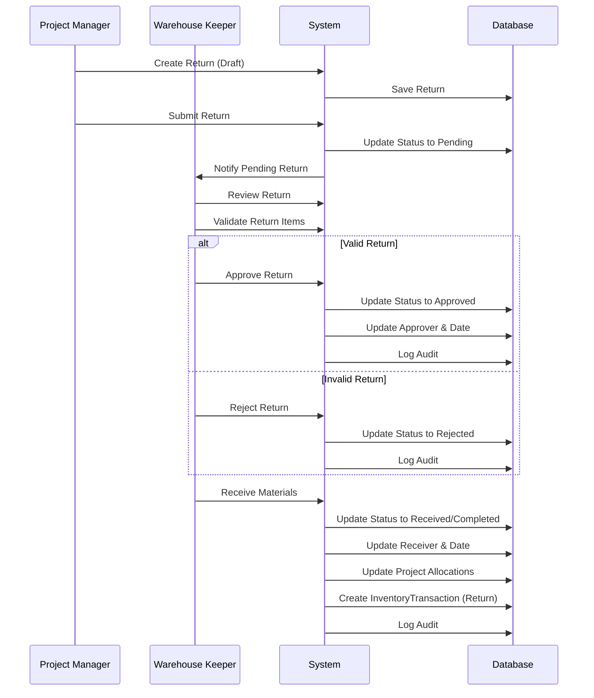
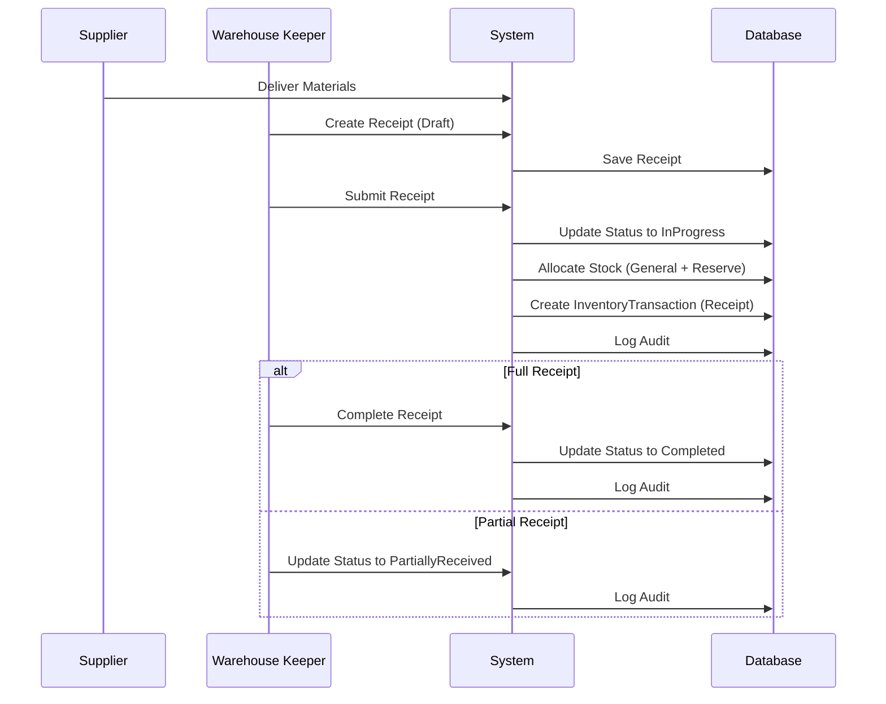
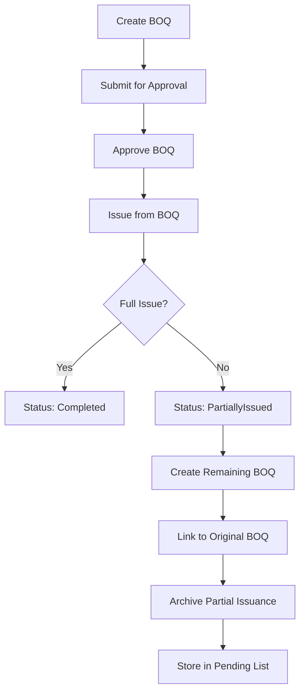

# Workflows Analysis & Weaknesses/Risks Identification
## مجمع الصناعات الهندسية - نظام إدارة المخازن

**Date:** February 1, 2026  
**Status:** Complete Analysis  
**Version:** 1.0

---

## Table of Contents

1. [Current Workflows Analysis](#current-workflows-analysis)
2. [Workflow Details](#workflow-details)
3. [Weaknesses & Risks Identification](#weaknesses--risks-identification)
4. [Human Error Possibilities](#human-error-possibilities)
5. [Data Integrity Risks](#data-integrity-risks)
6. [UX/UI Issues](#uxui-issues)
7. [Performance Concerns](#performance-concerns)
8. [Missing Business Logic](#missing-business-logic)
9. [Summary & Recommendations](#summary--recommendations)

---

## Current Workflows Analysis

### Workflow Overview

The system currently implements **5 main workflows**:

1. **Requisition Workflow** (طلب الصرف) - Material requests from departments/projects
2. **Transfer Workflow** (نقل المواد) - Material transfers between warehouses
3. **Return Workflow** (إرجاع المواد) - Material returns from projects
4. **Consumption Workflow** (استهلاك المواد) - Material usage tracking
5. **Receipt Workflow** (استلام المواد) - Material receipts from suppliers

### Workflow Comparison Matrix

| Workflow | Status | Partial Support | Commander's Reserve | Audit Trail | BOQ Support |
|-----------|--------|-----------------|---------------------|--------------|--------------|
| Requisition | ✅ Implemented | ✅ PartiallyIssued | ✅ Full | ❌ Missing |
| Transfer | ✅ Implemented | ✅ PartiallyReceived | ✅ Full | ❌ Missing |
| Return | ✅ Implemented | ❌ No | ✅ Full | ❌ Missing |
| Consumption | ✅ Implemented | ❌ No | ✅ Full | ❌ Missing |
| Receipt | ✅ Implemented | ✅ PartiallyReceived | ✅ Full | ❌ Missing |

---

## Workflow Details

### 1. Requisition Workflow (طلب الصرف)

#### Current Implementation

```mermaid
sequenceDiagram
    participant DH as Department Head
    participant WH as Warehouse Keeper
    participant CMDR as Commander
    participant SYS as System
    participant DB as Database

    DH->>SYS: Create Requisition (Draft)
    SYS->>DB: Save Requisition
    DH->>SYS: Submit Requisition
    SYS->>DB: Update Status to Pending
    SYS->>WH: Notify Pending Requisition
    WH->>SYS: Review Requisition
    WH->>SYS: Check Stock Availability
    
    alt Stock Available (General)
        WH->>SYS: Approve Requisition
        SYS->>DB: Update Status to Approved
        SYS->>DB: Update Approver & Date
        SYS->>DB: Allocate Stock (General)
        SYS->>DB: Create InventoryTransaction
        SYS->>DB: Log Audit
    else Stock Insufficient - Needs Reserve
        SYS->>WH: Flag RequiresCommanderReserve
        WH->>CMDR: Request Reserve Approval
        CMDR->>SYS: Review & Approve/Reject
        alt Commander Approves
            SYS->>DB: Update CommanderApproval
            SYS->>DB: Update Status to Approved
            SYS->>DB: Allocate Stock (Reserve)
            SYS->>DB: Create InventoryTransaction
            SYS->>DB: Log Audit
        else Commander Rejects
            SYS->>DB: Update Status to Rejected
            SYS->>DB: Log Audit
    end
    
    WH->>SYS: Issue Materials
    SYS->>DB: Update IssuedQuantity
    alt Full Issue
        SYS->>DB: Update Status to Issued
    else Partial Issue
        SYS->>DB: Update Status to PartiallyIssued
    end
    SYS->>DB: Create InventoryTransaction
    SYS->>DB: Log Audit
    
    DH->>SYS: Receive Materials
    SYS->>DB: Update Status to Completed
    SYS->>DB: Log Audit
```

#### Business Logic Implementation

**Command Handler:**
```csharp
public class IssueRequisitionCommandHandler : IRequestHandler<IssueRequisitionCommand, RequisitionDto>
{
    private readonly IRequisitionService _requisitionService;
    private readonly IAuditService _auditService;

    public async Task<RequisitionDto> Handle(IssueRequisitionCommand request, CancellationToken cancellationToken)
    {
        var result = await _requisitionService.IssueRequisitionAsync(request.Request, request.UserId, cancellationToken);
        
        await _auditService.LogActionAsync(
            userId: request.UserId,
            action: "RequisitionIssued",
            entityType: "Requisition",
            entityId: result.Id.ToString(),
            description: $"Requisition {result.RequisitionNumber} issued",
            cancellationToken: cancellationToken);
        
        return result;
    }
}
```

**Domain Entity Logic:**
```csharp
public class Requisition : BaseEntity
{
    public void Issue(decimal quantity, int updatedBy)
    {
        IssuedQuantity += quantity;
        if (IssuedQuantity >= TotalQuantity)
        {
            Status = RequisitionStatus.Completed;
        }
        else
        {
            Status = RequisitionStatus.PartiallyIssued;
        }
        Update(updatedBy);
    }
    
    public decimal GetRemainingQuantity()
    {
        return TotalQuantity - IssuedQuantity;
    }
}
```

#### Current Strengths

✅ **Complete status workflow:** Draft → Pending → Approved → Issued/PartiallyIssued → Completed  
✅ **Commander's Reserve approval:** Separate workflow for reserve usage  
✅ **Partial issuance support:** PartiallyIssued status  
✅ **Audit logging:** All actions logged with user attribution  
✅ **Stock allocation:** GeneralAllocated and ReserveAllocated tracking  
✅ **Transaction history:** InventoryTransaction created for each issue  

#### Current Weaknesses

❌ **No automatic remaining requisition creation:** When partial issue occurs, system doesn't automatically create a new requisition for remaining items  
❌ **No BOQ linkage:** Cannot issue from project BOQ  
❌ **No partial issue reason tracking:** No field to record why items couldn't be issued  
❌ **No archive of partial issuances:** No way to see history of partial issuances  
❌ **Manual process for partial issuance:** Requires manual intervention to handle remaining items  

#### Gaps for BOQ Requirements

| Requirement | Current State | Gap |
|-------------|----------------|------|
| Create BOQ for project | ❌ Not implemented | Missing BOQ entity |
| Issue from BOQ | ❌ Not implemented | No BOQ reference in Requisition |
| Full issue logic | ⚠️ Partially implemented | No BOQ-specific workflow |
| Partial issue logic | ⚠️ Partially implemented | No automatic remaining BOQ creation |
| Archive remaining BOQ | ❌ Not implemented | No BOQ versioning/archiving |
| Track pending items | ❌ Not implemented | No BOQ pending list |

---

### 2. Transfer Workflow (نقل المواد)

#### Current Implementation

```mermaid
sequenceDiagram
    participant SRC as Source Warehouse
    participant DST as Destination Warehouse
    participant CMDR as Commander
    participant SYS as System
    participant DB as Database

    SRC->>SYS: Create Transfer (Draft)
    SYS->>DB: Save Transfer
    SRC->>SYS: Submit Transfer
    SYS->>DB: Update Status to Pending
    SYS->>DST: Notify Pending Transfer
    
    DST->>SYS: Review Transfer
    DST->>SYS: Check Source Stock
    
    alt Stock Available
        DST->>SYS: Approve Transfer
        SYS->>DB: Update Status to Approved
        SYS->>DB: Update Approver & Date
        SYS->>DB: Allocate Source Stock
        SYS->>DB: Create InventoryTransaction (TransferOut)
        SYS->>DB: Log Audit
    else Stock Insufficient - Needs Reserve
        SYS->>DST: Flag RequiresCommanderReserve
        DST->>CMDR: Request Reserve Approval
        CMDR->>SYS: Review & Approve/Reject
        alt Commander Approves
            SYS->>DB: Update CommanderApproval
            SYS->>DB: Update Status to Approved
            SYS->>DB: Allocate Source Stock (Reserve)
            SYS->>DB: Create InventoryTransaction (TransferOut)
            SYS->>DB: Log Audit
        else Commander Rejects
            SYS->>DB: Update Status to Rejected
            SYS->>DB: Log Audit
    end
    
    SRC->>SYS: Ship Materials
    SYS->>DB: Update ShippedDate
    SYS->>DB: Update Status to Shipped
    SYS->>DB: Update ShippedQuantity
    SYS->>DB: Create InventoryTransaction (TransferOut)
    SYS->>DB: Log Audit
    
    DST->>SYS: Receive Materials
    SYS->>DB: Update ReceivedQuantity
    alt Full Receipt
        SYS->>DB: Update Status to Received/Completed
        SYS->>DB: Update ReceivedDate
    else Partial Receipt
        SYS->>DB: Update Status to PartiallyReceived
    end
    SYS->>DB: Create InventoryTransaction (TransferIn)
    SYS->>DB: Log Audit
```

#### Business Logic Implementation

**Domain Entity Logic:**
```csharp
public class Transfer : BaseEntity
{
    public void Ship(int updatedBy)
    {
        ShippedDate = DateTime.UtcNow;
        Status = "Shipped";
        ShippedQuantity = TotalQuantity;
        Update(updatedBy);
    }
    
    public void Receive(decimal quantity, int updatedBy)
    {
        ReceivedQuantity += quantity;
        if (ReceivedQuantity >= TotalQuantity)
        {
            ReceivedDate = DateTime.UtcNow;
            Status = "Received";
        }
        Update(updatedBy);
    }
    
    public decimal GetRemainingQuantity()
    {
        return TotalQuantity - ReceivedQuantity;
    }
}
```

#### Current Strengths

✅ **Complete transfer workflow:** Draft → Pending → Approved → Shipped → Received/PartiallyReceived → Completed  
✅ **Commander's Reserve approval:** Separate workflow for reserve usage  
✅ **Partial receipt support:** PartiallyReceived status  
✅ **Audit logging:** All actions logged  
✅ **Shipped vs received tracking:** Separate quantities tracked  
✅ **Transaction history:** InventoryTransaction created for source and destination  

#### Current Weaknesses

❌ **No BOQ transfer support:** Cannot transfer materials based on BOQ  
❌ **No automatic remaining transfer creation:** When partial receipt occurs, system doesn't automatically create new transfer  
❌ **No partial receipt reason tracking:** No field to record why items couldn't be received  
❌ **No archive of partial transfers:** No way to see history of partial transfers  

---

### 3. Return Workflow (إرجاع المواد)

#### Current Implementation



#### Business Logic Implementation

**Domain Entity Logic:**
```csharp
public class Return : BaseEntity
{
    public void Receive(int receiverId, int updatedBy)
    {
        ReceiverId = receiverId;
        ReceivedDate = DateTime.UtcNow;
        Status = "Received";
        Update(updatedBy);
    }
}
```

#### Current Strengths

✅ **Complete return workflow:** Draft → Pending → Approved → Received → Completed  
✅ **Approval workflow:** Requires warehouse approval  
✅ **Audit logging:** All actions logged  
✅ **Project allocation update:** Updates ProjectAllocation when received  
✅ **Transaction history:** InventoryTransaction created  

#### Current Weaknesses

❌ **No BOQ return support:** Cannot return materials based on BOQ  
❌ **No partial return support:** Cannot handle partial returns  
❌ **No return reason tracking:** Limited reason field  
❌ **No quality inspection:** No workflow for checking returned materials  

---

### 4. Consumption Workflow (استهلاك المواد)

#### Current Implementation

```mermaid
sequenceDiagram
    participant PM as Project Manager
    participant OFF as Officer
    participant SYS as System
    participant DB as Database

    PM->>SYS: Create Consumption (Draft)
    SYS->>DB: Save Consumption
    PM->>SYS: Submit Consumption
    SYS->>DB: Update Status to Pending
    SYS->>OFF: Notify Pending Consumption
    
    OFF->>SYS: Review Consumption
    OFF->>SYS: Validate Consumption Items
    
    alt Valid Consumption
        OFF->>SYS: Approve Consumption
        SYS->>DB: Update Status to Approved
        SYS->>DB: Update Approver & Date
        SYS->>DB: Log Audit
    else Invalid Consumption
        OFF->>SYS: Reject Consumption
        SYS->>DB: Update Status to Rejected
        SYS->>DB: Log Audit
    end
    
    OFF->>SYS: Complete Consumption
    SYS->>DB: Update Status to Completed
    SYS->>DB: Update Project Allocations
    SYS->>DB: Create InventoryTransaction (Consumption)
    SYS->>DB: Log Audit
```

#### Business Logic Implementation

**Domain Entity Logic:**
```csharp
public class Consumption : BaseEntity
{
    public void Complete(int updatedBy)
    {
        Status = ConsumptionStatus.Completed;
        Update(updatedBy);
    }
    
    public bool IsVehicleRelated()
    {
        return !string.IsNullOrEmpty(VehicleNumber);
    }
}
```

#### Current Strengths

✅ **Complete consumption workflow:** Draft → Pending → Approved → Completed  
✅ **Approval workflow:** Requires officer approval  
✅ **Vehicle tracking:** VehicleNumber and WorkOrderNumber fields  
✅ **Audit logging:** All actions logged  
✅ **Project allocation update:** Updates ProjectAllocation when completed  
✅ **Transaction history:** InventoryTransaction created  

#### Current Weaknesses

❌ **No BOQ consumption tracking:** Cannot track consumption against BOQ  
❌ **No partial consumption support:** Cannot handle partial consumption  
❌ **No consumption reason tracking:** Limited notes field  
❌ **No consumption approval workflow:** No multi-level approval  

---

### 5. Receipt Workflow (استلام المواد)

#### Current Implementation



#### Current Strengths

✅ **Complete receipt workflow:** Draft → InProgress → PartiallyReceived → Completed  
✅ **Automatic stock allocation:** Splits into General and Commander's Reserve based on ReservePercentage  
✅ **Audit logging:** All actions logged  
✅ **Transaction history:** InventoryTransaction created  

#### Current Weaknesses

❌ **No BOQ receipt support:** Cannot receive materials against BOQ  
❌ **No quality inspection:** No workflow for checking received materials  
❌ **No discrepancy tracking:** No workflow for handling quantity discrepancies  

---

## Weaknesses & Risks Identification

### 1. Missing BOQ System - CRITICAL

**Problem:** No Bill of Quantities (BOQ) system for projects

**Impact Analysis:**

| Impact | Severity | Description |
|--------|-----------|-------------|
| Cannot create project BOQ | 🔴 Critical | No way to define project material requirements |
| Cannot issue from BOQ | 🔴 Critical | Must use generic requisitions instead |
| No BOQ fulfillment tracking | 🔴 Critical | Cannot track progress of BOQ completion |
| No partial BOQ issuance | 🔴 Critical | Cannot handle partial BOQ fulfillment |
| No BOQ archive | 🟡 Medium | No history of BOQ versions |
| No pending BOQ list | 🟡 Medium | Cannot see which BOQ items are pending |

**Business Impact:**
- ❌ Projects cannot have formal material lists
- ❌ No way to track project material requirements
- ❌ Manual tracking of BOQ fulfillment in Excel
- ❌ Risk of human error in BOQ management
- ❌ No audit trail for BOQ changes

**Technical Impact:**
- ❌ Missing BOQ entity
- ❌ No BOQItem entity
- ❌ No BOQStatus enum
- ❌ No BOQ workflow in services
- ❌ No BOQ API endpoints
- ❌ No BOQ UI components

**Risk Level:** 🔴 **CRITICAL** - This is the #1 requirement from user

---

### 2. Limited Item Details View - HIGH

**Problem:** Current inventory page shows basic information only

**Impact Analysis:**

| Missing Feature | Severity | Impact |
|-----------------|-----------|---------|
| Complete transaction history | 🟡 High | Cannot see full item movement history |
| Project allocation summary | 🟡 High | Cannot see which projects use this item |
| Reserved stock breakdown | 🟡 High | Cannot see reserved stock per warehouse |
| Consumption patterns | 🟡 Medium | Cannot analyze item usage patterns |
| Excel-like detailed view | 🟡 Medium | No detailed, exportable view |
| Stock movements over time | 🟡 Medium | Cannot see stock trends |

**Current Implementation:**
```typescript
interface InventoryItem {
    id: string;
    itemCode: string;
    itemName: string;
    itemNameAr: string;
    category: string;
    categoryAr: string;
    unit: string;
    unitAr: string;
    totalStock: number;
    generalStock: number;
    commanderReserve: number;
    allocated: number;
    available: number;
    reorderPoint: number;
    minimumReserveRequired: number;
    status: 'OK' | 'LOW' | 'CRITICAL';
    warehouseName: string;
    warehouseNameAr: string;
    lastUpdated: string;
}
```

**Missing Fields:**
- ❌ Transaction history table
- ❌ Project allocations list
- ❌ Reserved stock per warehouse
- ❌ Consumption summary
- ❌ Stock movement chart
- ❌ Export functionality

**Risk Level:** 🟡 **HIGH** - User explicitly requested "Advanced Item Page"

---

### 3. Free Text Input Risks - HIGH

**Problem:** Forms may allow free text typing for critical fields

**Impact Analysis:**

| Risk | Severity | Example |
|-------|-----------|----------|
| Typing errors in item codes | 🔴 Critical | User types "STL-001" instead of "STL-001" |
| Inconsistent item references | 🔴 Critical | Same item referenced with different codes |
| Data integrity issues | 🔴 Critical | Duplicate entries, orphaned records |
| Manual entry errors | 🟡 High | Wrong quantities, wrong units |

**Current State Analysis:**

**Requisition Form:**
```typescript
// Current implementation uses dropdowns
<FormControl fullWidth>
    <InputLabel>القسم</InputLabel>
    <Select
        value={newRequisition.department}
        label="القسم"
        onChange={(e) => setNewRequisition(prev => ({ ...prev, department: e.target.value }))}
    >
        <MenuItem value="قسم الإنتاج">قسم الإنتاج</MenuItem>
        <MenuItem value="قسم الصيانة">قسم الصيانة</MenuItem>
        <MenuItem value="قسم الجودة">قسم الجودة</MenuItem>
    </Select>
</FormControl>
```

**Item Selection:**
```typescript
// TODO comments suggest API integration not complete
// No search-based item selection visible
const [newItem, setNewItem] = useState({
    itemId: 0,
    itemCode: '',        // ⚠️ Free text input
    itemName: '',        // ⚠️ Free text input
    requestedQuantity: 0,
    unit: ''
});
```

**Risk Level:** 🟡 **HIGH** - User explicitly requested "search and selection only, no free text"

---

### 4. Partial Issuance Workflow Gaps - HIGH

**Problem:** Current requisition system supports partial issuance but lacks automation

**Impact Analysis:**

| Gap | Severity | Impact |
|------|-----------|---------|
| No automatic remaining requisition | 🔴 Critical | Manual intervention required |
| No link to original requisition | 🟡 High | No traceability to original BOQ |
| No archive of partial issuances | 🟡 Medium | No history of partial issuances |
| No reason tracking for partial issuance | 🟡 Medium | Cannot see why items were not issued |

**Current Implementation:**
```csharp
public class Requisition : BaseEntity
{
    public void Issue(decimal quantity, int updatedBy)
    {
        IssuedQuantity += quantity;
        if (IssuedQuantity >= TotalQuantity)
        {
            Status = RequisitionStatus.Completed;
        }
        else
        {
            Status = RequisitionStatus.PartiallyIssued;
            // ❌ No automatic remaining requisition creation
            // ❌ No link to original requisition
            // ❌ No archive entry
        }
        Update(updatedBy);
    }
}
```

**Missing Logic:**
```csharp
// Missing automatic workflow
public void Issue(decimal quantity, int updatedBy)
{
    IssuedQuantity += quantity;
    if (IssuedQuantity >= TotalQuantity)
    {
        Status = RequisitionStatus.Completed;
    }
    else
    {
        Status = RequisitionStatus.PartiallyIssued;
        
        // ❌ MISSING: Create remaining requisition
        // ❌ MISSING: Link to original requisition
        // ❌ MISSING: Archive partial issuance
        // ❌ MISSING: Record reason for partial issuance
    }
    Update(updatedBy);
}
```

**Required BOQ Workflow:**


**Risk Level:** 🟡 **HIGH** - User explicitly requested "Partial Issue Logic"

---

### 5. Data Integrity Risks - MEDIUM

**Problem:** No validation constraints on critical business rules

**Impact Analysis:**

| Risk | Severity | Current State |
|-------|-----------|---------------|
| Negative quantities | 🟡 High | Some validation exists, not enforced at DB level |
| Inconsistent allocations | 🟡 High | Allocated can exceed available |
| No Commander's Reserve rule enforcement | 🟡 Medium | Business rules in code, not DB constraints |
| No circular reference prevention | 🟡 Medium | Can create circular requisitions |

**Current Validation:**
```csharp
public class InventoryRecord : BaseEntity
{
    public void AllocateGeneral(decimal quantity, int updatedBy)
    {
        if (quantity > AvailableQuantity)
            throw new InvalidOperationException("Insufficient general stock");
        
        GeneralAllocated += quantity;
        Update(updatedBy);
        // ⚠️ Validation in code, not DB constraint
    }
}
```

**Missing DB Constraints:**
```sql
-- Missing constraints
ALTER TABLE InventoryRecords ADD CONSTRAINT CHK_GeneralQuantity CHECK (GeneralQuantity >= 0);
ALTER TABLE InventoryRecords ADD CONSTRAINT CHK_CommanderReserveQuantity CHECK (CommanderReserveQuantity >= 0);
ALTER TABLE InventoryRecords ADD CONSTRAINT CHK_TotalQuantity CHECK (TotalQuantity >= 0);
ALTER TABLE InventoryRecords ADD CONSTRAINT CHK_AllocatedNotExceed CHECK (GeneralAllocated <= GeneralQuantity);
ALTER TABLE InventoryRecords ADD CONSTRAINT CHK_ReserveAllocatedNotExceed CHECK (ReserveAllocated <= CommanderReserveQuantity);
```

**Risk Level:** 🟡 **MEDIUM** - Data integrity issues could occur

---

### 6. No Item Master Unique Part Number Enforcement - MEDIUM

**Problem:** ItemCode is unique but not enforced as a true "Part Number" system

**Impact Analysis:**

| Risk | Severity | Impact |
|-------|-----------|---------|
| Duplicate items with different codes | 🟡 Medium | Same physical item, different codes |
| No standardized part numbering | 🟡 Medium | Difficulty in cross-referencing |
| No barcode integration | 🟡 Low | Manual entry required |

**Current State:**
```csharp
public class Item : BaseEntity
{
    public string ItemCode { get; private set; }  // Unique index
    // ❌ No validation of part number format
    // ❌ No cross-reference to supplier part numbers
    // ❌ No barcode integration
}
```

**Missing:**
```csharp
// Missing part number validation
public class Item : BaseEntity
{
    public string ItemCode { get; private set; }
    
    public void SetItemCode(string itemCode, int updatedBy)
    {
        // ❌ MISSING: Format validation
        // ❌ MISSING: Barcode validation
        // ❌ MISSING: Supplier part number cross-reference
        ItemCode = itemCode;
        Update(updatedBy);
    }
}
```

**Risk Level:** 🟡 **MEDIUM** - User explicitly requested "Every item must have a unique Part Number"

---

### 7. Limited Reporting Capabilities - MEDIUM

**Problem:** No comprehensive reporting system

**Impact Analysis:**

| Missing Report | Severity | Impact |
|----------------|-----------|---------|
| BOQ fulfillment report | 🔴 Critical | Cannot track BOQ completion status |
| Item consumption report | 🟡 High | Cannot analyze item usage patterns |
| Reserve utilization report | 🟡 High | Cannot see reserve usage trends |
| Project cost report | 🟡 High | Cannot track project material costs |
| Stock movement report | 🟡 Medium | Cannot see stock flow |
| Partial issuance report | 🟡 Medium | Cannot see partial issuance history |

**Current State:**
```csharp
// ReportsController exists but implementation not visible
[ApiController]
[Route("api/[controller]")]
[Authorize]
public class ReportsController : ControllerBase
{
    // ⚠️ Implementation details not visible
    // ⚠️ Likely basic statistics only
}
```

**Missing Reports:**
```csharp
// Missing comprehensive reporting
public interface IReportService
{
    // ❌ MISSING: BOQ fulfillment report
    // ❌ MISSING: Item consumption report
    // ❌ MISSING: Reserve utilization report
    // ❌ MISSING: Project cost report
    // ❌ MISSING: Stock movement report
    // ❌ MISSING: Partial issuance report
}
```

**Risk Level:** 🟡 **MEDIUM** - Limited visibility into system data

---

### 8. Performance Concerns - MEDIUM

**Problem:** Potential N+1 query issues with navigation properties

**Impact Analysis:**

| Performance Issue | Severity | Impact |
|-------------------|-----------|---------|
| Slow loading of requisitions with items | 🟡 Medium | Poor user experience |
| Slow loading of inventory with transactions | 🟡 Medium | Poor user experience |
| Potential memory issues with large datasets | 🟡 Low | System instability |
| No pagination in all queries | 🟡 Medium | Slow page loads |
| No caching strategy | 🟡 Low | Repeated database hits |

**Current Implementation:**
```csharp
// Potential N+1 issue
public async Task<IEnumerable<RequisitionDto>> GetRequisitions(...)
{
    var requisitions = await _repository.GetAllAsync();
    // Each requisition.Items causes separate query
    return requisitions.Select(r => MapToDto(r));
}
```

**Missing Optimizations:**
```csharp
// Missing eager loading
public async Task<IEnumerable<RequisitionDto>> GetRequisitions(...)
{
    // ❌ MISSING: .Include(r => r.Items)
    // ❌ MISSING: .Include(r => r.Requester)
    // ❌ MISSING: .Include(r => r.Warehouse)
    // ❌ MISSING: Pagination
    // ❌ MISSING: Caching
    var requisitions = await _repository
        .GetAllAsync()
        .Include(r => r.Items)
        .Include(r => r.Requester)
        .Include(r => r.Warehouse)
        .ToListAsync();
    
    return requisitions.Select(r => MapToDto(r));
}
```

**Risk Level:** 🟡 **MEDIUM** - Performance degradation over time

---

### 9. No Archiving Strategy - LOW

**Problem:** No archiving of completed transactions

**Impact Analysis:**

| Impact | Severity | Timeline |
|--------|-----------|-----------|
| Database growth | 🟡 Medium | 6-12 months |
| Slow queries on large tables | 🟡 Medium | 12-18 months |
| No historical data separation | 🟡 Low | 18-24 months |

**Current State:**
```csharp
// No archive tables
public class ApplicationDbContext : DbContext
{
    // ❌ MISSING: Archive tables
    // ❌ MISSING: Archiving jobs
    // ❌ MISSING: Retention policy
}
```

**Missing:**
```sql
-- Missing archive tables
CREATE TABLE Requisitions_Archive (
    -- Same structure as Requisitions
    ArchivedDate DATETIME NOT NULL,
    ArchiveReason VARCHAR(255) NOT NULL
);

CREATE TABLE InventoryTransactions_Archive (
    -- Same structure as InventoryTransactions
    ArchivedDate DATETIME NOT NULL,
    ArchiveReason VARCHAR(255) NOT NULL
);
```

**Risk Level:** 🟢 **LOW** - Long-term concern, not immediate

---

### 10. Limited Error Handling - MEDIUM

**Problem:** Generic error messages and no user-friendly guidance

**Impact Analysis:**

| Issue | Severity | Impact |
|--------|-----------|---------|
| Poor user experience | 🟡 Medium | Users frustrated with errors |
| Difficult troubleshooting | 🟡 Medium | Hard to diagnose issues |
| No context for errors | 🟡 Medium | Cannot understand what went wrong |

**Current State:**
```typescript
catch (error) {
    setAlert({
        show: true,
        message: 'حدث خطأ أثناء الموافقة على الطلب',  // Generic message
        severity: 'error'
    });
}
```

**Missing:**
```typescript
// Missing specific error messages
catch (error) {
    // ❌ MISSING: Specific error messages
    // ❌ MISSING: Error codes
    // ❌ MISSING: User guidance for resolution
    // ❌ MISSING: Error logging for support
    let message = '';
    let guidance = '';
    
    if (error.code === 'INSUFFICIENT_STOCK') {
        message = 'المخزون غير كافي للإصدار';
        guidance = 'يرجى التحقق من المخزون المتاح أو طلب المواد من المخزن الاحتياطي';
    } else if (error.code === 'COMMANDER_APPROVAL_REQUIRED') {
        message = 'يتطلب موافقة القائد';
        guidance = 'يرجى تقديم طلب للموافقة من القائد';
    } else {
        message = 'حدث خطأ غير متوقع';
        guidance = 'يرجى الاتصال بالدعم الفني';
    }
    
    setAlert({
        show: true,
        message: message,
        guidance: guidance,
        severity: 'error',
        code: error.code
    });
}
```

**Risk Level:** 🟡 **MEDIUM** - Poor user experience

---

## Human Error Possibilities

### 1. Item Code Entry Errors

**Risk:** Users manually typing item codes

**Current Vulnerability:**
```typescript
// Free text input for item code
<input
    type="text"
    placeholder="أدخل كود الصنف"
    value={newItem.itemCode}
    onChange={(e) => setNewItem(prev => ({ ...prev, itemCode: e.target.value }))}
/>
```

**Potential Errors:**
- ❌ Typo: "STL-001" → "STL-00l" (letter l instead of 1)
- ❌ Wrong format: "STL001" → "STL-001" (missing hyphen)
- ❌ Wrong case: "stl-001" → "STL-001" (lowercase)
- ❌ Duplicate codes: Same item with multiple codes

**Impact:**
- 🔴 Cannot find item in inventory
- 🔴 Creates duplicate items
- 🔴 Breaks inventory tracking

**Mitigation Required:**
```typescript
// Search-based selection with autocomplete
<Autocomplete
    options={items}
    getOptionLabel={(option) => `${option.itemCode} - ${option.itemName}`}
    onChange={(event, value) => handleItemSelect(value)}
    renderInput={(params) => (
        <TextField
            {...params}
            label="اختر الصنف"
            placeholder="ابحث بالكود أو الاسم"
            InputProps={{
                ...params.InputProps,
                endAdornment: (
                    <InputAdornment position="end">
                        <SearchIcon />
                    </InputAdornment>
                ),
            }}
        />
    )}
/>
```

---

### 2. Quantity Entry Errors

**Risk:** Users manually entering quantities

**Current Vulnerability:**
```typescript
// Free text input for quantity
<input
    type="number"
    placeholder="الكمية"
    value={newItem.requestedQuantity}
    onChange={(e) => setNewItem(prev => ({ ...prev, requestedQuantity: parseFloat(e.target.value) }))}
/>
```

**Potential Errors:**
- ❌ Wrong unit: Requesting 500 when unit is KG but meant 500g
- ❌ Decimal errors: 100.5 instead of 100
- ❌ Negative quantities: -50 instead of 50
- ❌ Excessive quantities: 1000000 instead of 1000

**Impact:**
- 🟡 Wrong quantities issued
- 🟡 Stock discrepancies
- 🟡 Financial losses

**Mitigation Required:**
```typescript
// Controlled input with validation
<TextField
    type="number"
    label="الكمية"
    value={newItem.requestedQuantity}
    onChange={(e) => {
        const value = parseFloat(e.target.value);
        if (value > 0 && value <= item.availableQuantity) {
            setNewItem(prev => ({ ...prev, requestedQuantity: value }));
        }
    }}
    inputProps={{
        min: 1,
        max: item.availableQuantity,
        step: item.unit === 'KG' ? 0.1 : 1
    }}
    helperText={`المتاح: ${item.availableQuantity} ${item.unit}`}
    error={newItem.requestedQuantity > item.availableQuantity}
/>
```

---

### 3. Department/Project Selection Errors

**Risk:** Users selecting wrong department or project

**Current Vulnerability:**
```typescript
// Dropdown selection
<Select
    value={newRequisition.department}
    label="القسم"
    onChange={(e) => setNewRequisition(prev => ({ ...prev, department: e.target.value }))}
>
    <MenuItem value="قسم الإنتاج">قسم الإنتاج</MenuItem>
    <MenuItem value="قسم الصيانة">قسم الصيانة</MenuItem>
</Select>
```

**Potential Errors:**
- ❌ Wrong department: Production instead of Maintenance
- ❌ Wrong project: Project A instead of Project B
- ❌ No validation: Can select any department/project

**Impact:**
- 🟡 Materials issued to wrong department
- 🟡 Wrong project cost tracking
- 🟡 Audit trail confusion

**Mitigation Required:**
```typescript
// Role-based filtering
<Select
    value={newRequisition.department}
    label="القسم"
    onChange={(e) => setNewRequisition(prev => ({ ...prev, department: e.target.value }))}
>
    {user.departments.map(dept => (
        <MenuItem key={dept.id} value={dept.id}>
            {dept.nameAr}
        </MenuItem>
    ))}
</Select>
```

---

## Data Integrity Risks

### 1. Negative Quantities

**Risk:** Quantities can become negative

**Current State:**
```csharp
// Some validation exists but not enforced at DB level
public void AllocateGeneral(decimal quantity, int updatedBy)
{
    if (quantity > AvailableQuantity)
        throw new InvalidOperationException("Insufficient general stock");
    
    GeneralAllocated += quantity;
    Update(updatedBy);
    // ⚠️ No check that GeneralAllocated doesn't exceed GeneralQuantity
}
```

**Potential Issues:**
- ❌ Race conditions in concurrent updates
- ❌ Manual database updates bypass validation
- ❌ No DB-level constraints

**Mitigation Required:**
```sql
-- Add DB constraints
ALTER TABLE InventoryRecords ADD CONSTRAINT CHK_GeneralQuantity CHECK (GeneralQuantity >= 0);
ALTER TABLE InventoryRecords ADD CONSTRAINT CHK_CommanderReserveQuantity CHECK (CommanderReserveQuantity >= 0);
ALTER TABLE InventoryRecords ADD CONSTRAINT CHK_TotalQuantity CHECK (TotalQuantity >= 0);
ALTER TABLE InventoryRecords ADD CONSTRAINT CHK_AllocatedNotExceed CHECK (GeneralAllocated <= GeneralQuantity);
ALTER TABLE InventoryRecords ADD CONSTRAINT CHK_ReserveAllocatedNotExceed CHECK (ReserveAllocated <= CommanderReserveQuantity);
```

---

### 2. Inconsistent Allocations

**Risk:** Allocated quantities can exceed available quantities

**Current State:**
```csharp
public class InventoryRecord : BaseEntity
{
    public decimal AvailableQuantity => GeneralQuantity - GeneralAllocated;
    public decimal AvailableReserve => CommanderReserveQuantity - ReserveAllocated;
    
    // ⚠️ No DB constraint that Allocated <= Available
}
```

**Potential Issues:**
- ❌ Can allocate more than available
- ❌ Race conditions in concurrent allocations
- ❌ No transaction isolation

**Mitigation Required:**
```csharp
// Add transaction isolation
public async Task AllocateGeneralAsync(int inventoryRecordId, decimal quantity, int userId)
{
    using var transaction = await _context.Database.BeginTransactionAsync();
    
    try
    {
        var record = await _context.InventoryRecords
            .Where(r => r.Id == inventoryRecordId)
            .FirstOrDefaultAsync();
        
        if (quantity > record.AvailableQuantity)
            throw new InvalidOperationException("Insufficient stock");
        
        record.GeneralAllocated += quantity;
        await _context.SaveChangesAsync();
        
        await transaction.CommitAsync();
    }
    catch
    {
        await transaction.RollbackAsync();
        throw;
    }
}
```

---

### 3. No Circular Reference Prevention

**Risk:** Can create circular requisitions

**Current State:**
```csharp
// No validation to prevent circular references
public class Requisition : BaseEntity
{
    public int? ProjectId { get; private set; }
    
    // ⚠️ No check that project doesn't create circular dependency
}
```

**Potential Issues:**
- ❌ Project A requisitions from Project B
- ❌ Project B requisitions from Project A
- ❌ Infinite loops in material flow

**Mitigation Required:**
```csharp
// Add circular reference detection
public async Task<RequisitionDto> CreateRequisitionAsync(CreateRequisitionDto request, int userId)
{
    // Check for circular references
    if (request.ProjectId.HasValue)
    {
        var project = await _context.Projects.FindAsync(request.ProjectId.Value);
        var hasCircularRef = await CheckCircularReference(project.Id);
        if (hasCircularRef)
            throw new InvalidOperationException("Circular reference detected");
    }
    
    // Create requisition
}
```

---

## UX/UI Issues

### 1. Limited Item Details View

**Problem:** Cannot see complete item information

**Current View:**
```typescript
// Basic inventory table
<Table>
    <TableRow>
        <TableCell>الكود</TableCell>
        <TableCell>الصنف</TableCell>
        <TableCell>الفئة</TableCell>
        <TableCell>المخزن</TableCell>
        <TableCell>الإجمالي</TableCell>
        <TableCell>الاحتياطي</TableCell>
        <TableCell>متاح</TableCell>
        <TableCell>الحالة</TableCell>
        <TableCell>الإجراءات</TableCell>
    </TableRow>
</Table>
```

**Missing Features:**
- ❌ No drill-down to item details
- ❌ No transaction history view
- ❌ No project allocation view
- ❌ No stock movement chart
- ❌ No export functionality

**Required View:**
```typescript
// Advanced item details page
<Box>
    <Typography variant="h4">تفاصيل الصنف</Typography>
    
    {/* Basic Information */}
    <Grid item xs={12}>
        <Typography>الكود: {item.itemCode}</Typography>
        <Typography>الاسم: {item.itemNameAr} / {item.itemName}</Typography>
        <Typography>الفئة: {item.categoryAr} / {item.category}</Typography>
    </Grid>
    
    {/* Stock Information */}
    <Grid item xs={12}>
        <Typography>المخزون الإجمالي: {item.totalStock} {item.unitAr}</Typography>
        <Typography>المخزون العام: {item.generalStock} {item.unitAr}</Typography>
        <Typography>الاحتياطي: {item.commanderReserve} {item.unitAr}</Typography>
        <Typography>المخصص: {item.allocated} {item.unitAr}</Typography>
        <Typography>المتاح: {item.available} {item.unitAr}</Typography>
    </Grid>
    
    {/* Transaction History */}
    <Grid item xs={12}>
        <Typography variant="h6">تاريخ الحركات</Typography>
        <DataGrid
            rows={item.transactions}
            columns={[
                { field: 'date', headerName: 'التاريخ' },
                { field: 'type', headerName: 'النوع' },
                { field: 'quantity', headerName: 'الكمية' },
                { field: 'reference', headerName: 'المرجع' },
                { field: 'user', headerName: 'المستخدم' }
            ]}
        />
    </Grid>
    
    {/* Project Allocations */}
    <Grid item xs={12}>
        <Typography variant="h6">تخصيصات المشاريع</Typography>
        <DataGrid
            rows={item.projectAllocations}
            columns={[
                { field: 'project', headerName: 'المشروع' },
                { field: 'allocated', headerName: 'المخصص' },
                { field: 'consumed', headerName: 'المستهلك' },
                { field: 'returned', headerName: 'المرجع' }
            ]}
        />
    </Grid>
    
    {/* Export Button */}
    <Button onClick={handleExport}>تصدير إلى Excel</Button>
</Box>
```

---

### 2. No Search-Based Item Selection

**Problem:** Cannot search and select items efficiently

**Current State:**
```typescript
// Free text input or basic dropdown
<input
    type="text"
    placeholder="أدخل كود الصنف"
    value={newItem.itemCode}
    onChange={(e) => setNewItem(prev => ({ ...prev, itemCode: e.target.value }))}
/>
```

**Required Feature:**
```typescript
// Search-based autocomplete
<Autocomplete
    options={items}
    getOptionLabel={(option) => `${option.itemCode} - ${option.itemNameAr}`}
    filterOptions={(options, params) => {
        const { inputValue } = params;
        return options.filter(option => 
            option.itemCode.toLowerCase().includes(inputValue.toLowerCase()) ||
            option.itemName.toLowerCase().includes(inputValue.toLowerCase()) ||
            option.itemNameAr.includes(inputValue)
        );
    }}
    renderOption={(props, option) => (
        <li {...props}>
            <Box>
                <Typography variant="body1">{option.itemCode}</Typography>
                <Typography variant="body2">{option.itemNameAr}</Typography>
                <Typography variant="caption">{option.itemName}</Typography>
            </Box>
        </li>
    )}
    onChange={(event, value) => handleItemSelect(value)}
/>
```

---

### 3. Generic Error Messages

**Problem:** Users don't understand what went wrong

**Current State:**
```typescript
catch (error) {
    setAlert({
        show: true,
        message: 'حدث خطأ أثناء الموافقة على الطلب',  // Generic
        severity: 'error'
    });
}
```

**Required Feature:**
```typescript
// Specific error messages with guidance
catch (error) {
    let message = '';
    let guidance = '';
    
    switch (error.code) {
        case 'INSUFFICIENT_STOCK':
            message = 'المخزون غير كافي للإصدار';
            guidance = `المتاح: ${error.available} ${error.unit}. المطلوب: ${error.requested} ${error.unit}`;
            break;
        case 'COMMANDER_APPROVAL_REQUIRED':
            message = 'يتطلب موافقة القائد';
            guidance = 'يرجى تقديم طلب للموافقة من القائد';
            break;
        case 'ITEM_NOT_FOUND':
            message = 'الصنف غير موجود';
            guidance = 'يرجى التحقق من كود الصنف';
            break;
        default:
            message = 'حدث خطأ غير متوقع';
            guidance = 'يرجى الاتصال بالدعم الفني';
    }
    
    setAlert({
        show: true,
        message: message,
        guidance: guidance,
        severity: 'error',
        code: error.code
    });
}
```

---

## Performance Concerns

### 1. N+1 Query Problem

**Problem:** Loading navigation properties causes multiple database queries

**Current Implementation:**
```csharp
public async Task<IEnumerable<RequisitionDto>> GetRequisitions(...)
{
    var requisitions = await _repository.GetAllAsync();
    // Each requisition.Items causes separate query
    // Each requisition.Requester causes separate query
    // Each requisition.Warehouse causes separate query
    return requisitions.Select(r => MapToDto(r));
}
```

**Impact:**
- 🟡 Slow page loads
- 🟡 High database load
- 🟡 Poor user experience

**Mitigation Required:**
```csharp
// Use eager loading
public async Task<IEnumerable<RequisitionDto>> GetRequisitions(...)
{
    var requisitions = await _repository
        .GetAllAsync()
        .Include(r => r.Items)
            .ThenInclude(i => i.Item)
        .Include(r => r.Requester)
        .Include(r => r.Approver)
        .Include(r => r.CommanderApprover)
        .Include(r => r.Warehouse)
        .Include(r => r.Department)
        .Include(r => r.Project)
        .ToListAsync();
    
    return requisitions.Select(r => MapToDto(r));
}
```

---

### 2. No Pagination

**Problem:** Loading all records at once

**Current Implementation:**
```csharp
public async Task<IEnumerable<RequisitionDto>> GetRequisitions(...)
{
    // ❌ Loads all requisitions
    var requisitions = await _repository.GetAllAsync();
    return requisitions.Select(r => MapToDto(r));
}
```

**Impact:**
- 🟡 Slow page loads with large datasets
- 🟡 High memory usage
- 🟡 Browser crashes

**Mitigation Required:**
```csharp
// Add pagination
public async Task<(IEnumerable<RequisitionDto> Items, int TotalCount)> GetRequisitions(
    int pageNumber = 1,
    int pageSize = 20)
{
    var query = _context.Requisitions
        .Include(r => r.Items)
        .Include(r => r.Requester);
    
    var totalCount = await query.CountAsync();
    var items = await query
        .Skip((pageNumber - 1) * pageSize)
        .Take(pageSize)
        .ToListAsync();
    
    return (items, totalCount);
}
```

---

### 3. No Caching

**Problem:** Repeated database queries for same data

**Current State:**
```csharp
// No caching
public async Task<ItemDto> GetItemAsync(int itemId)
{
    // ❌ Queries database every time
    return await _context.Items.FindAsync(itemId);
}
```

**Impact:**
- 🟢 Low impact on small datasets
- 🟡 Medium impact on large datasets
- 🟢 Low impact with fast database

**Mitigation Required:**
```csharp
// Add caching
public async Task<ItemDto> GetItemAsync(int itemId)
{
    string cacheKey = $"item_{itemId}";
    
    // Check cache
    var cachedItem = await _cache.GetAsync<ItemDto>(cacheKey);
    if (cachedItem != null)
        return cachedItem;
    
    // Query database
    var item = await _context.Items.FindAsync(itemId);
    
    // Cache result
    await _cache.SetAsync(cacheKey, item, TimeSpan.FromMinutes(30));
    
    return item;
}
```

---

## Missing Business Logic

### 1. No BOQ Entity

**Problem:** No Bill of Quantities system

**Required Entity:**
```csharp
public class ProjectBOQ : BaseEntity
{
    public string BOQNumber { get; private set; }
    public int ProjectId { get; private set; }
    public DateTime CreatedDate { get; private set; }
    public BOQStatus Status { get; private set; }  // Draft, Pending, Approved, PartiallyIssued, Completed
    public decimal TotalQuantity { get; private set; }
    public decimal TotalValue { get; private set; }
    public decimal IssuedQuantity { get; private set; }
    public int? OriginalBOQId { get; private set; }  // For remaining BOQs
    public string? PartialIssueReason { get; private set; }
    
    // Navigation
    public Project Project { get; private set; }
    public ICollection<ProjectBOQItem> Items { get; private set; }
    public ICollection<InventoryTransaction> Transactions { get; private set; }
}

public class ProjectBOQItem : BaseEntity
{
    public int BOQId { get; private set; }
    public int ItemId { get; private set; }
    public decimal RequestedQuantity { get; private set; }
    public decimal IssuedQuantity { get; private set; }
    public decimal UnitPrice { get; private set; }
    public decimal TotalValue { get; private set; }
    public string? Notes { get; private set; }
    public bool IsFromCommanderReserve { get; private set; }
    public decimal CommanderReserveQuantity { get; private set; }
    
    // Navigation
    public ProjectBOQ BOQ { get; private set; }
    public Item Item { get; private set; }
}
```

---

### 2. No Partial BOQ Workflow

**Problem:** No automatic creation of remaining BOQ

**Required Logic:**
```csharp
public class ProjectBOQ : BaseEntity
{
    public void Issue(decimal quantity, int updatedBy)
    {
        IssuedQuantity += quantity;
        
        if (IssuedQuantity >= TotalQuantity)
        {
            Status = BOQStatus.Completed;
        }
        else
        {
            Status = BOQStatus.PartiallyIssued;
            
            // ✅ Create remaining BOQ
            CreateRemainingBOQ(updatedBy);
        }
        
        Update(updatedBy);
    }
    
    private void CreateRemainingBOQ(int updatedBy)
    {
        var remainingBOQ = new ProjectBOQ(
            boqNumber: GenerateBOQNumber(),
            projectId: ProjectId,
            originalBOQId: Id,
            createdBy: updatedBy
        );
        
        // Copy remaining items
        foreach (var item in Items.Where(i => !i.IsFullyIssued()))
        {
            var remainingItem = new ProjectBOQItem(
                boqId: remainingBOQ.Id,
                itemId: item.ItemId,
                requestedQuantity: item.GetRemainingQuantity(),
                unitPrice: item.UnitPrice,
                createdBy: updatedBy
            );
            remainingBOQ.Items.Add(remainingItem);
        }
        
        // Save remaining BOQ
        // (implementation details)
    }
}
```

---

### 3. No BOQ Archive

**Problem:** No way to archive completed BOQs

**Required Logic:**
```csharp
public class ProjectBOQ : BaseEntity
{
    public void Archive(string reason, int updatedBy)
    {
        Status = BOQStatus.Archived;
        
        // Create archive entry
        var archive = new BOQArchive(
            originalBOQId: Id,
            archiveDate: DateTime.UtcNow,
            archiveReason: reason,
            createdBy: updatedBy
        );
        
        Update(updatedBy);
    }
}

public class BOQArchive : BaseEntity
{
    public int OriginalBOQId { get; private set; }
    public DateTime ArchiveDate { get; private set; }
    public string ArchiveReason { get; private set; }
    public int CreatedBy { get; private set; }
    
    // Navigation
    public ProjectBOQ OriginalBOQ { get; private set; }
}
```

---

## Summary & Recommendations

### Critical Issues (Immediate Action Required)

| Issue | Severity | Impact | Priority |
|--------|-----------|---------|----------|
| No BOQ System | 🔴 Critical | Cannot manage project material requirements | 1 |
| Free Text Input Risks | 🔴 Critical | Human typing errors | 2 |
| Partial Issuance Gaps | 🔴 Critical | No automation for remaining items | 3 |

### High Priority Issues

| Issue | Severity | Impact | Priority |
|--------|-----------|---------|----------|
| Limited Item Details View | 🟡 High | Poor visibility into item data | 4 |
| No Search-Based Selection | 🟡 High | Inefficient item selection | 5 |
| Data Integrity Risks | 🟡 High | Potential data corruption | 6 |
| Limited Reporting | 🟡 High | No visibility into system data | 7 |

### Medium Priority Issues

| Issue | Severity | Impact | Priority |
|--------|-----------|---------|----------|
| Performance Concerns | 🟡 Medium | Poor user experience | 8 |
| Limited Error Handling | 🟡 Medium | Difficult troubleshooting | 9 |
| No Archiving Strategy | 🟡 Medium | Database growth | 10 |

### Low Priority Issues

| Issue | Severity | Impact | Priority |
|--------|-----------|---------|----------|
| No Part Number System | 🟢 Low | Potential duplicates | 11 |

---

**Next Steps:** Proceed to Phase 4 (Requirements Analysis for New Features) and Phase 5 (Recommendations & Architecture Design) to design solutions for identified weaknesses.
