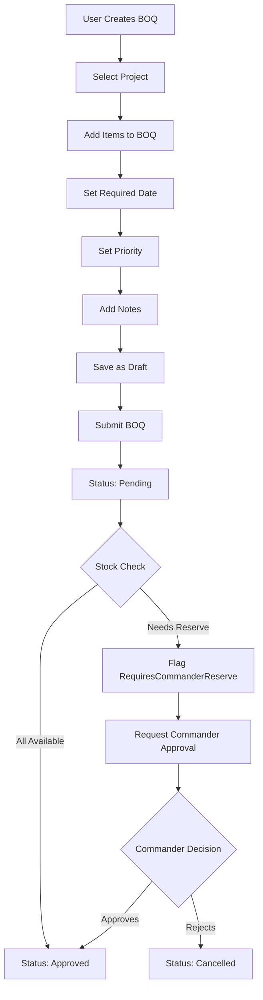
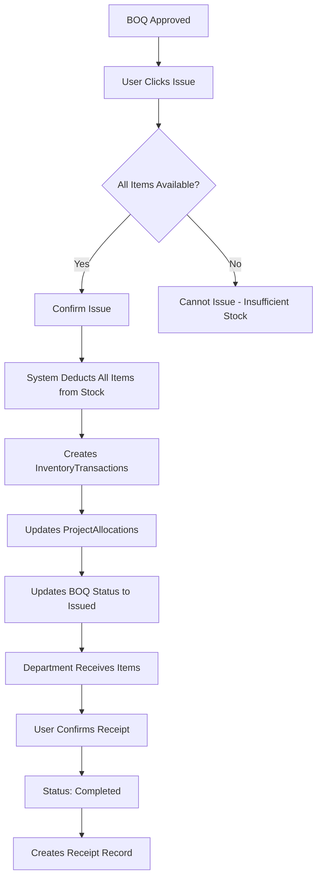
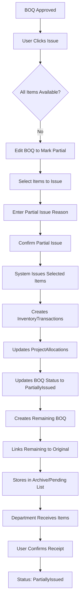

# Requirements Analysis for New Features
## مجمع الصناعات الهندسية - نظام إدارة المخازن

**Date:** February 1, 2026  
**Status:** Complete Requirements Analysis  
**Version:** 1.0

---

## Table of Contents

1. [Project BOQ Requirements](#project-boq-requirements)
2. [Advanced Item Page Requirements](#advanced-item-page-requirements)
3. [Forms & UX Improvement Requirements](#forms--ux-improvement-requirements)
4. [Cross-Feature Requirements](#cross-feature-requirements)
5. [Priority Matrix](#priority-matrix)

---

## Project BOQ Requirements

### 1.1 BOQ Entity Definition

**Purpose:** Create a Bill of Quantities (BOQ) system for projects to track material requirements and fulfillment status.

**Entity Requirements:**

```csharp
public class ProjectBOQ : BaseEntity
{
    // Identification
    public string BOQNumber { get; private set; }  // Unique identifier (e.g., "BOQ-2025-0001")
    public int ProjectId { get; private set; }
    
    // Dates
    public DateTime CreatedDate { get; private set; }
    public DateTime? RequiredDate { get; private set; }
    public DateTime? ApprovedDate { get; private set; }
    public DateTime? CompletedDate { get; private set; }
    
    // Status
    public BOQStatus Status { get; private set; }  // Draft, Pending, Approved, PartiallyIssued, Issued, Completed, Cancelled
    public BOQPriority Priority { get; private set; }  // Low, Medium, High, Critical
    
    // Quantities
    public decimal TotalQuantity { get; private set; }
    public decimal TotalValue { get; private set; }
    public decimal IssuedQuantity { get; private set; }
    public decimal RemainingQuantity { get; private set; }  // Computed: TotalQuantity - IssuedQuantity
    
    // Commander's Reserve
    public bool RequiresCommanderReserve { get; private set; }
    public decimal CommanderReserveQuantity { get; private set; }
    public int? CommanderApprovalId { get; private set; }
    public DateTime? CommanderApprovalDate { get; private set; }
    public string? CommanderApprovalNotes { get; private set; }
    
    // Partial Issue Tracking
    public int? OriginalBOQId { get; private set; }  // Link to original BOQ for remaining BOQs
    public string? PartialIssueReason { get; private set; }  // Reason why BOQ was partially issued
    public bool IsRemainingBOQ { get; private set; }  // Flag indicating this is a remaining BOQ
    
    // Notes
    public string? Notes { get; private set; }
    public string? NotesArabic { get; private set; }
    
    // Approval
    public int? ApprovedBy { get; private set; }
    public string? ApprovalNotes { get; private set; }
    
    // Navigation
    public Project Project { get; private set; }
    public ICollection<ProjectBOQItem> Items { get; private set; } = new List<ProjectBOQItem>();
    public ICollection<InventoryTransaction> Transactions { get; private set; } = new List<InventoryTransaction>();
}

public class ProjectBOQItem : BaseEntity
{
    public int BOQId { get; private set; }
    public int ItemId { get; private set; }
    
    // Quantities
    public decimal RequestedQuantity { get; private set; }
    public decimal IssuedQuantity { get; private set; }
    public decimal RemainingQuantity { get; private set; }  // Computed: RequestedQuantity - IssuedQuantity
    
    // Financial
    public decimal UnitPrice { get; private set; }
    public decimal TotalValue { get; private set; }  // RequestedQuantity * UnitPrice
    public decimal IssuedValue { get; private set; }  // IssuedQuantity * UnitPrice
    
    // Commander's Reserve
    public bool IsFromCommanderReserve { get; private set; }
    public decimal CommanderReserveQuantity { get; private set; }
    
    // Notes
    public string? Notes { get; private set; }
    public string? NotesArabic { get; private set; }
    
    // Partial Issue Tracking
    public string? PartialIssueReason { get; private set; }  // Reason why item was not fully issued
    
    // Navigation
    public ProjectBOQ BOQ { get; private set; }
    public Item Item { get; private set; }
}

public enum BOQStatus
{
    Draft,           // BOQ created, not submitted
    Pending,         // BOQ submitted, awaiting approval
    Approved,         // BOQ approved, ready for issuance
    PartiallyIssued,  // Some items issued, remaining items in new BOQ
    Issued,          // All items issued, awaiting receipt
    Completed,        // All items received and confirmed
    Cancelled         // BOQ cancelled
}

public enum BOQPriority
{
    Low,
    Medium,
    High,
    Critical
}
```

### 1.2 BOQ Workflow Requirements

#### 1.2.1 Create BOQ Workflow



**Requirements:**
- ✅ User can create BOQ for a project
- ✅ User can add multiple items to BOQ
- ✅ System checks stock availability
- ✅ System flags if Commander's Reserve is needed
- ✅ Commander approval workflow for reserve items
- ✅ BOQ can be saved as draft
- ✅ BOQ can be submitted for approval

#### 1.2.2 Full Issue Workflow



**Requirements:**
- ✅ User can issue all items from BOQ
- ✅ System validates all items are available
- ✅ System automatically deducts from stock
- ✅ System creates inventory transactions
- ✅ System updates project allocations
- ✅ System updates BOQ status to Issued
- ✅ Department confirms receipt
- ✅ System creates receipt record
- ✅ System links issue to project and warehouse logs

#### 1.2.3 Partial Issue Workflow



**Requirements:**
- ✅ User can edit BOQ to mark as partially issued
- ✅ User can select which items to issue
- ✅ User can enter reason for partial issue
- ✅ System issues selected items
- ✅ System creates inventory transactions
- ✅ System updates project allocations
- ✅ System updates original BOQ status to PartiallyIssued
- ✅ System automatically creates remaining BOQ
- ✅ System links remaining BOQ to original
- ✅ System stores remaining items in archive/pending list
- ✅ System can tell exactly which items are still missing
- ✅ System can tell from which project
- ✅ System can tell why items were not issued

### 1.3 BOQ Archive & Pending List Requirements

#### 1.3.1 Pending BOQ List

**Purpose:** View all BOQ items that are still pending issuance.

**Requirements:**
```csharp
public interface IPendingBOQService
{
    // Get all pending BOQ items
    Task<IEnumerable<PendingBOQItemDto>> GetPendingBOQItemsAsync(
        int? projectId = null,
        int? warehouseId = null,
        DateTime? fromDate = null,
        DateTime? toDate = null);
    
    // Get pending items for specific BOQ
    Task<IEnumerable<PendingBOQItemDto>> GetPendingItemsForBOQAsync(int boqId);
    
    // Get pending items for specific project
    Task<IEnumerable<PendingBOQItemDto>> GetPendingItemsForProjectAsync(int projectId);
}

public class PendingBOQItemDto
{
    public int BOQId { get; }
    public string BOQNumber { get; }
    public int ProjectId { get; }
    public string ProjectName { get; }
    public string ProjectNameAr { get; }
    public int ItemId { get; }
    public string ItemCode { get; }
    public string ItemName { get; }
    public string ItemNameAr { get; }
    public decimal RequestedQuantity { get; }
    public decimal IssuedQuantity { get; }
    public decimal RemainingQuantity { get; }
    public string Unit { get; }
    public decimal UnitPrice { get; }
    public decimal TotalValue { get; }
    public bool IsFromCommanderReserve { get; }
    public string? PartialIssueReason { get; }
    public DateTime CreatedDate { get; }
    public DateTime? RequiredDate { get; }
    public BOQStatus Status { get; }
    public int? OriginalBOQId { get; }
    public bool IsRemainingBOQ { get; }
}
```

**UI Requirements:**
```typescript
interface PendingBOQPageProps {
    // Filters
    projectId?: number;
    warehouseId?: number;
    fromDate?: Date;
    toDate?: Date;
    
    // Data
    pendingItems: PendingBOQItemDto[];
    
    // Actions
    onIssue: (boqId: number, itemIds: number[]) => void;
    onViewDetails: (boqId: number) => void;
    onExport: () => void;
}

// Pending BOQ List Page
const PendingBOQList: React.FC<PendingBOQPageProps> = ({
    pendingItems,
    projectId,
    warehouseId,
    fromDate,
    toDate,
    onIssue,
    onViewDetails,
    onExport
}) => {
    return (
        <Box>
            {/* Header */}
            <Typography variant="h4">قائمة BOQ المعلقة</Typography>
            
            {/* Filters */}
            <Grid container spacing={2}>
                <Grid item xs={3}>
                    <Select
                        value={projectId}
                        label="المشروع"
                        onChange={handleProjectChange}
                    >
                        <MenuItem value="">كل المشاريع</MenuItem>
                        {projects.map(p => (
                            <MenuItem key={p.id} value={p.id}>
                                {p.nameAr}
                            </MenuItem>
                        ))}
                    </Select>
                </Grid>
                <Grid item xs={3}>
                    <Select
                        value={warehouseId}
                        label="المخزن"
                        onChange={handleWarehouseChange}
                    >
                        <MenuItem value="">كل المخازن</MenuItem>
                        {warehouses.map(w => (
                            <MenuItem key={w.id} value={w.id}>
                                {w.nameAr}
                            </MenuItem>
                        ))}
                    </Select>
                </Grid>
                <Grid item xs={3}>
                    <DatePicker
                        label="من تاريخ"
                        value={fromDate}
                        onChange={handleFromDateChange}
                    />
                </Grid>
                <Grid item xs={3}>
                    <DatePicker
                        label="إلى تاريخ"
                        value={toDate}
                        onChange={handleToDateChange}
                    />
                </Grid>
            </Grid>
            
            {/* Pending Items Table */}
            <DataGrid
                rows={pendingItems}
                columns={[
                    { field: 'boqNumber', headerName: 'رقم BOQ', width: 150 },
                    { field: 'projectNameAr', headerName: 'المشروع', width: 200 },
                    { field: 'itemCode', headerName: 'الكود', width: 120 },
                    { field: 'itemNameAr', headerName: 'الصنف', width: 200 },
                    { field: 'requestedQuantity', headerName: 'المطلوب', width: 100 },
                    { field: 'issuedQuantity', headerName: 'المصدر', width: 100 },
                    { field: 'remainingQuantity', headerName: 'المتبقي', width: 100 },
                    { field: 'unit', headerName: 'الوحدة', width: 80 },
                    { field: 'partialIssueReason', headerName: 'سبب عدم الإصدار الكامل', width: 250 },
                    { field: 'createdDate', headerName: 'تاريخ الإنشاء', width: 150 },
                    { field: 'status', headerName: 'الحالة', width: 120 }
                ]}
                pageSize={20}
                checkboxSelection
                onSelectionModelChange={handleSelectionChange}
            />
            
            {/* Actions */}
            <Box sx={{ mt: 2, display: 'flex', justifyContent: 'flex-end' }}>
                <Button
                    variant="contained"
                    startIcon={<CheckIcon />}
                    onClick={handleIssueSelected}
                    disabled={selectedItems.length === 0}
                >
                    إصدار المحدد
                </Button>
                <Button
                    variant="outlined"
                    startIcon={<ExportIcon />}
                    onClick={onExport}
                >
                    تصدير إلى Excel
                </Button>
            </Box>
        </Box>
    );
};
```

#### 1.3.2 BOQ Archive

**Purpose:** Archive completed BOQs for historical reference.

**Requirements:**
```csharp
public class BOQArchive : BaseEntity
{
    public int OriginalBOQId { get; private set; }
    public DateTime ArchiveDate { get; private set; }
    public string ArchiveReason { get; private set; }
    public string ArchiveReasonArabic { get; private set; }
    public int ArchivedBy { get; private set; }
    
    // Snapshot of original BOQ state
    public string BOQNumber { get; private set; }
    public int ProjectId { get; private set; }
    public decimal TotalQuantity { get; private set; }
    public decimal TotalValue { get; private set; }
    public decimal IssuedQuantity { get; private set; }
    public BOQStatus FinalStatus { get; private set; }
    
    // Navigation
    public ProjectBOQ OriginalBOQ { get; private set; }
    public User ArchivedByUser { get; private set; }
}

public interface IBOQArchiveService
{
    // Archive a completed BOQ
    Task ArchiveBOQAsync(int boqId, string reason, int userId);
    
    // Get archived BOQs
    Task<IEnumerable<BOQArchiveDto>> GetArchivedBOQsAsync(
        int? projectId = null,
        DateTime? fromDate = null,
        DateTime? toDate = null,
        int pageNumber = 1,
        int pageSize = 20);
    
    // Get original BOQ from archive
    Task<ProjectBOQDto> GetOriginalBOQAsync(int archivedBoqId);
    
    // Restore archived BOQ
    Task RestoreBOQAsync(int archivedBoqId, int userId);
}
```

**UI Requirements:**
```typescript
interface BOQArchivePageProps {
    // Filters
    projectId?: number;
    fromDate?: Date;
    toDate?: Date;
    
    // Data
    archivedBOQs: BOQArchiveDto[];
    totalCount: number;
    
    // Actions
    onViewOriginal: (archivedId: number) => void;
    onRestore: (archivedId: number) => void;
    onExport: () => void;
}

// BOQ Archive Page
const BOQArchive: React.FC<BOQArchivePageProps> = ({
    archivedBOQs,
    totalCount,
    projectId,
    fromDate,
    toDate,
    onViewOriginal,
    onRestore,
    onExport
}) => {
    return (
        <Box>
            {/* Header */}
            <Typography variant="h4">أرشيف BOQ</Typography>
            
            {/* Filters */}
            <Grid container spacing={2}>
                <Grid item xs={4}>
                    <Select
                        value={projectId}
                        label="المشروع"
                        onChange={handleProjectChange}
                    >
                        <MenuItem value="">كل المشاريع</MenuItem>
                        {projects.map(p => (
                            <MenuItem key={p.id} value={p.id}>
                                {p.nameAr}
                            </MenuItem>
                        ))}
                    </Select>
                </Grid>
                <Grid item xs={4}>
                    <DatePicker
                        label="من تاريخ"
                        value={fromDate}
                        onChange={handleFromDateChange}
                    />
                </Grid>
                <Grid item xs={4}>
                    <DatePicker
                        label="إلى تاريخ"
                        value={toDate}
                        onChange={handleToDateChange}
                    />
                </Grid>
            </Grid>
            
            {/* Archived BOQs Table */}
            <DataGrid
                rows={archivedBOQs}
                columns={[
                    { field: 'boqNumber', headerName: 'رقم BOQ', width: 150 },
                    { field: 'projectNameAr', headerName: 'المشروع', width: 200 },
                    { field: 'totalQuantity', headerName: 'الكمية الإجمالية', width: 120 },
                    { field: 'issuedQuantity', headerName: 'الكمية المصدرة', width: 120 },
                    { field: 'finalStatus', headerName: 'الحالة النهائية', width: 150 },
                    { field: 'archiveDate', headerName: 'تاريخ الأرشفة', width: 150 },
                    { field: 'archiveReason', headerName: 'سبب الأرشفة', width: 250 }
                ]}
                pageSize={20}
                pagination
                rowCount={totalCount}
                paginationMode="server"
                onPageChange={handlePageChange}
            />
            
            {/* Actions */}
            <Box sx={{ mt: 2, display: 'flex', justifyContent: 'flex-end' }}>
                <Button
                    variant="outlined"
                    startIcon={<VisibilityIcon />}
                    onClick={handleViewOriginal}
                    disabled={!selectedArchivedBOQ}
                >
                    عرض الأصلي
                </Button>
                <Button
                    variant="outlined"
                    startIcon={<RestoreIcon />}
                    onClick={handleRestore}
                    disabled={!selectedArchivedBOQ}
                >
                    استعادة
                </Button>
                <Button
                    variant="outlined"
                    startIcon={<ExportIcon />}
                    onClick={onExport}
                >
                    تصدير إلى Excel
                </Button>
            </Box>
        </Box>
    );
};
```

### 1.4 BOQ API Endpoints Requirements

```csharp
[ApiController]
[Route("api/[controller]")]
[Authorize]
public class ProjectBOQController : ControllerBase
{
    // BOQ CRUD
    [HttpGet]
    public async Task<ActionResult<IEnumerable<ProjectBOQDto>>> GetBOQs(
        [FromQuery] int? projectId = null,
        [FromQuery] BOQStatus? status = null,
        [FromQuery] DateTime? fromDate = null,
        [FromQuery] DateTime? toDate = null,
        [FromQuery] int pageNumber = 1,
        [FromQuery] int pageSize = 20)
    {
        var query = new GetBOQsQuery(projectId, status, fromDate, toDate, pageNumber, pageSize);
        var result = await _mediator.Send(query);
        return Ok(result);
    }
    
    [HttpGet("{id}")]
    public async Task<ActionResult<ProjectBOQDto>> GetBOQ(int id)
    {
        var query = new GetBOQQuery(id);
        var result = await _mediator.Send(query);
        if (result == null)
            return NotFound();
        return Ok(result);
    }
    
    [HttpPost]
    public async Task<ActionResult<ProjectBOQDto>> CreateBOQ([FromBody] CreateBOQDto request)
    {
        var userId = int.Parse(User.FindFirst("sub")?.Value ?? "0");
        var command = new CreateBOQCommand(request, userId);
        var result = await _mediator.Send(command);
        return CreatedAtAction(nameof(GetBOQ), new { id = result.Id }, result);
    }
    
    [HttpPut("{id}")]
    public async Task<ActionResult<ProjectBOQDto>> UpdateBOQ(int id, [FromBody] UpdateBOQDto request)
    {
        var userId = int.Parse(User.FindFirst("sub")?.Value ?? "0");
        var command = new UpdateBOQCommand(request with { Id = id }, userId);
        var result = await _mediator.Send(command);
        return Ok(result);
    }
    
    [HttpPost("{id}/submit")]
    public async Task<ActionResult<ProjectBOQDto>> SubmitBOQ(int id)
    {
        var userId = int.Parse(User.FindFirst("sub")?.Value ?? "0");
        var command = new SubmitBOQCommand(id, userId);
        var result = await _mediator.Send(command);
        return Ok(result);
    }
    
    [HttpPost("{id}/approve")]
    public async Task<ActionResult<ProjectBOQDto>> ApproveBOQ(int id, [FromBody] ApproveBOQDto request)
    {
        var userId = int.Parse(User.FindFirst("sub")?.Value ?? "0");
        var command = new ApproveBOQCommand(request with { Id = id }, userId);
        var result = await _mediator.Send(command);
        return Ok(result);
    }
    
    [HttpPost("{id}/reject")]
    public async Task<ActionResult<ProjectBOQDto>> RejectBOQ(int id, [FromBody] RejectBOQDto request)
    {
        var userId = int.Parse(User.FindFirst("sub")?.Value ?? "0");
        var command = new RejectBOQCommand(request with { Id = id }, userId);
        var result = await _mediator.Send(command);
        return Ok(result);
    }
    
    [HttpPost("{id}/issue")]
    public async Task<ActionResult<ProjectBOQDto>> IssueBOQ(int id, [FromBody] IssueBOQDto request)
    {
        var userId = int.Parse(User.FindFirst("sub")?.Value ?? "0");
        var command = new IssueBOQCommand(request with { Id = id }, userId);
        var result = await _mediator.Send(command);
        return Ok(result);
    }
    
    [HttpPost("{id}/issue-partial")]
    public async Task<ActionResult<ProjectBOQDto>> IssuePartialBOQ(int id, [FromBody] IssuePartialBOQDto request)
    {
        var userId = int.Parse(User.FindFirst("sub")?.Value ?? "0");
        var command = new IssuePartialBOQCommand(request with { Id = id }, userId);
        var result = await _mediator.Send(command);
        return Ok(result);
    }
    
    [HttpPost("{id}/receive")]
    public async Task<ActionResult<ProjectBOQDto>> ReceiveBOQ(int id, [FromBody] ReceiveBOQDto request)
    {
        var userId = int.Parse(User.FindFirst("sub")?.Value ?? "0");
        var command = new ReceiveBOQCommand(request with { Id = id }, userId);
        var result = await _mediator.Send(command);
        return Ok(result);
    }
    
    [HttpPost("{id}/cancel")]
    public async Task<ActionResult<bool>> CancelBOQ(int id, [FromBody] CancelBOQDto request)
    {
        var userId = int.Parse(User.FindFirst("sub")?.Value ?? "0");
        var command = new CancelBOQCommand(id, userId, request.Reason);
        var result = await _mediator.Send(command);
        return Ok(result);
    }
    
    // Pending Items
    [HttpGet("pending-items")]
    public async Task<ActionResult<IEnumerable<PendingBOQItemDto>>> GetPendingBOQItems(
        [FromQuery] int? projectId = null,
        [FromQuery] int? warehouseId = null,
        [FromQuery] DateTime? fromDate = null,
        [FromQuery] DateTime? toDate = null)
    {
        var query = new GetPendingBOQItemsQuery(projectId, warehouseId, fromDate, toDate);
        var result = await _mediator.Send(query);
        return Ok(result);
    }
    
    // Archive
    [HttpGet("archive")]
    public async Task<ActionResult<IEnumerable<BOQArchiveDto>>> GetArchivedBOQs(
        [FromQuery] int? projectId = null,
        [FromQuery] DateTime? fromDate = null,
        [FromQuery] DateTime? toDate = null,
        [FromQuery] int pageNumber = 1,
        [FromQuery] int pageSize = 20)
    {
        var query = new GetArchivedBOQsQuery(projectId, fromDate, toDate, pageNumber, pageSize);
        var result = await _mediator.Send(query);
        return Ok(result);
    }
    
    [HttpPost("archive/{id}")]
    public async Task<ActionResult<bool>> ArchiveBOQ(int id, [FromBody] ArchiveBOQDto request)
    {
        var userId = int.Parse(User.FindFirst("sub")?.Value ?? "0");
        var command = new ArchiveBOQCommand(id, request.Reason, userId);
        var result = await _mediator.Send(command);
        return Ok(result);
    }
    
    [HttpPost("archive/{id}/restore")]
    public async Task<ActionResult<ProjectBOQDto>> RestoreBOQ(int id)
    {
        var userId = int.Parse(User.FindFirst("sub")?.Value ?? "0");
        var command = new RestoreBOQCommand(id, userId);
        var result = await _mediator.Send(command);
        return Ok(result);
    }
}
```

---

## Advanced Item Page Requirements

### 2.1 Item Details Page Definition

**Purpose:** Provide comprehensive view of item details including stock, allocations, transactions, and project usage.

**UI Requirements:**

```typescript
interface ItemDetailsPageProps {
    itemId: number;
    warehouseId?: number;
}

interface ItemDetails {
    // Basic Information
    id: number;
    itemCode: string;
    itemName: string;
    itemNameAr: string;
    description: string;
    descriptionAr: string;
    category: string;
    categoryAr: string;
    unit: string;
    unitAr: string;
    specifications: string;
    specificationsAr: string;
    barcode: string;
    
    // Financial
    standardCost: number;
    weight: number;
    weightUnit: string;
    
    // Stock Control
    reorderPoint: number;
    minimumStock: number;
    maximumStock: number;
    reservePercentage: number;
    isCritical: boolean;
    isVehicleRelated: boolean;
    
    // Stock Information
    totalStock: number;
    generalStock: number;
    commanderReserve: number;
    reservedStock: number;
    availableStock: number;
    allocatedStock: number;
    
    // Warehouse Breakdown
    warehouseStock: WarehouseStock[];
    
    // Project Allocations
    projectAllocations: ProjectAllocation[];
    
    // Transaction History
    transactions: ItemTransaction[];
    
    // Consumption Summary
    consumptionSummary: ConsumptionSummary;
}

interface WarehouseStock {
    warehouseId: number;
    warehouseName: string;
    warehouseNameAr: string;
    totalStock: number;
    generalStock: number;
    commanderReserve: number;
    reservedStock: number;
    availableStock: number;
    allocatedStock: number;
    warehouseType: 'Central' | 'Factory' | 'Project';
}

interface ProjectAllocation {
    projectId: number;
    projectName: string;
    projectNameAr: string;
    allocatedQuantity: number;
    consumedQuantity: number;
    returnedQuantity: number;
    availableQuantity: number;
    unitPrice: number;
    totalValue: number;
    allocationDate: string;
    isFromCommanderReserve: boolean;
}

interface ItemTransaction {
    id: number;
    transactionDate: string;
    transactionType: string;
    quantity: number;
    generalQuantity: number;
    commanderReserveQuantity: number;
    unitPrice: number;
    totalValue: number;
    previousGeneralQuantity: number;
    previousReserveQuantity: number;
    newGeneralQuantity: number;
    newReserveQuantity: number;
    referenceType: string;
    referenceId: number;
    referenceNumber: string;
    notes: string;
    isFromCommanderReserve: boolean;
    userName: string;
    warehouseName: string;
}

interface ConsumptionSummary {
    totalConsumed: number;
    totalConsumedValue: number;
    averageMonthlyConsumption: number;
    consumptionTrend: 'Increasing' | 'Decreasing' | 'Stable';
    lastConsumptionDate: string;
}
```

### 2.2 Item Details Page UI Structure

```typescript
// Advanced Item Details Page
const ItemDetailsPage: React.FC<ItemDetailsPageProps> = ({ itemId, warehouseId }) => {
    const [item, setItem] = useState<ItemDetails | null>(null);
    const [loading, setLoading] = useState(true);
    const [activeTab, setActiveTab] = useState(0);
    
    useEffect(() => {
        loadItemDetails();
    }, [itemId, warehouseId]);
    
    const loadItemDetails = async () => {
        setLoading(true);
        const data = await api.get(`/api/inventory/items/${itemId}`, {
            params: { warehouseId }
        });
        setItem(data);
        setLoading(false);
    };
    
    if (loading) return <LoadingSpinner />;
    if (!item) return <NotFound />;
    
    return (
        <Box>
            {/* Header */}
            <Box sx={{ display: 'flex', justifyContent: 'space-between', alignItems: 'center', mb: 3 }}>
                <Typography variant="h4">
                    {item.itemNameAr} / {item.itemName}
                </Typography>
                <Typography variant="subtitle1" color="textSecondary">
                    {item.itemCode} - {item.categoryAr}
                </Typography>
                <Box sx={{ display: 'flex', gap: 2 }}>
                    <Button variant="outlined" startIcon={<EditIcon />}>
                        تعديل
                    </Button>
                    <Button variant="outlined" startIcon={<PrintIcon />}>
                        طباعة
                    </Button>
                    <Button variant="outlined" startIcon={<ExportIcon />}>
                        تصدير
                    </Button>
                </Box>
            </Box>
            
            {/* Tabs */}
            <Paper>
                <Tabs value={activeTab} onChange={(e, newValue) => setActiveTab(newValue)}>
                    <Tab label="معلومات أساسية" />
                    <Tab label="المخزون" />
                    <Tab label="تخصيصات المشاريع" />
                    <Tab label="تاريخ الحركات" />
                    <Tab label="تحليل الاستهلاك" />
                </Tabs>
                
                {/* Tab Panels */}
                <TabPanel value={activeTab} index={0}>
                    <BasicInformationTab item={item} />
                </TabPanel>
                <TabPanel value={activeTab} index={1}>
                    <StockTab item={item} />
                </TabPanel>
                <TabPanel value={activeTab} index={2}>
                    <ProjectAllocationsTab item={item} />
                </TabPanel>
                <TabPanel value={activeTab} index={3}>
                    <TransactionHistoryTab item={item} />
                </TabPanel>
                <TabPanel value={activeTab} index={4}>
                    <ConsumptionAnalysisTab item={item} />
                </TabPanel>
            </Paper>
        </Box>
    );
};
```

### 2.3 Basic Information Tab

```typescript
const BasicInformationTab: React.FC<{ item: ItemDetails }> = ({ item }) => {
    return (
        <Grid container spacing={3}>
            <Grid item xs={12} md={6}>
                <Typography variant="h6" gutterBottom>معلومات الصنف</Typography>
                <Box sx={{ bgcolor: 'grey.100', p: 2, borderRadius: 1 }}>
                    <Grid container spacing={2}>
                        <Grid item xs={6}>
                            <Typography variant="body2">الكود:</Typography>
                            <Typography variant="body1" fontWeight="bold">{item.itemCode}</Typography>
                        </Grid>
                        <Grid item xs={6}>
                            <Typography variant="body2">الاسم (عربي):</Typography>
                            <Typography variant="body1" fontWeight="bold">{item.itemNameAr}</Typography>
                        </Grid>
                        <Grid item xs={6}>
                            <Typography variant="body2">الاسم (إنجليزي):</Typography>
                            <Typography variant="body1" fontWeight="bold">{item.itemName}</Typography>
                        </Grid>
                        <Grid item xs={6}>
                            <Typography variant="body2">الفئة:</Typography>
                            <Typography variant="body1" fontWeight="bold">{item.categoryAr} / {item.category}</Typography>
                        </Grid>
                        <Grid item xs={6}>
                            <Typography variant="body2">الوحدة:</Typography>
                            <Typography variant="body1" fontWeight="bold">{item.unitAr} / {item.unit}</Typography>
                        </Grid>
                    </Grid>
                </Box>
            </Grid>
            
            <Grid item xs={12} md={6}>
                <Typography variant="h6" gutterBottom>الوصف</Typography>
                <Box sx={{ bgcolor: 'grey.100', p: 2, borderRadius: 1 }}>
                    <Typography variant="body2">{item.descriptionAr}</Typography>
                    <Typography variant="body2" color="textSecondary">{item.description}</Typography>
                </Box>
            </Grid>
            
            <Grid item xs={12} md={6}>
                <Typography variant="h6" gutterBottom>المواصفات</Typography>
                <Box sx={{ bgcolor: 'grey.100', p: 2, borderRadius: 1 }}>
                    <Typography variant="body2">{item.specificationsAr}</Typography>
                    <Typography variant="body2" color="textSecondary">{item.specifications}</Typography>
                </Box>
            </Grid>
            
            <Grid item xs={12} md={6}>
                <Typography variant="h6" gutterBottom>معلومات مالية وفيزيائية</Typography>
                <Box sx={{ bgcolor: 'grey.100', p: 2, borderRadius: 1 }}>
                    <Grid container spacing={2}>
                        <Grid item xs={6}>
                            <Typography variant="body2">التكلفة القياسية:</Typography>
                            <Typography variant="body1" fontWeight="bold">{item.standardCost} ج.م</Typography>
                        </Grid>
                        <Grid item xs={6}>
                            <Typography variant="body2">الوزن:</Typography>
                            <Typography variant="body1" fontWeight="bold">{item.weight} {item.weightUnit}</Typography>
                        </Grid>
                        <Grid item xs={6}>
                            <Typography variant="body2">الباركود:</Typography>
                            <Typography variant="body1" fontWeight="bold">{item.barcode || 'غير محدد'}</Typography>
                        </Grid>
                    </Grid>
                </Box>
            </Grid>
        </Grid>
    );
};
```

### 2.4 Stock Tab

```typescript
const StockTab: React.FC<{ item: ItemDetails }> = ({ item }) => {
    return (
        <Box>
            {/* Stock Summary Cards */}
            <Grid container spacing={3} sx={{ mb: 3 }}>
                <Grid item xs={12} sm={6} md={3}>
                    <Card>
                        <CardContent>
                            <Typography variant="subtitle2" color="textSecondary">المخزون الإجمالي</Typography>
                            <Typography variant="h4" color="primary">
                                {item.totalStock.toLocaleString()} {item.unitAr}
                            </Typography>
                        </CardContent>
                    </Card>
                </Grid>
                <Grid item xs={12} sm={6} md={3}>
                    <Card>
                        <CardContent>
                            <Typography variant="subtitle2" color="textSecondary">المخزون العام</Typography>
                            <Typography variant="h4" color="success">
                                {item.generalStock.toLocaleString()} {item.unitAr}
                            </Typography>
                        </CardContent>
                    </Card>
                </Grid>
                <Grid item xs={12} sm={6} md={3}>
                    <Card sx={{ bgcolor: 'warning.light' }}>
                        <CardContent>
                            <Typography variant="subtitle2" color="textSecondary">احتياطي القائد ⭐</Typography>
                            <Typography variant="h4" color="warning.dark">
                                {item.commanderReserve.toLocaleString()} {item.unitAr}
                            </Typography>
                        </CardContent>
                    </Card>
                </Grid>
                <Grid item xs={12} sm={6} md={3}>
                    <Card>
                        <CardContent>
                            <Typography variant="subtitle2" color="textSecondary">المخزون المتاح</Typography>
                            <Typography variant="h4" color="info">
                                {item.availableStock.toLocaleString()} {item.unitAr}
                            </Typography>
                        </CardContent>
                    </Card>
                </Grid>
            </Grid>
            
            {/* Stock Thresholds */}
            <Box sx={{ bgcolor: 'grey.100', p: 2, borderRadius: 1, mb: 3 }}>
                <Typography variant="h6" gutterBottom>حدود المخزون</Typography>
                <Grid container spacing={2}>
                    <Grid item xs={4}>
                        <Typography variant="body2">نقطة إعادة الطلب:</Typography>
                        <Typography variant="body1" fontWeight="bold">{item.reorderPoint} {item.unitAr}</Typography>
                    </Grid>
                    <Grid item xs={4}>
                        <Typography variant="body2">الحد الأدنى:</Typography>
                        <Typography variant="body1" fontWeight="bold">{item.minimumStock} {item.unitAr}</Typography>
                    </Grid>
                    <Grid item xs={4}>
                        <Typography variant="body2">الحد الأقصى:</Typography>
                        <Typography variant="body1" fontWeight="bold">{item.maximumStock} {item.unitAr}</Typography>
                    </Grid>
                </Grid>
            </Box>
            
            {/* Stock Status */}
            <Alert severity={getStockStatusSeverity(item)}>
                {getStockStatusMessage(item)}
            </Alert>
            
            {/* Warehouse Breakdown Table */}
            <Typography variant="h6" gutterBottom sx={{ mt: 3 }}>
                توزيع المخزون حسب المخازن
            </Typography>
            <TableContainer component={Paper}>
                <Table>
                    <TableHead>
                        <TableRow>
                            <TableCell>المخزن</TableCell>
                            <TableCell>النوع</TableCell>
                            <TableCell>الإجمالي</TableCell>
                            <TableCell>العام</TableCell>
                            <TableCell>الاحتياطي⭐ </TableCell>
                            <TableCell>المتاح</TableCell>
                            <TableCell>الحالة</TableCell>
                        </TableRow>
                    </TableHead>
                    <TableBody>
                        {item.warehouseStock.map((ws, index) => (
                            <TableRow key={index}>
                                <TableCell>
                                    {ws.warehouseNameAr}
                                </TableCell>
                                <TableCell>
                                    <Chip label={getWarehouseTypeLabel(ws.warehouseType)} size="small" />
                                </TableCell>
                                <TableCell>{ws.totalStock}</TableCell>
                                <TableCell>{ws.generalStock}</TableCell>
                                <TableCell sx={{ bgcolor: 'warning.light' }}>
                                    {ws.commanderReserve}
                                </TableCell>
                                <TableCell>{ws.availableStock}</TableCell>
                                <TableCell>
                                    {getWarehouseStockStatus(ws)}
                                </TableCell>
                            </TableRow>
                        ))}
                    </TableBody>
                </Table>
            </TableContainer>
        </Box>
    );
};
```

### 2.5 Project Allocations Tab

```typescript
const ProjectAllocationsTab: React.FC<{ item: ItemDetails }> = ({ item }) => {
    return (
        <Box>
            {/* Allocations Summary */}
            <Grid container spacing={3} sx={{ mb: 3 }}>
                <Grid item xs={12} sm={4}>
                    <Card>
                        <CardContent>
                            <Typography variant="subtitle2" color="textSecondary">عدد المشاريع</Typography>
                            <Typography variant="h4">{item.projectAllocations.length}</Typography>
                        </CardContent>
                    </Card>
                </Grid>
                <Grid item xs={12} sm={4}>
                    <Card>
                        <CardContent>
                            <Typography variant="subtitle2" color="textSecondary">إجمالي المخصص</Typography>
                            <Typography variant="h4">
                                {item.projectAllocations.reduce((sum, alloc) => sum + alloc.allocatedQuantity, 0).toLocaleString()} {item.unitAr}
                            </Typography>
                        </CardContent>
                    </Card>
                </Grid>
                <Grid item xs={12} sm={4}>
                    <Card>
                        <CardContent>
                            <Typography variant="subtitle2" color="textSecondary">إجمالي المستهلك</Typography>
                            <Typography variant="h4">
                                {item.projectAllocations.reduce((sum, alloc) => sum + alloc.consumedQuantity, 0).toLocaleString()} {item.unitAr}
                            </Typography>
                        </CardContent>
                    </Card>
                </Grid>
            </Grid>
            
            {/* Allocations Table */}
            <Typography variant="h6" gutterBottom>
                تخصيصات المشاريع
            </Typography>
            <DataGrid
                rows={item.projectAllocations}
                columns={[
                    { field: 'projectNameAr', headerName: 'المشروع', width: 200 },
                    { field: 'allocatedQuantity', headerName: 'المخصص', width: 120, type: 'number' },
                    { field: 'consumedQuantity', headerName: 'المستهلك', width: 120, type: 'number' },
                    { field: 'returnedQuantity', headerName: 'المرجع', width: 120, type: 'number' },
                    { field: 'availableQuantity', headerName: 'المتبقي', width: 120, type: 'number' },
                    { field: 'unitPrice', headerName: 'سعر الوحدة', width: 120, type: 'number' },
                    { field: 'totalValue', headerName: 'القيمة الإجمالية', width: 150, type: 'number' },
                    { field: 'allocationDate', headerName: 'تاريخ التخصيص', width: 150, type: 'date' },
                    { field: 'isFromCommanderReserve', headerName: 'من الاحتياطي', width: 120, type: 'boolean' }
                ]}
                pageSize={10}
                autoHeight
            />
        </Box>
    );
};
```

### 2.6 Transaction History Tab

```typescript
const TransactionHistoryTab: React.FC<{ item: ItemDetails }> = ({ item }) => {
    return (
        <Box>
            {/* Transaction Summary */}
            <Grid container spacing={3} sx={{ mb: 3 }}>
                <Grid item xs={12} sm={3}>
                    <Card>
                        <CardContent>
                            <Typography variant="subtitle2" color="textSecondary">عدد الحركات</Typography>
                            <Typography variant="h4">{item.transactions.length}</Typography>
                        </CardContent>
                    </Card>
                </Grid>
                <Grid item xs={12} sm={3}>
                    <Card>
                        <CardContent>
                            <Typography variant="subtitle2" color="textSecondary">إجمالي الصادر</Typography>
                            <Typography variant="h4">
                                {item.transactions.filter(t => ['Issue', 'TransferOut'].includes(t.transactionType)).reduce((sum, t) => sum + t.quantity, 0).toLocaleString()} {item.unitAr}
                            </Typography>
                        </CardContent>
                    </Card>
                </Grid>
                <Grid item xs={12} sm={3}>
                    <Card>
                        <CardContent>
                            <Typography variant="subtitle2" color="textSecondary">إجمالي الوارد</Typography>
                            <Typography variant="h4">
                                {item.transactions.filter(t => ['Receipt', 'TransferIn', 'Return'].includes(t.transactionType)).reduce((sum, t) => sum + t.quantity, 0).toLocaleString()} {item.unitAr}
                            </Typography>
                        </CardContent>
                    </Card>
                </Grid>
                <Grid item xs={12} sm={3}>
                    <Card>
                        <CardContent>
                            <Typography variant="subtitle2" color="textSecondary">صافي التغيير</Typography>
                            <Typography variant="h4">
                                {(item.transactions.filter(t => ['Receipt', 'TransferIn', 'Return'].reduce((sum, t) => sum + t.quantity, 0) - 
                                  item.transactions.filter(t => ['Issue', 'TransferOut'].reduce((sum, t) => sum + t.quantity, 0))).toLocaleString()} {item.unitAr}
                            </Typography>
                        </CardContent>
                    </Card>
                </Grid>
            </Grid>
            
            {/* Transactions Table */}
            <Typography variant="h6" gutterBottom>
                تاريخ الحركات
            </Typography>
            <DataGrid
                rows={item.transactions}
                columns={[
                    { field: 'transactionDate', headerName: 'التاريخ', width: 150, type: 'dateTime' },
                    { field: 'transactionType', headerName: 'النوع', width: 120 },
                    { field: 'quantity', headerName: 'الكمية', width: 100, type: 'number' },
                    { field: 'generalQuantity', headerName: 'من العام', width: 100, type: 'number' },
                    { field: 'commanderReserveQuantity', headerName: 'من الاحتياطي', width: 120, type: 'number' },
                    { field: 'unitPrice', headerName: 'سعر الوحدة', width: 120, type: 'number' },
                    { field: 'totalValue', headerName: 'القيمة', width: 120, type: 'number' },
                    { field: 'referenceType', headerName: 'المرجع', width: 120 },
                    { field: 'referenceNumber', headerName: 'رقم المرجع', width: 150 },
                    { field: 'userName', headerName: 'المستخدم', width: 150 },
                    { field: 'warehouseName', headerName: 'المخزن', width: 150 },
                    { field: 'isFromCommanderReserve', headerName: 'احتياطي', width: 100, type: 'boolean' }
                ]}
                pageSize={20}
                autoHeight
                pagination
            />
            
            {/* Export Button */}
            <Box sx={{ mt: 2, display: 'flex', justifyContent: 'flex-end' }}>
                <Button
                    variant="contained"
                    startIcon={<ExcelIcon />}
                    onClick={handleExportToExcel}
                >
                    تصدير إلى Excel
                </Button>
            </Box>
        </Box>
    );
};
```

### 2.7 Consumption Analysis Tab

```typescript
const ConsumptionAnalysisTab: React.FC<{ item: ItemDetails }> = ({ item }) => {
    return (
        <Box>
            {/* Consumption Summary */}
            <Grid container spacing={3} sx={{ mb: 3 }}>
                <Grid item xs={12} sm={4}>
                    <Card>
                        <CardContent>
                            <Typography variant="subtitle2" color="textSecondary">إجمالي المستهلك</Typography>
                            <Typography variant="h4">
                                {item.consumptionSummary.totalConsumed.toLocaleString()} {item.unitAr}
                            </Typography>
                        </CardContent>
                    </Card>
                </Grid>
                <Grid item xs={12} sm={4}>
                    <Card>
                        <CardContent>
                            <Typography variant="subtitle2" color="textSecondary">القيمة الإجمالية</Typography>
                            <Typography variant="h4">
                                {item.consumptionSummary.totalConsumedValue.toLocaleString()} ج.م
                            </Typography>
                        </CardContent>
                    </Card>
                </Grid>
                <Grid item xs={12} sm={4}>
                    <Card>
                        <CardContent>
                            <Typography variant="subtitle2" color="textSecondary">متوسط الاستهلاك الشهري</Typography>
                            <Typography variant="h4">
                                {item.consumptionSummary.averageMonthlyConsumption.toLocaleString()} {item.unitAr}
                            </Typography>
                        </CardContent>
                    </Card>
                </Grid>
            </Grid>
            
            {/* Consumption Trend */}
            <Box sx={{ bgcolor: 'grey.100', p: 2, borderRadius: 1, mb: 3 }}>
                <Typography variant="h6" gutterBottom>اتجاه الاستهلاك</Typography>
                <Alert severity={getConsumptionTrendSeverity(item.consumptionSummary.consumptionTrend)}>
                    {getConsumptionTrendMessage(item.consumptionSummary.consumptionTrend)}
                </Alert>
                <Typography variant="body2" sx={{ mt: 1 }}>
                    آخر استهلاك: {item.consumptionSummary.lastConsumptionDate}
                </Typography>
            </Box>
            
            {/* Consumption Chart */}
            <Typography variant="h6" gutterBottom sx={{ mt: 3 }}>
                رسم بياني للاستهلاك
            </Typography>
            <Box sx={{ height: 400 }}>
                <ResponsiveContainer width="100%" height="100%">
                    <LineChart data={item.consumptionSummary.chartData}>
                        <CartesianGrid dataKey="date" />
                        <XAxis dataKey="date" />
                        <YAxis />
                        <Tooltip />
                        <Legend />
                        <Line type="monotone" dataKey="quantity" stroke="#8884d8" strokeWidth={2} />
                    </LineChart>
                </ResponsiveContainer>
            </Box>
        </Box>
    );
};
```

---

## Forms & UX Improvement Requirements

### 3.1 Search-Based Item Selection

**Purpose:** Eliminate free text typing for item codes and provide search-based autocomplete.

**Requirements:**

```typescript
interface ItemAutocompleteProps {
    // Selection
    items: Item[];
    selectedItems: Item[];
    onChange: (items: Item[]) => void;
    
    // Configuration
    multiple?: boolean;
    disabled?: boolean;
    placeholder?: string;
    
    // Filters
    warehouseId?: number;
    category?: string;
    onlyAvailable?: boolean;
}

const ItemAutocomplete: React.FC<ItemAutocompleteProps> = ({
    items,
    selectedItems,
    onChange,
    multiple = false,
    disabled = false,
    placeholder = 'ابحث عن الصنف',
    warehouseId,
    category,
    onlyAvailable = false
}) => {
    const [searchTerm, setSearchTerm] = useState('');
    const [filteredItems, setFilteredItems] = useState<Item[]>([]);
    
    useEffect(() => {
        // Filter items based on search term and other filters
        let filtered = items;
        
        // Apply search filter
        if (searchTerm) {
            const term = searchTerm.toLowerCase();
            filtered = filtered.filter(item => 
                item.itemCode.toLowerCase().includes(term) ||
                item.itemName.toLowerCase().includes(term) ||
                item.itemNameAr.includes(term) ||
                item.barcode?.toLowerCase().includes(term)
            );
        }
        
        // Apply warehouse filter
        if (warehouseId) {
            filtered = filtered.filter(item => 
                item.warehouseStock.some(ws => ws.warehouseId === warehouseId)
            );
        }
        
        // Apply category filter
        if (category) {
            filtered = filtered.filter(item => item.category === category);
        }
        
        // Apply availability filter
        if (onlyAvailable) {
            filtered = filtered.filter(item => item.availableStock > 0);
        }
        
        setFilteredItems(filtered);
    }, [searchTerm, items, warehouseId, category, onlyAvailable]);
    
    return (
        <Autocomplete
            multiple={multiple}
            disabled={disabled}
            options={filteredItems}
            value={selectedItems}
            onChange={(event, value) => onChange(value as Item[])}
            getOptionLabel={(option) => `${option.itemCode} - ${option.itemNameAr}`}
            filterOptions={(options, params) => {
                const { inputValue } = params;
                setSearchTerm(inputValue);
                return options;
            }}
            noOptionsText="لا توجد نتائج"
            loadingText="جاري البحث..."
            renderInput={(params) => (
                <TextField
                    {...params.InputProps}
                    label={placeholder}
                    placeholder={placeholder}
                    InputProps={{
                        ...params.InputProps,
                        endAdornment: (
                            <InputAdornment position="end">
                                <SearchIcon />
                            </InputAdornment>
                        ),
                    }}
                />
            )}
            renderOption={(props, option) => (
                <li {...props}>
                    <Box sx={{ display: 'flex', flexDirection: 'column' }}>
                        <Typography variant="body1" fontWeight="bold">
                            {option.itemCode}
                        </Typography>
                        <Box sx={{ display: 'flex', gap: 1, alignItems: 'center' }}>
                            <Typography variant="body2">
                                {option.itemNameAr}
                            </Typography>
                            <Typography variant="caption" color="textSecondary">
                                {option.itemName}
                            </Typography>
                        </Box>
                        <Box sx={{ display: 'flex', gap: 2, alignItems: 'center' }}>
                            <Chip label={option.categoryAr} size="small" />
                            <Chip 
                                label={`${option.availableStock} ${option.unitAr} متاح`} 
                                size="small" 
                                color={option.availableStock > 0 ? 'success' : 'error'}
                            />
                        </Box>
                    </Box>
                </li>
            )}
        />
    );
};
```

### 3.2 Controlled Quantity Input

**Purpose:** Prevent quantity entry errors with validation and constraints.

**Requirements:**

```typescript
interface QuantityInputProps {
    // Value
    value: number;
    onChange: (value: number) => void;
    
    // Validation
    min?: number;
    max?: number;
    step?: number;
    unit?: string;
    availableQuantity?: number;
    
    // UI
    label?: string;
    placeholder?: string;
    disabled?: boolean;
    error?: boolean;
    helperText?: string;
}

const QuantityInput: React.FC<QuantityInputProps> = ({
    value,
    onChange,
    min = 1,
    max,
    step = 1,
    unit,
    availableQuantity,
    label,
    placeholder,
    disabled = false,
    error = false,
    helperText
}) => {
    const [localValue, setLocalValue] = useState(value);
    const [validationError, setValidationError] = useState<string | null>(null);
    
    useEffect(() => {
        setLocalValue(value);
    }, [value]);
    
    const handleChange = (event: React.ChangeEvent<HTMLInputElement>) => {
        const newValue = parseFloat(event.target.value);
        
        // Validate min
        if (newValue < min) {
            setValidationError(`الحد الأدنى هو ${min}`);
            return;
        }
        
        // Validate max
        if (max && newValue > max) {
            setValidationError(`الحد الأقصى هو ${max}`);
            return;
        }
        
        // Validate available quantity
        if (availableQuantity && newValue > availableQuantity) {
            setValidationError(`المتاح هو ${availableQuantity} ${unit}`);
            return;
        }
        
        // Clear validation error
        setValidationError(null);
        setLocalValue(newValue);
        onChange(newValue);
    };
    
    return (
        <TextField
            type="number"
            label={label}
            placeholder={placeholder}
            value={localValue}
            onChange={handleChange}
            disabled={disabled}
            error={error || validationError !== null}
            helperText={validationError || helperText || (availableQuantity && `المتاح: ${availableQuantity} ${unit}`)}
            InputProps={{
                inputProps: {
                    min,
                    max,
                    step
                },
                endAdornment: unit ? (
                    <InputAdornment position="end">{unit}</InputAdornment>
                ) : undefined
            }}
        />
    );
};
```

### 3.3 Dropdown-Only Selection

**Purpose:** Prevent free text entry for critical fields like departments, projects, warehouses.

**Requirements:**

```typescript
interface DropdownSelectProps<T> {
    // Value
    value: T | null;
    onChange: (value: T | null) => void;
    
    // Options
    options: Array<{ id: T; labelAr: string; labelEn: string }>;
    
    // Configuration
    label?: string;
    placeholder?: string;
    disabled?: boolean;
    required?: boolean;
    error?: boolean;
    helperText?: string;
}

const DropdownSelect = <T extends number>({
    value,
    onChange,
    options,
    label,
    placeholder,
    disabled = false,
    required = false,
    error = false,
    helperText
}: DropdownSelectProps<T>) => {
    return (
        <FormControl fullWidth error={error} required={required}>
            {label && <InputLabel>{label}</InputLabel>}
            <Select
                value={value}
                onChange={(e) => onChange(e.target.value as T | null)}
                disabled={disabled}
                displayEmpty
            >
                {placeholder && <MenuItem value="" disabled>
                    <em>{placeholder}</em>
                </MenuItem>}
                {options.map(option => (
                    <MenuItem key={option.id} value={option.id}>
                        <Box sx={{ display: 'flex', flexDirection: 'column' }}>
                            <Typography variant="body1">{option.labelAr}</Typography>
                            <Typography variant="caption" color="textSecondary">
                                {option.labelEn}
                            </Typography>
                        </Box>
                    </MenuItem>
                ))}
            </Select>
            {helperText && <FormHelperText>{helperText}</FormHelperText>}
        </FormControl>
    );
};
```

### 3.4 Form Validation & Error Handling

**Purpose:** Provide clear, specific error messages with user guidance.

**Requirements:**

```typescript
interface FormError {
    code: string;
    messageAr: string;
    messageEn: string;
    severity: 'error' | 'warning' | 'info';
    guidanceAr?: string;
    guidanceEn?: string;
}

const ERROR_MESSAGES: Record<string, FormError> = {
    'INSUFFICIENT_STOCK': {
        code: 'INSUFFICIENT_STOCK',
        messageAr: 'المخزون غير كافي للإصدار',
        messageEn: 'Insufficient stock for issuance',
        severity: 'error',
        guidanceAr: 'يرجى التحقق من المخزون المتاح أو طلب المواد من المخزن الاحتياطي',
        guidanceEn: 'Please check available stock or request from Commander\'s Reserve'
    },
    'COMMANDER_APPROVAL_REQUIRED': {
        code: 'COMMANDER_APPROVAL_REQUIRED',
        messageAr: 'يتطلب موافقة القائد',
        messageEn: 'Commander approval required',
        severity: 'warning',
        guidanceAr: 'يرجى تقديم طلب للموافقة من القائد',
        guidanceEn: 'Please submit request for Commander approval'
    },
    'ITEM_NOT_FOUND': {
        code: 'ITEM_NOT_FOUND',
        messageAr: 'الصنف غير موجود',
        messageEn: 'Item not found',
        severity: 'error',
        guidanceAr: 'يرجى التحقق من كود الصنف',
        guidanceEn: 'Please verify item code'
    },
    'INVALID_QUANTITY': {
        code: 'INVALID_QUANTITY',
        messageAr: 'الكمية غير صحيحة',
        messageEn: 'Invalid quantity',
        severity: 'error',
        guidanceAr: 'يرجى إدخال كمية صحيحة',
        guidanceEn: 'Please enter a valid quantity'
    },
    'DUPLICATE_ITEM': {
        code: 'DUPLICATE_ITEM',
        messageAr: 'الصنف موجود بالفعل',
        messageEn: 'Item already exists',
        severity: 'error',
        guidanceAr: 'يرجى اختيار صنف آخر أو تعديل الصنف الحالي',
        guidanceEn: 'Please select another item or edit the current item'
    }
};

const ErrorAlert: React.FC<{ error: FormError | null }> = ({ error }) => {
    if (!error) return null;
    
    return (
        <Alert severity={error.severity} sx={{ mb: 2 }}>
            <AlertTitle>{error.messageAr}</AlertTitle>
            {error.guidanceAr && (
                <Typography variant="body2" sx={{ mt: 1 }}>
                    <strong>الإرشاد:</strong> {error.guidanceAr}
                </Typography>
            )}
            {error.guidanceEn && (
                <Typography variant="caption" color="textSecondary" sx={{ mt: 1 }}>
                    <strong>Guidance:</strong> {error.guidanceEn}
                </Typography>
            )}
        </Alert>
    );
};
```

---

## Cross-Feature Requirements

### 4.1 Bilingual Support

**Requirements:**
- ✅ All new features must support Arabic and English
- ✅ RTL (Right-to-Left) layout for Arabic
- ✅ LTR (Left-to-Right) layout for English
- ✅ Language toggle capability
- ✅ All labels, messages, and content in both languages

### 4.2 Role-Based Access Control

**Requirements:**
- ✅ BOQ creation: Project Managers, Officers
- ✅ BOQ approval: Warehouse Keepers, Officers
- ✅ BOQ issuance: Warehouse Keepers
- ✅ BOQ archive: All authorized users
- ✅ Commander's Reserve approval: Commanders only
- ✅ Item details view: All authorized users
- ✅ Pending BOQ list: All authorized users

### 4.3 Audit Trail

**Requirements:**
- ✅ All BOQ actions must be logged
- ✅ All item view actions must be logged
- ✅ User attribution for all actions
- ✅ Timestamp for all actions
- ✅ IP address logging
- ✅ Change tracking for critical fields

### 4.4 Performance Requirements

**Requirements:**
- ✅ Pagination for all list views (20 items per page)
- ✅ Eager loading for navigation properties
- ✅ Caching for frequently accessed data
- ✅ Lazy loading for large datasets
- ✅ Optimized database queries

### 4.5 Export Functionality

**Requirements:**
- ✅ Export to Excel for all data tables
- ✅ Export to PDF for reports
- ✅ Export options: All data vs filtered data
- ✅ Export format: Arabic and English headers

---

## Priority Matrix

| Feature | Priority | Complexity | Impact | Dependencies |
|---------|-----------|------------|--------|--------------|
| BOQ Entity & Workflow | 🔴 Critical | High | Domain, Application, Infrastructure |
| BOQ Full Issue Logic | 🔴 Critical | Medium | Domain, Application |
| BOQ Partial Issue Logic | 🔴 Critical | High | Domain, Application, Infrastructure |
| BOQ Pending List | 🟡 High | Medium | Application, Frontend |
| BOQ Archive | 🟡 High | Medium | Domain, Application, Infrastructure |
| Advanced Item Page | 🟡 High | High | Application, Frontend |
| Search-Based Item Selection | 🔴 Critical | Medium | Frontend |
| Controlled Quantity Input | 🟡 High | Low | Frontend |
| Dropdown-Only Selection | 🟡 High | Low | Frontend |
| Form Validation & Error Handling | 🟡 High | Medium | Frontend |
| Bilingual Support | 🔴 Critical | Medium | All layers |
| Role-Based Access Control | 🔴 Critical | Medium | All layers |
| Audit Trail | 🔴 Critical | Medium | All layers |
| Performance Optimization | 🟡 High | Medium | All layers |
| Export Functionality | 🟡 High | Low | Frontend |

---

**Next Steps:** Proceed to Phase 5 (Recommendations & Architecture Design) to create detailed implementation plans for all identified requirements.
