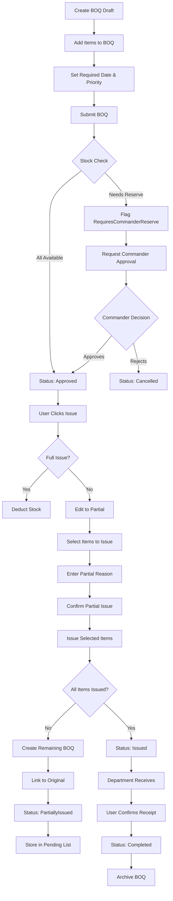
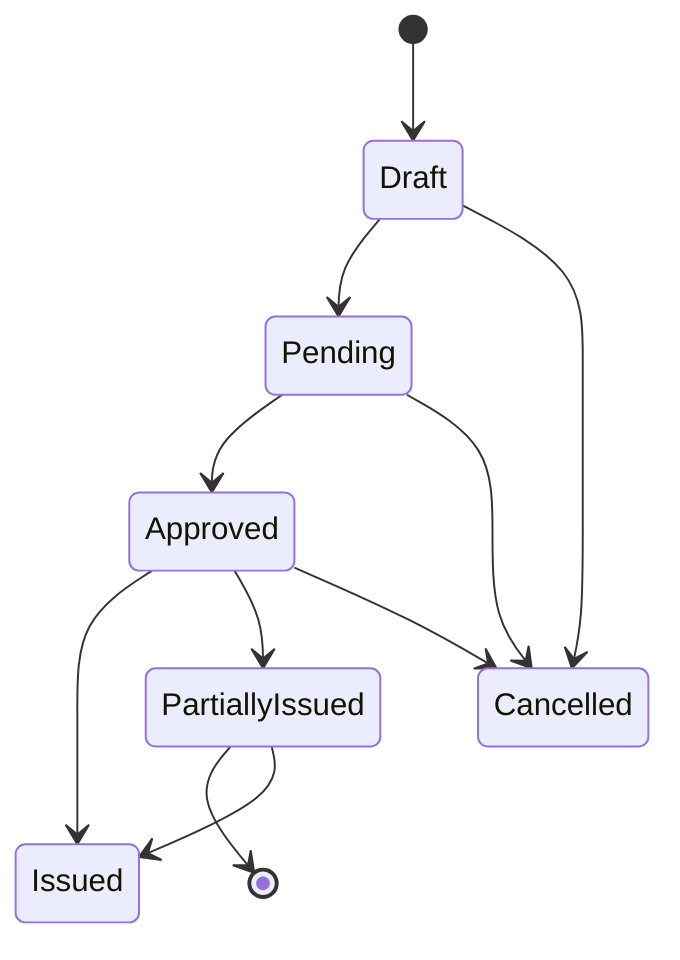

# Architecture Design & Implementation Plan
## مجمع الصناعات الهندسية - نظام إدارة المخازن

**Date:** February 1, 2026  
**Status:** Complete Architecture Design  
**Version:** 1.0

---

## Table of Contents

1. [Database Schema Improvements](#database-schema-improvements)
2. [BOQ Backend Logic Flow](#boq-backend-logic-flow)
3. [Frontend UI/UX Structure](#frontend-ux-structure)
4. [State Handling for Partial/Full Issuing](#state-handling-for-partialfull-issuing)
5. [Archiving Strategy](#archiving-strategy)
6. [Auditing Strategy](#auditing-strategy)
7. [Reporting Strategy](#reporting-strategy)
8. [Scalability Considerations](#scalability-considerations)
9. [Implementation Roadmap](#implementation-roadmap)

---

## Database Schema Improvements

### 1.1 New BOQ Entities

```sql
-- ProjectBOQ: Bill of Quantities for projects
CREATE TABLE ProjectBOQs (
    Id INT PRIMARY KEY IDENTITY(1,1),
    BOQNumber NVARCHAR(50) NOT NULL UNIQUE,
    ProjectId INT NOT NULL,
    CreatedDate DATETIME2 NOT NULL DEFAULT GETUTCDATE(),
    RequiredDate DATETIME2 NULL,
    ApprovedDate DATETIME2 NULL,
    CompletedDate DATETIME2 NULL,
    Status NVARCHAR(50) NOT NULL, -- Draft, Pending, Approved, PartiallyIssued, Issued, Completed, Cancelled
    Priority NVARCHAR(20) NOT NULL, -- Low, Medium, High, Critical
    TotalQuantity DECIMAL(18,4) NOT NULL,
    TotalValue DECIMAL(18,4) NOT NULL,
    IssuedQuantity DECIMAL(18,4) NOT NULL DEFAULT 0,
    RemainingQuantity DECIMAL(18,4) NOT NULL, -- Computed: TotalQuantity - IssuedQuantity
    RequiresCommanderReserve BIT NOT NULL DEFAULT 0,
    CommanderReserveQuantity DECIMAL(18,4) NOT NULL DEFAULT 0,
    CommanderApprovalId INT NULL,
    CommanderApprovalDate DATETIME2 NULL,
    CommanderApprovalNotes NVARCHAR(500) NULL,
    OriginalBOQId INT NULL, -- For remaining BOQs
    PartialIssueReason NVARCHAR(500) NULL,
    IsRemainingBOQ BIT NOT NULL DEFAULT 0,
    Notes NVARCHAR(1000) NULL,
    NotesArabic NVARCHAR(1000) NULL,
    ApprovedBy INT NULL,
    ApprovalNotes NVARCHAR(500) NULL,
    CreatedBy INT NOT NULL,
    CreatedAt DATETIME2 NOT NULL DEFAULT GETUTCDATE(),
    UpdatedBy INT NULL,
    UpdatedAt DATETIME2 NULL,
    
    CONSTRAINT FK_ProjectBOQ_Project FOREIGN KEY (ProjectId) REFERENCES Projects(Id),
    CONSTRAINT CHK_Status CHECK (Status IN ('Draft', 'Pending', 'Approved', 'PartiallyIssued', 'Issued', 'Completed', 'Cancelled')),
    CONSTRAINT CHK_Priority CHECK (Priority IN ('Low', 'Medium', 'High', 'Critical'))
);

-- ProjectBOQItem: Items within a BOQ
CREATE TABLE ProjectBOQItems (
    Id INT PRIMARY KEY IDENTITY(1,1),
    BOQId INT NOT NULL,
    ItemId INT NOT NULL,
    RequestedQuantity DECIMAL(18,4) NOT NULL,
    IssuedQuantity DECIMAL(18,4) NOT NULL DEFAULT 0,
    RemainingQuantity DECIMAL(18,4) NOT NULL, -- Computed: RequestedQuantity - IssuedQuantity
    UnitPrice DECIMAL(18,4) NOT NULL,
    TotalValue DECIMAL(18,4) NOT NULL, -- RequestedQuantity * UnitPrice
    IssuedValue DECIMAL(18,4) NOT NULL, -- IssuedQuantity * UnitPrice
    Notes NVARCHAR(500) NULL,
    NotesArabic NVARCHAR(500) NULL,
    IsFromCommanderReserve BIT NOT NULL DEFAULT 0,
    CommanderReserveQuantity DECIMAL(18,4) NOT NULL DEFAULT 0,
    PartialIssueReason NVARCHAR(500) NULL,
    CreatedBy INT NOT NULL,
    CreatedAt DATETIME2 NOT NULL DEFAULT GETUTCDATE(),
    UpdatedBy INT NULL,
    UpdatedAt DATETIME2 NULL,
    
    CONSTRAINT FK_ProjectBOQItem_BOQ FOREIGN KEY (BOQId) REFERENCES ProjectBOQs(Id),
    CONSTRAINT FK_ProjectBOQItem_Item FOREIGN KEY (ItemId) REFERENCES Items(Id),
    CONSTRAINT CHK_RequestedQuantity CHECK (RequestedQuantity > 0),
    CONSTRAINT CHK_IssuedQuantity CHECK (IssuedQuantity >= 0 AND IssuedQuantity <= RequestedQuantity)
);

-- BOQArchive: Archive of completed BOQs
CREATE TABLE BOQArchives (
    Id INT PRIMARY KEY IDENTITY(1,1),
    OriginalBOQId INT NOT NULL,
    ArchiveDate DATETIME2 NOT NULL DEFAULT GETUTCDATE(),
    ArchiveReason NVARCHAR(255) NOT NULL,
    ArchiveReasonArabic NVARCHAR(255) NOT NULL,
    ArchivedBy INT NOT NULL,
    CreatedAt DATETIME2 NOT NULL DEFAULT GETUTCDATE(),
    
    -- Snapshot of original BOQ state
    BOQNumber NVARCHAR(50) NOT NULL,
    ProjectId INT NOT NULL,
    TotalQuantity DECIMAL(18,4) NOT NULL,
    TotalValue DECIMAL(18,4) NOT NULL,
    IssuedQuantity DECIMAL(18,4) NOT NULL,
    FinalStatus NVARCHAR(50) NOT NULL,
    
    CONSTRAINT FK_BOQArchive_OriginalBOQ FOREIGN KEY (OriginalBOQId) REFERENCES ProjectBOQs(Id),
    CONSTRAINT FK_BOQArchive_Project FOREIGN KEY (ProjectId) REFERENCES Projects(Id),
    CONSTRAINT FK_BOQArchive_ArchivedBy FOREIGN KEY (ArchivedBy) REFERENCES Users(Id)
);

-- Add indexes for performance
CREATE INDEX IX_ProjectBOQs_ProjectId ON ProjectBOQs(ProjectId);
CREATE INDEX IX_ProjectBOQs_Status ON ProjectBOQs(Status);
CREATE INDEX IX_ProjectBOQs_CreatedDate ON ProjectBOQs(CreatedDate);
CREATE INDEX IX_ProjectBOQItems_BOQId ON ProjectBOQItems(BOQId);
CREATE INDEX IX_ProjectBOQItems_ItemId ON ProjectBOQItems(ItemId);
CREATE INDEX IX_BOQArchives_OriginalBOQId ON BOQArchives(OriginalBOQId);
CREATE INDEX IX_BOQArchives_ArchiveDate ON BOQArchives(ArchiveDate);
```

### 1.2 Enhanced Item Entity

```sql
-- Add part number validation and supplier cross-reference
ALTER TABLE Items ADD SupplierPartNumber NVARCHAR(50) NULL;
ALTER TABLE Items ADD PrimarySupplierId INT NULL;
ALTER TABLE Items ADD CONSTRAINT FK_Items_PrimarySupplier FOREIGN KEY (PrimarySupplierId) REFERENCES Suppliers(Id);

-- Add indexes for item queries
CREATE INDEX IX_Items_ItemCode ON Items(ItemCode);
CREATE INDEX IX_Items_Category ON Items(Category);
CREATE INDEX IX_Items_IsActive ON Items(IsActive);
CREATE INDEX IX_Items_IsCritical ON Items(IsCritical);
```

### 1.3 Data Integrity Constraints

```sql
-- Add constraints to prevent negative quantities
ALTER TABLE InventoryRecords ADD CONSTRAINT CHK_InventoryRecords_GeneralQuantity CHECK (GeneralQuantity >= 0);
ALTER TABLE InventoryRecords ADD CONSTRAINT CHK_InventoryRecords_CommanderReserveQuantity CHECK (CommanderReserveQuantity >= 0);
ALTER TABLE InventoryRecords ADD CONSTRAINT CHK_InventoryRecords_TotalQuantity CHECK (TotalQuantity >= 0);
ALTER TABLE InventoryRecords ADD CONSTRAINT CHK_InventoryRecords_AllocatedNotExceed CHECK (GeneralAllocated <= GeneralQuantity);
ALTER TABLE InventoryRecords ADD CONSTRAINT CHK_InventoryRecords_ReserveAllocatedNotExceed CHECK (ReserveAllocated <= CommanderReserveQuantity);

-- Add constraints for RequisitionItems
ALTER TABLE RequisitionItems ADD CONSTRAINT CHK_RequisitionItems_RequestedQuantity CHECK (RequestedQuantity > 0);
ALTER TABLE RequisitionItems ADD CONSTRAINT CHK_RequisitionItems_IssuedQuantity CHECK (IssuedQuantity >= 0 AND IssuedQuantity <= RequestedQuantity);

-- Add constraints for ProjectAllocations
ALTER TABLE ProjectAllocations ADD CONSTRAINT CHK_ProjectAllocations_AllocatedQuantity CHECK (AllocatedQuantity >= 0);
ALTER TABLE ProjectAllocations ADD CONSTRAINT CHK_ProjectAllocations_ConsumedQuantity CHECK (ConsumedQuantity >= 0);
ALTER TABLE ProjectAllocations ADD CONSTRAINT CHK_ProjectAllocations_ReturnedQuantity CHECK (ReturnedQuantity >= 0);
ALTER TABLE ProjectAllocations ADD CONSTRAINT CHK_ProjectAllocations_AvailableQuantity CHECK ((AllocatedQuantity - ConsumedQuantity - ReturnedQuantity) >= 0);
```

---

## BOQ Backend Logic Flow

### 2.1 BOQ Domain Logic

```csharp
public class ProjectBOQ : BaseEntity
{
    public void Submit(int updatedBy)
    {
        Status = BOQStatus.Pending;
        Update(updatedBy);
    }
    
    public void Approve(int approverId, string? approvalNotes, int updatedBy)
    {
        ApproverId = approverId;
        ApprovalDate = DateTime.UtcNow;
        ApprovalNotes = approvalNotes;
        Status = BOQStatus.Approved;
        Update(updatedBy);
    }
    
    public void Reject(int approverId, string rejectionReason, int updatedBy)
    {
        ApproverId = approverId;
        ApprovalDate = DateTime.UtcNow;
        ApprovalNotes = rejectionReason;
        Status = BOQStatus.Cancelled;
        Update(updatedBy);
    }
    
    public void Issue(decimal quantity, int updatedBy)
    {
        IssuedQuantity += quantity;
        
        if (IssuedQuantity >= TotalQuantity)
        {
            Status = BOQStatus.Issued;
        }
        else
        {
            Status = BOQStatus.PartiallyIssued;
            CreateRemainingBOQ(updatedBy);
        }
        
        Update(updatedBy);
    }
    
    public void IssuePartial(Dictionary<int, decimal> itemQuantities, string reason, int updatedBy)
    {
        foreach (var (itemId, quantity) in itemQuantities)
        {
            var item = Items.FirstOrDefault(i => i.Id == itemId);
            if (item != null)
            {
                var boqItem = Items.FirstOrDefault(i => i.BOQId == Id && i.ItemId == itemId);
                if (boqItem != null)
                {
                    boqItem.Issue(quantity, updatedBy);
                    boqItem.PartialIssueReason = reason;
                }
            }
        }
        
        Status = BOQStatus.PartiallyIssued;
        CreateRemainingBOQ(updatedBy);
        Update(updatedBy);
    }
    
    private void CreateRemainingBOQ(int updatedBy)
    {
        var remainingBOQ = new ProjectBOQ(
            boqNumber: GenerateBOQNumber(),
            projectId: ProjectId,
            originalBOQId: Id,
            createdBy: updatedBy
        );
        
        // Copy remaining items
        foreach (var item in Items.Where(i => !i.IsFullyIssued()))
        {
            var remainingItem = new ProjectBOQItem(
                boqId: remainingBOQ.Id,
                itemId: item.ItemId,
                requestedQuantity: item.GetRemainingQuantity(),
                unitPrice: item.UnitPrice,
                createdBy: updatedBy
            );
            remainingBOQ.Items.Add(remainingItem);
        }
        
        // Calculate totals
        remainingBOQ.TotalQuantity = remainingBOQ.Items.Sum(i => i.RequestedQuantity);
        remainingBOQ.TotalValue = remainingBOQ.Items.Sum(i => i.TotalValue);
        
        // Save remaining BOQ
        // (implementation details)
        
        // Mark as remaining
        remainingBOQ.IsRemainingBOQ = true;
    }
    
    public void Archive(string reason, int updatedBy)
    {
        // Create archive entry
        var archive = new BOQArchive(
            originalBOQId: Id,
            archiveDate: DateTime.UtcNow,
            archiveReason: reason,
            archivedBy: updatedBy
        );
        
        // Save snapshot
        archive.BOQNumber = BOQNumber;
        archive.ProjectId = ProjectId;
        archive.TotalQuantity = TotalQuantity;
        archive.TotalValue = TotalValue;
        archive.IssuedQuantity = IssuedQuantity;
        archive.FinalStatus = Status;
        
        // Save archive
        // (implementation details)
    }
}
```

### 2.2 BOQ Workflow Diagram



### 2.3 BOQ Service Interface

```csharp
public interface IProjectBOQService
{
    // BOQ CRUD
    Task<ProjectBOQDto> CreateBOQAsync(CreateBOQDto request, int userId, CancellationToken cancellationToken = default);
    Task<ProjectBOQDto> UpdateBOQAsync(UpdateBOQDto request, int userId, CancellationToken cancellationToken = default);
    Task<ProjectBOQDto> GetBOQAsync(int id, CancellationToken cancellationToken = default);
    Task<(IEnumerable<ProjectBOQDto> Items, int TotalCount)> GetBOQsAsync(
        int? projectId = null,
        BOQStatus? status = null,
        DateTime? fromDate = null,
        DateTime? toDate = null,
        int pageNumber = 1,
        int pageSize = 20,
        CancellationToken cancellationToken = default);
    
    // BOQ Actions
    Task<ProjectBOQDto> SubmitBOQAsync(int id, int userId, CancellationToken cancellationToken = default);
    Task<ProjectBOQDto> ApproveBOQAsync(ApproveBOQDto request, int userId, CancellationToken cancellationToken = default);
    Task<ProjectBOQDto> RejectBOQAsync(RejectBOQDto request, int userId, CancellationToken cancellationToken = default);
    Task<ProjectBOQDto> IssueBOQAsync(IssueBOQDto request, int userId, CancellationToken cancellationToken = default);
    Task<ProjectBOQDto> IssuePartialBOQAsync(IssuePartialBOQDto request, int userId, CancellationToken cancellationToken = default);
    Task<ProjectBOQDto> ReceiveBOQAsync(ReceiveBOQDto request, int userId, CancellationToken cancellationToken = default);
    Task<ProjectBOQDto> CancelBOQAsync(int id, CancelBOQDto request, CancellationToken cancellationToken = default);
    
    // Pending Items
    Task<IEnumerable<PendingBOQItemDto>> GetPendingBOQItemsAsync(
        int? projectId = null,
        int? warehouseId = null,
        DateTime? fromDate = null,
        DateTime? toDate = null,
        CancellationToken cancellationToken = default);
    
    // Archive
    Task<(IEnumerable<BOQArchiveDto> Items, int TotalCount)> GetArchivedBOQsAsync(
        int? projectId = null,
        DateTime? fromDate = null,
        DateTime? toDate = null,
        int pageNumber = 1,
        int pageSize = 20,
        CancellationToken cancellationToken = default);
    Task<bool> ArchiveBOQAsync(int id, ArchiveBOQDto request, CancellationToken cancellationToken = default);
    Task<ProjectBOQDto> GetOriginalBOQAsync(int archivedId, CancellationToken cancellationToken = default);
    Task<bool> RestoreBOQAsync(int archivedId, CancellationToken cancellationToken = default);
}
```

---

## Frontend UI/UX Structure

### 3.1 BOQ Management Pages

```typescript
// BOQ List Page
interface BOQListPageProps {
    projectId?: number;
    status?: BOQStatus;
}

const BOQListPage: React.FC<BOQListPageProps> = ({ projectId, status }) => {
    return (
        <Box>
            {/* Header */}
            <Box sx={{ display: 'flex', justifyContent: 'space-between', alignItems: 'center', mb: 3 }}>
                <Typography variant="h4">قائمة BOQ</Typography>
                <Button variant="contained" startIcon={<AddIcon />}>
                    BOQ جديد
                </Button>
            </Box>
            
            {/* Filters */}
            <Paper sx={{ p: 2, mb: 3 }}>
                <Grid container spacing={2}>
                    <Grid item xs={3}>
                        <FormControl fullWidth>
                            <InputLabel>المشروع</InputLabel>
                            <Select value={projectId} onChange={handleProjectChange}>
                                <MenuItem value="">كل المشاريع</MenuItem>
                                {projects.map(p => (
                                    <MenuItem key={p.id} value={p.id}>{p.nameAr}</MenuItem>
                                ))}
                            </Select>
                        </FormControl>
                    </Grid>
                    <Grid item xs={3}>
                        <FormControl fullWidth>
                            <InputLabel>الحالة</InputLabel>
                            <Select value={status} onChange={handleStatusChange}>
                                <MenuItem value="">كل الحالات</MenuItem>
                                <MenuItem value="Draft">مسودة</MenuItem>
                                <MenuItem value="Pending">قيد الانتظار</MenuItem>
                                <MenuItem value="Approved">تمت الموافقة</MenuItem>
                                <MenuItem value="PartiallyIssued">صدر جزئي</MenuItem>
                                <MenuItem value="Issued">تم الصدر</MenuItem>
                                <MenuItem value="Completed">مكتمل</MenuItem>
                                <MenuItem value="Cancelled">ملغي</MenuItem>
                            </Select>
                        </FormControl>
                    </Grid>
                </Grid>
            </Paper>
            
            {/* BOQs Table */}
            <DataGrid
                rows={boqs}
                columns={[
                    { field: 'boqNumber', headerName: 'رقم BOQ', width: 150 },
                    { field: 'projectNameAr', headerName: 'المشروع', width: 200 },
                    { field: 'totalQuantity', headerName: 'الكمية الإجمالية', width: 120 },
                    { field: 'issuedQuantity', headerName: 'الكمية المصدرة', width: 120 },
                    { field: 'remainingQuantity', headerName: 'الكمية المتبقية', width: 120 },
                    { field: 'status', headerName: 'الحالة', width: 120 },
                    { field: 'createdDate', headerName: 'تاريخ الإنشاء', width: 150 },
                    { field: 'requiresCommanderReserve', headerName: 'احتياطي', width: 100 }
                ]}
                pageSize={20}
                checkboxSelection
                onRowClick={handleRowClick}
            />
        </Box>
    );
};

// BOQ Details Page
interface BOQDetailsPageProps {
    boqId: number;
}

const BOQDetailsPage: React.FC<BOQDetailsPageProps> = ({ boqId }) => {
    return (
        <Box>
            {/* Header */}
            <Box sx={{ display: 'flex', justifyContent: 'space-between', alignItems: 'center', mb: 3 }}>
                <Typography variant="h4">تفاصيل BOQ</Typography>
                <Box>
                    <Button variant="outlined" startIcon={<EditIcon />}>تعديل</Button>
                    <Button variant="outlined" startIcon={<PrintIcon />}>طباعة</Button>
                    <Button variant="outlined" startIcon={<ExportIcon />}>تصدير</Button>
                </Box>
            </Box>
            
            {/* BOQ Info */}
            <Grid container spacing={3} sx={{ mb: 3 }}>
                <Grid item xs={12} md={6}>
                    <Card>
                        <CardContent>
                            <Typography variant="subtitle2">معلومات BOQ</Typography>
                            <Typography variant="h6">{boq.boqNumber}</Typography>
                            <Typography>المشروع: {boq.projectNameAr}</Typography>
                            <Typography>الحالة: {getStatusLabel(boq.status)}</Typography>
                            <Typography>الأولوية: {getPriorityLabel(boq.priority)}</Typography>
                        </CardContent>
                    </Card>
                </Grid>
                <Grid item xs={12} md={6}>
                    <Card>
                        <CardContent>
                            <Typography variant="subtitle2">الكميات</Typography>
                            <Typography>الإجمالي: {boq.totalQuantity}</Typography>
                            <Typography>المصدور: {boq.issuedQuantity}</Typography>
                            <Typography>المتبقي: {boq.remainingQuantity}</Typography>
                        </CardContent>
                    </Card>
                </Grid>
            </Grid>
            
            {/* Items Table */}
            <Typography variant="h6" gutterBottom>أصناف BOQ</Typography>
            <DataGrid
                rows={boq.items}
                columns={[
                    { field: 'itemCode', headerName: 'الكود', width: 120 },
                    { field: 'itemNameAr', headerName: 'الصنف', width: 200 },
                    { field: 'requestedQuantity', headerName: 'المطلوب', width: 100 },
                    { field: 'issuedQuantity', headerName: 'المصدر', width: 100 },
                    { field: 'remainingQuantity', headerName: 'المتبقي', width: 100 },
                    { field: 'unitPrice', headerName: 'سعر الوحدة', width: 100 },
                    { field: 'totalValue', headerName: 'القيمة', width: 120 },
                    { field: 'isFromCommanderReserve', headerName: 'احتياطي', width: 100 }
                ]}
                pageSize={10}
                autoHeight
            />
            
            {/* Actions */}
            <Box sx={{ mt: 3, display: 'flex', justifyContent: 'flex-end' }}>
                {boq.status === 'Approved' && (
                    <Button variant="contained" color="success" startIcon={<CheckIcon />} onClick={handleIssue}>
                        صدر كامل
                    </Button>
                )}
                {boq.status === 'Approved' && (
                    <Button variant="contained" color="warning" startIcon={<EditIcon />} onClick={handlePartialIssue}>
                        صدر جزئي
                    </Button>
                )}
            </Box>
        </Box>
    );
};
```

### 3.2 Pending BOQ List Page

```typescript
interface PendingBOQListPageProps {
    projectId?: number;
    warehouseId?: number;
    fromDate?: Date;
    toDate?: Date;
}

const PendingBOQListPage: React.FC<PendingBOQListPageProps> = ({
    projectId,
    warehouseId,
    fromDate,
    toDate
}) => {
    return (
        <Box>
            {/* Header */}
            <Typography variant="h4">قائمة BOQ المعلقة</Typography>
            
            {/* Filters */}
            <Paper sx={{ p: 2, mb: 3 }}>
                <Grid container spacing={2}>
                    <Grid item xs={3}>
                        <FormControl fullWidth>
                            <InputLabel>المشروع</InputLabel>
                            <Select value={projectId} onChange={handleProjectChange}>
                                <MenuItem value="">كل المشاريع</MenuItem>
                                {projects.map(p => (
                                    <MenuItem key={p.id} value={p.id}>{p.nameAr}</MenuItem>
                                ))}
                            </Select>
                        </FormControl>
                    </Grid>
                    <Grid item xs={3}>
                        <FormControl fullWidth>
                            <InputLabel>المخزن</InputLabel>
                            <Select value={warehouseId} onChange={handleWarehouseChange}>
                                <MenuItem value="">كل المخازن</MenuItem>
                                {warehouses.map(w => (
                                    <MenuItem key={w.id} value={w.id}>{w.nameAr}</MenuItem>
                                ))}
                            </Select>
                        </FormControl>
                    </Grid>
                </Grid>
            </Paper>
            
            {/* Pending Items Table */}
            <DataGrid
                rows={pendingItems}
                columns={[
                    { field: 'boqNumber', headerName: 'رقم BOQ', width: 150 },
                    { field: 'projectNameAr', headerName: 'المشروع', width: 200 },
                    { field: 'itemCode', headerName: 'الكود', width: 120 },
                    { field: 'itemNameAr', headerName: 'الصنف', width: 200 },
                    { field: 'requestedQuantity', headerName: 'المطلوب', width: 100 },
                    { field: 'issuedQuantity', headerName: 'المصدر', width: 100 },
                    { field: 'remainingQuantity', headerName: 'المتبقي', width: 100 },
                    { field: 'partialIssueReason', headerName: 'سبب عدم الصدر الكامل', width: 250 },
                    { field: 'createdDate', headerName: 'تاريخ الإنشاء', width: 150 }
                ]}
                pageSize={20}
                checkboxSelection
                onSelectionModelChange={handleSelectionChange}
            />
            
            {/* Actions */}
            <Box sx={{ mt: 3, display: 'flex', justifyContent: 'flex-end' }}>
                <Button variant="contained" startIcon={<CheckIcon />} disabled={selectedItems.length === 0} onClick={handleIssueSelected}>
                    صدر المحدد
                </Button>
                <Button variant="outlined" startIcon={<ExportIcon />} onClick={handleExport}>
                    تصدير إلى Excel
                </Button>
            </Box>
        </Box>
    );
};
```

---

## State Handling for Partial/Full Issuing

### 4.1 BOQ State Machine

```typescript
interface BOQState {
    // Current BOQ state
    status: BOQStatus;
    issuedQuantity: number;
    remainingQuantity: number;
    isRemainingBOQ: boolean;
    
    // Related BOQs
    originalBOQId: number | null;
    remainingBOQId: number | null;
    
    // Items state
    items: BOQItemState[];
}

interface BOQItemState {
    itemId: number;
    requestedQuantity: number;
    issuedQuantity: number;
    remainingQuantity: number;
    isFromCommanderReserve: boolean;
    partialIssueReason: string | null;
}

// BOQ State Management Hook
const useBOQState = (boqId: number) => {
    const [state, setState] = useState<BOQState>({
        status: 'Draft',
        issuedQuantity: 0,
        remainingQuantity: 0,
        isRemainingBOQ: false,
        originalBOQId: null,
        remainingBOQId: null,
        items: []
    });
    
    const issueFull = async () => {
        try {
            await api.post(`/api/project-boq/${boqId}/issue`, {
                issueType: 'full'
            });
            
            setState(prev => ({
                ...prev,
                status: 'Issued',
                issuedQuantity: prev.totalQuantity,
                remainingQuantity: 0
            }));
        } catch (error) {
            showError(error);
        }
    };
    
    const issuePartial = async (itemIds: number[], reason: string) => {
        try {
            await api.post(`/api/project-boq/${boqId}/issue-partial`, {
                itemIds,
                reason
            });
            
            setState(prev => ({
                ...prev,
                status: 'PartiallyIssued',
                isRemainingBOQ: true
            }));
        } catch (error) {
            showError(error);
        }
    };
    
    const canIssueFull = () => {
        return state.status === 'Approved' && state.issuedQuantity === 0;
    };
    
    const canIssuePartial = () => {
        return state.status === 'Approved' && state.issuedQuantity < state.totalQuantity;
    };
    
    return {
        state,
        issueFull,
        issuePartial,
        canIssueFull,
        canIssuePartial
    };
};
```

### 4.2 Partial Issue Workflow State Diagram



---

## Archiving Strategy

### 5.1 Archive Tables

```sql
-- Archive tables for completed transactions
CREATE TABLE Requisitions_Archive (
    -- Same structure as Requisitions
    ArchivedDate DATETIME2 NOT NULL DEFAULT GETUTCDATE(),
    ArchiveReason NVARCHAR(255) NOT NULL,
    ArchivedBy INT NOT NULL
);

CREATE TABLE InventoryTransactions_Archive (
    -- Same structure as InventoryTransactions
    ArchivedDate DATETIME2 NOT NULL DEFAULT GETUTCDATE(),
    ArchiveReason NVARCHAR(255) NOT NULL,
    ArchivedBy INT NOT NULL
);

CREATE TABLE ProjectBOQs_Archive (
    -- Same structure as ProjectBOQs
    ArchivedDate DATETIME2 NOT NULL DEFAULT GETUTCDATE(),
    ArchiveReason NVARCHAR(255) NOT NULL,
    ArchivedBy INT NOT NULL
);
```

### 5.2 Archiving Service

```csharp
public interface IArchiveService
{
    // Archive completed BOQs
    Task ArchiveBOQAsync(int boqId, string reason, int userId, CancellationToken cancellationToken = default);
    
    // Archive completed requisitions
    Task ArchiveRequisitionAsync(int requisitionId, string reason, int userId, CancellationToken cancellationToken = default);
    
    // Archive old inventory transactions
    Task ArchiveInventoryTransactionsAsync(DateTime beforeDate, CancellationToken cancellationToken = default);
    
    // Restore archived records
    Task RestoreBOQAsync(int archivedId, int userId, CancellationToken cancellationToken = default);
    Task RestoreRequisitionAsync(int archivedId, int userId, CancellationToken cancellationToken = default);
}

public class ArchiveService : IArchiveService
{
    public async Task ArchiveBOQAsync(int boqId, string reason, int userId, CancellationToken cancellationToken)
    {
        using var transaction = await _context.Database.BeginTransactionAsync();
        
        try
        {
            // Get original BOQ
            var boq = await _context.ProjectBOQs.FindAsync(boqId);
            if (boq == null)
                throw new NotFoundException("BOQ not found");
            
            // Create archive entry
            var archive = new BOQArchive(
                originalBOQId: boqId,
                archiveDate: DateTime.UtcNow,
                archiveReason: reason,
                archivedBy: userId
            );
            
            await _context.BOQArchives.AddAsync(archive);
            
            // Mark original as completed
            boq.Status = BOQStatus.Completed;
            await _context.SaveChangesAsync();
            
            await transaction.CommitAsync();
        }
        catch
        {
            await transaction.RollbackAsync();
            throw;
        }
    }
    
    public async Task ArchiveInventoryTransactionsAsync(DateTime beforeDate, CancellationToken cancellationToken)
    {
        // Archive inventory transactions older than 6 months
        var cutoffDate = beforeDate.AddMonths(-6);
        
        var transactionsToArchive = await _context.InventoryTransactions
            .Where(t => t.TransactionDate < cutoffDate)
            .ToListAsync();
        
        // Create archive entries
        var archives = transactionsToArchive.Select(t => new InventoryTransactionArchive
        {
            // Copy all fields
            ArchivedDate = DateTime.UtcNow,
            ArchiveReason = "Routine archiving",
            ArchivedBy = 1 // System user
        });
        
        await _context.InventoryTransactions_Archive.AddRangeAsync(archives);
        
        // Remove from main table
        _context.InventoryTransactions.RemoveRange(transactionsToArchive);
        
        await _context.SaveChangesAsync();
    }
}
```

### 5.3 Background Archiving Job

```csharp
public class ArchiveBackgroundService : BackgroundService
{
    private readonly IArchiveService _archiveService;
    private readonly ILogger<ArchiveBackgroundService> _logger;
    
    protected override async Task ExecuteAsync(CancellationToken stoppingToken)
    {
        _logger.LogInformation("Archive background service started");
        
        while (!stoppingToken.IsCancellationRequested)
        {
            try
            {
                // Archive completed BOQs older than 12 months
                var cutoffDate = DateTime.UtcNow.AddMonths(-12);
                var completedBOQs = await _context.ProjectBOQs
                    .Where(b => b.Status == BOQStatus.Completed && b.CompletedDate < cutoffDate)
                    .ToListAsync();
                
                foreach (var boq in completedBOQs)
                {
                    await _archiveService.ArchiveBOQAsync(boq.Id, "Completed BOQ - 12 month retention", 1);
                }
                
                // Archive old inventory transactions
                await _archiveService.ArchiveInventoryTransactionsAsync(cutoffDate, stoppingToken);
                
                // Wait 24 hours before next run
                await Task.Delay(TimeSpan.FromHours(24), stoppingToken);
            }
            catch (Exception ex)
            {
                _logger.LogError(ex, "Error during archiving");
            }
        }
        
        _logger.LogInformation("Archive background service stopped");
    }
}
```

---

## Auditing Strategy

### 6.1 Enhanced Audit Logging

```csharp
// Enhanced audit service with BOQ support
public class AuditService : IAuditService
{
    public async Task LogBOQCreatedAsync(int boqId, int userId, CancellationToken cancellationToken = default)
    {
        var auditLog = new AuditLog(
            action: "BOQCreated",
            entityType: "ProjectBOQ",
            entityId: boqId.ToString(),
            description: $"BOQ {boqNumber} created for project {projectName}",
            userId: userId,
            timestamp: DateTime.UtcNow
        );
        
        await _context.AuditLogs.AddAsync(auditLog);
        await _context.SaveChangesAsync();
    }
    
    public async Task LogBOQIssuedAsync(int boqId, string issueType, int userId, CancellationToken cancellationToken = default)
    {
        var auditLog = new AuditLog(
            action: $"BOQ{issueType}",
            entityType: "ProjectBOQ",
            entityId: boqId.ToString(),
            description: $"BOQ {boqNumber} {issueType}",
            userId: userId,
            timestamp: DateTime.UtcNow
        );
        
        await _context.AuditLogs.AddAsync(auditLog);
        await _context.SaveChangesAsync();
    }
    
    public async Task LogBOQPartialIssuedAsync(int boqId, Dictionary<int, decimal> itemQuantities, string reason, int userId, CancellationToken cancellationToken = default)
    {
        var auditLog = new AuditLog(
            action: "BOQPartialIssued",
            entityType: "ProjectBOQ",
            entityId: boqId.ToString(),
            description: $"BOQ {boqNumber} partially issued. Items: {itemQuantities.Count}. Reason: {reason}",
            userId: userId,
            timestamp: DateTime.UtcNow
        );
        
        await _context.AuditLogs.AddAsync(auditLog);
        await _context.SaveChangesAsync();
    }
}
```

### 6.2 Audit Trail Query

```csharp
public interface IAuditQueryService
{
    // Get audit trail for BOQ
    Task<IEnumerable<AuditLogDto>> GetBOQAuditTrailAsync(int boqId, CancellationToken cancellationToken = default);
    
    // Get audit trail for item
    Task<IEnumerable<AuditLogDto>> GetItemAuditTrailAsync(int itemId, CancellationToken cancellationToken = default);
    
    // Get audit trail for project
    Task<IEnumerable<AuditLogDto>> GetProjectAuditTrailAsync(int projectId, CancellationToken cancellationToken = default);
    
    // Get audit trail by date range
    Task<IEnumerable<AuditLogDto>> GetAuditLogsByDateRangeAsync(DateTime fromDate, DateTime toDate, CancellationToken cancellationToken = default);
}
}
```

---

## Reporting Strategy

### 7.1 BOQ Reports

```csharp
public interface IBOQReportService
{
    // BOQ Fulfillment Report
    Task<BOQFulfillmentReportDto> GetBOQFulfillmentReportAsync(
        int? projectId = null,
        DateTime? fromDate = null,
        DateTime? toDate = null,
        CancellationToken cancellationToken = default);
    
    // Pending BOQ Items Report
    Task<PendingBOQItemsReportDto> GetPendingBOQItemsReportAsync(
        int? projectId = null,
        int? warehouseId = null,
        CancellationToken cancellationToken = default);
    
    // BOQ Archive Report
    Task<BOQArchiveReportDto> GetBOQArchiveReportAsync(
        int? projectId = null,
        DateTime? fromDate = null,
        DateTime? toDate = null,
        CancellationToken cancellationToken = default);
}

// Report DTOs
public class BOQFulfillmentReportDto
{
    public int TotalBOQs { get; }
    public int CompletedBOQs { get; }
    public int PartiallyIssuedBOQs { get; }
    public int PendingBOQs { get; }
    public decimal TotalRequestedQuantity { get; }
    public decimal TotalIssuedQuantity { get; }
    public decimal TotalRemainingQuantity { get; }
    public decimal FulfillmentRate { get; } // TotalIssued / TotalRequested
}

public class PendingBOQItemsReportDto
{
    public int TotalPendingItems { get; }
    public int TotalPendingBOQs { get; }
    public decimal TotalPendingQuantity { get; }
    public Dictionary<string, int> PendingByProject { get; }
    public Dictionary<string, int> PendingByWarehouse { get; }
    public Dictionary<string, int> PendingByReason { get; }
}
```

### 7.2 Report Controller

```csharp
[ApiController]
[Route("api/[controller]")]
[Authorize]
public class BOQReportController : ControllerBase
{
    private readonly IBOQReportService _reportService;
    
    [HttpGet("fulfillment")]
    public async Task<ActionResult<BOQFulfillmentReportDto>> GetFulfillmentReport(
        [FromQuery] int? projectId = null,
        [FromQuery] DateTime? fromDate = null,
        [FromQuery] DateTime? toDate = null)
    {
        var report = await _reportService.GetBOQFulfillmentReportAsync(projectId, fromDate, toDate);
        return Ok(report);
    }
    
    [HttpGet("pending-items")]
    public async Task<ActionResult<PendingBOQItemsReportDto>> GetPendingItemsReport(
        [FromQuery] int? projectId = null,
        [FromQuery] int? warehouseId = null)
    {
        var report = await _reportService.GetPendingBOQItemsReportAsync(projectId, warehouseId);
        return Ok(report);
    }
    
    [HttpGet("archive")]
    public async Task<ActionResult<BOQArchiveReportDto>> GetArchiveReport(
        [FromQuery] int? projectId = null,
        [FromQuery] DateTime? fromDate = null,
        [FromQuery] DateTime? toDate = null)
    {
        var report = await _reportService.GetBOQArchiveReportAsync(projectId, fromDate, toDate);
        return Ok(report);
    }
    
    [HttpPost("export")]
    public async Task<FileResult> ExportReport(
        [FromBody] ExportReportRequest request)
    {
        // Generate Excel/PDF report
        var file = await _reportService.GenerateReportAsync(request);
        return File(file.Content, file.FileName, file.ContentType);
    }
}
```

---

## Scalability Considerations

### 8.1 Performance Optimizations

```csharp
// Eager loading for navigation properties
public async Task<ProjectBOQDto> GetBOQAsync(int id, CancellationToken cancellationToken)
{
    var boq = await _context.ProjectBOQs
        .Include(b => b.Items)
            .ThenInclude(i => i.Item)
            .Include(b => b.Project)
            .Include(b => b.Approver)
        .Include(b => b.CommanderApprover)
        .FirstOrDefaultAsync(b => b.Id == id, cancellationToken);
    
    return MapToDto(boq);
}

// Pagination for large datasets
public async Task<(IEnumerable<ProjectBOQDto> Items, int TotalCount)>> GetBOQsAsync(
    int pageNumber = 1,
    int pageSize = 20,
    CancellationToken cancellationToken = default)
{
    var query = _context.ProjectBOQs
        .Include(b => b.Items)
        .Include(b => b.Project);
        .AsQueryable();
    
    var totalCount = await query.CountAsync(cancellationToken);
    var items = await query
        .Skip((pageNumber - 1) * pageSize)
        .Take(pageSize)
        .ToListAsync(cancellationToken);
    
    return (items.Select(MapToDto), totalCount);
}
```

### 8.2 Caching Strategy

```csharp
public interface ICacheService
{
    Task<T> GetAsync<T>(string key, CancellationToken cancellationToken = default);
    Task SetAsync<T>(string key, T value, TimeSpan? expiration = null, CancellationToken cancellationToken = default);
    Task RemoveAsync(string key, CancellationToken cancellationToken = default);
}

// Cache BOQ data
public async Task<ProjectBOQDto> GetBOQAsync(int id, CancellationToken cancellationToken)
{
    string cacheKey = $"boq_{id}";
    
    // Try cache first
    var cached = await _cacheService.GetAsync<ProjectBOQDto>(cacheKey, cancellationToken);
    if (cached != null)
        return cached;
    
    // Query from database
    var boq = await _context.ProjectBOQs
        .Include(b => b.Items)
        .ThenInclude(i => i.Item)
        .Include(b => b.Project)
        .FirstOrDefaultAsync(b => b.Id == id, cancellationToken);
    
    // Cache for 30 minutes
    await _cacheService.SetAsync(cacheKey, boq, TimeSpan.FromMinutes(30), cancellationToken);
    
    return MapToDto(boq);
}
```

### 8.3 Database Indexing Strategy

```sql
-- Indexes for frequently queried columns
CREATE INDEX IX_ProjectBOQs_ProjectId_Status_CreatedDate ON ProjectBOQs(ProjectId, Status, CreatedDate);
CREATE INDEX IX_ProjectBOQItems_BOQId_ItemId ON ProjectBOQItems(BOQId, ItemId);
CREATE INDEX IX_ProjectBOQItems_ItemId ON ProjectBOQItems(ItemId);
CREATE INDEX IX_InventoryRecords_WarehouseId_ItemId ON InventoryRecords(WarehouseId, ItemId);
CREATE INDEX IX_InventoryTransactions_TransactionDate ON InventoryTransactions(TransactionDate);
CREATE INDEX IX_InventoryTransactions_ReferenceType_ReferenceId ON InventoryTransactions(ReferenceType, ReferenceId);
CREATE INDEX IX_AuditLogs_EntityId_Timestamp ON AuditLogs(EntityId, Timestamp);
```

---

## Implementation Roadmap

### 9.1 Phase 1: Database & Backend (Weeks 1-2)

**Week 1:**
- [ ] Create ProjectBOQ and ProjectBOQItem entities
- [ ] Create BOQArchive entity
- [ ] Add database constraints
- [ ] Create database indexes
- [ ] Create IProjectBOQService interface
- [ ] Implement BOQ CRUD operations
- [ ] Implement BOQ approval workflow
- [ ] Implement BOQ full issue workflow
- [ ] Implement BOQ partial issue workflow
- [ ] Implement remaining BOQ creation
- [ ] Add audit logging for BOQ operations

**Week 2:**
- [ ] Create IBOQReportService interface
- [ ] Implement BOQ fulfillment report
- [ ] Implement pending BOQ items report
- [ ] Implement BOQ archive report
- [ ] Add export functionality
- [ ] Create ProjectBOQController
- [ ] Add caching layer
- [ ] Add pagination to all queries
- [ ] Add eager loading to all queries
- [ ] Unit tests for BOQ service

### 9.2 Phase 2: Frontend (Weeks 3-4)

**Week 3:**
- [ ] Create BOQ list page with filters
- [ ] Create BOQ details page
- [ ] Implement BOQ item selection with autocomplete
- [ ] Create BOQ creation dialog
- [ ] Implement BOQ full issue UI
- [ ] Implement BOQ partial issue UI
- [ ] Add loading states
- [ ] Add error handling
- [ ] Add success notifications

**Week 4:**
- [ ] Create pending BOQ list page
- [ ] Create BOQ archive page
- [ ] Implement BOQ reports page
- [ ] Add export functionality
- [ ] Add RTL support
- [ ] Add bilingual labels
- [ ] Responsive design
- [ ] Unit tests for components

### 9.3 Phase 3: Advanced Item Page (Weeks 5-6)

**Week 5:**
- [ ] Create item details page structure
- [ ] Implement basic information tab
- [ ] Implement stock tab with warehouse breakdown
- [ ] Implement project allocations tab
- [ ] Implement transaction history tab
- [ ] Implement consumption analysis tab
- [ ] Add export functionality

**Week 6:**
- [ ] Add stock movement chart
- [ ] Add consumption trend analysis
- [ ] Add warehouse comparison
- [ ] Add performance indicators
- [ ] Unit tests for item details

### 9.4 Phase 4: Forms & UX Improvements (Weeks 7-8)

**Week 7:**
- [ ] Create ItemAutocomplete component
- [ ] Create QuantityInput component
- [ ] Create DropdownSelect component
- [ ] Replace free text inputs with autocomplete
- [ ] Add validation to quantity inputs
- [ ] Add controlled components to all forms

**Week 8:**
- [ ] Create FormError component
- [ ] Add specific error messages
- [ ] Add user guidance for errors
- [ ] Add error codes
- [ ] Update all forms with new components
- [ ] Add success notifications
- [ ] Unit tests for form components

### 9.5 Phase 5: Archiving & Auditing (Weeks 9-10)

**Week 9:**
- [ ] Create IArchiveService interface
- [ ] Implement archiving service
- [ ] Create archive tables
- [ ] Implement BOQ archiving
- [ ] Implement requisition archiving
- [ ] Implement inventory transaction archiving
- [ ] Add background archiving job

**Week 10:**
- [ ] Create IAuditQueryService interface
- [ ] Implement audit trail queries
- [ ] Add audit trail UI
- [ ] Implement audit export
- [ ] Unit tests for archiving

### 9.6 Phase 6: Reporting (Weeks 11-12)

**Week 11:**
- [ ] Create IBOQReportService interface
- [ ] Implement BOQ fulfillment report
- [ ] Implement pending BOQ items report
- [ ] Implement BOQ archive report
- [ ] Create BOQ report controller

**Week 12:**
- [ ] Implement report export to Excel
- [ ] Implement report export to PDF
- [ ] Add report scheduling
- [ ] Create report dashboard
- [ ] Unit tests for reports

---

## Summary

### Key Deliverables

| Deliverable | Priority | Complexity | Timeline |
|-------------|-----------|------------|----------|
| BOQ Entity & Database Schema | 🔴 Critical | High | Week 1 |
| BOQ Backend Service | 🔴 Critical | High | Week 2 |
| BOQ Frontend Pages | 🟡 High | High | Weeks 3-4 |
| Advanced Item Page | 🟡 High | High | Weeks 5-6 |
| Search-Based Item Selection | 🔴 Critical | Medium | Weeks 7-8 |
| Form Validation & Error Handling | 🟡 High | Medium | Weeks 7-8 |
| Archiving Strategy | 🟡 High | Medium | Weeks 9-10 |
| Auditing Strategy | 🟡 High | Medium | Weeks 9-10 |
| Reporting Strategy | 🟡 High | Medium | Weeks 11-12 |
| Performance Optimizations | 🟡 High | Medium | Throughout |

### Success Criteria

- ✅ BOQ system allows creating project material lists
- ✅ BOQ can be issued fully or partially
- ✅ System automatically creates remaining BOQs for partial issuances
- ✅ Pending BOQ list shows all unfulfilled items
- ✅ BOQ archive maintains historical records
- ✅ Item details page shows complete information
- ✅ Search-based item selection eliminates typing errors
- ✅ All forms use controlled components
- ✅ Audit trail captures all BOQ operations
- ✅ Reports provide visibility into BOQ fulfillment
- ✅ Performance optimizations ensure scalability

---

**Next Steps:** Review this architecture design with user and proceed to implementation in Code mode.
